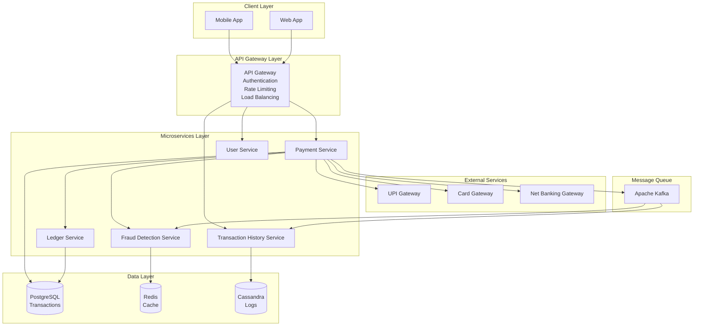
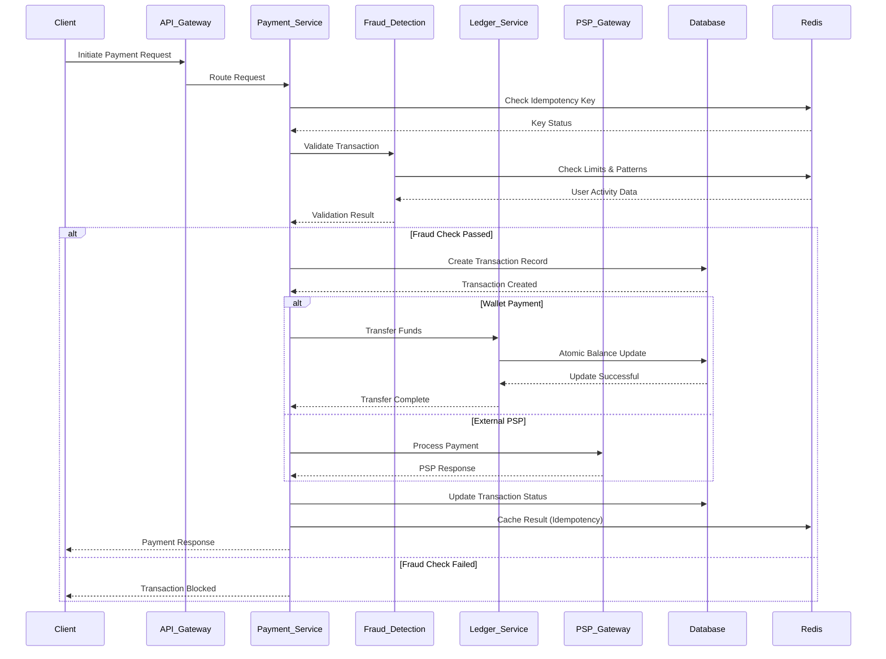
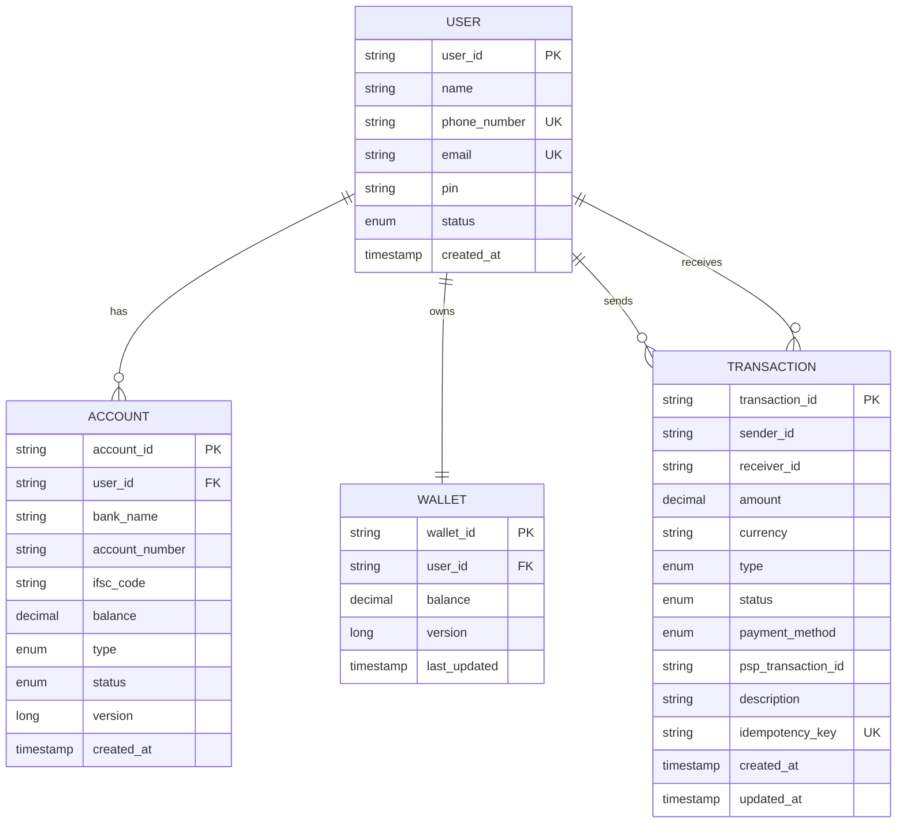
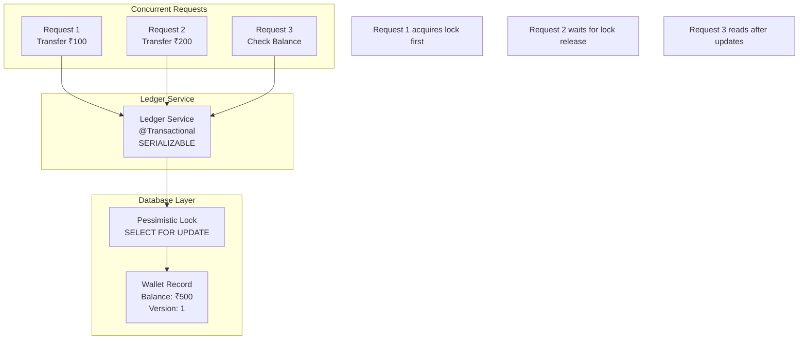
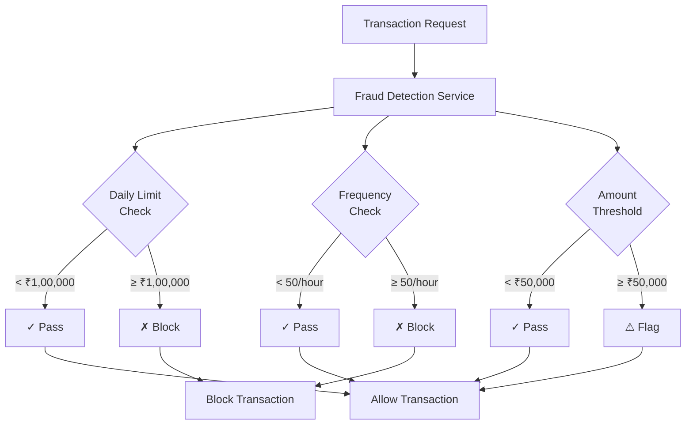
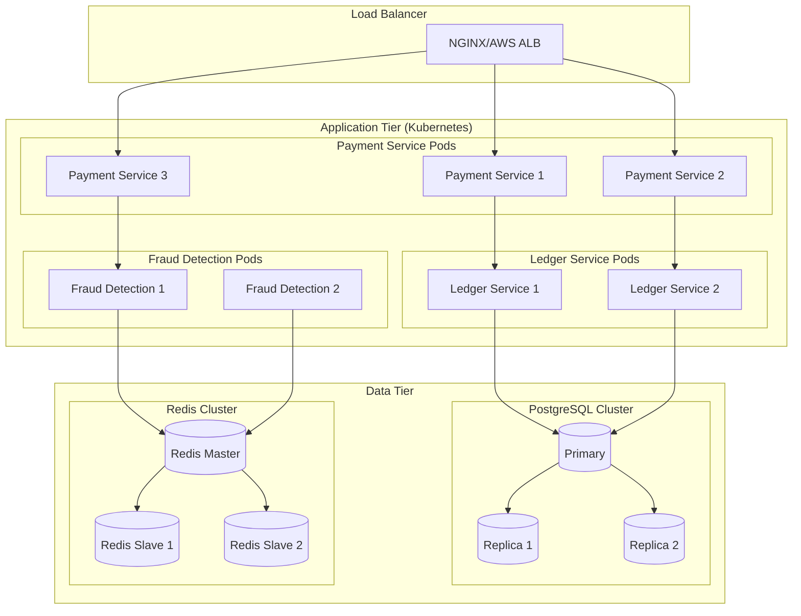

# Digital Payment Platform - Architecture Diagrams

## High-Level System Architecture

## Payment Flow Sequence Diagram

## Database Schema Design

## Concurrency Control Architecture

## Fraud Detection Flow

## Deployment Architecture

These diagrams illustrate the comprehensive architecture of the digital payment platform, showing the flow of data, security measures, and scalability considerations.