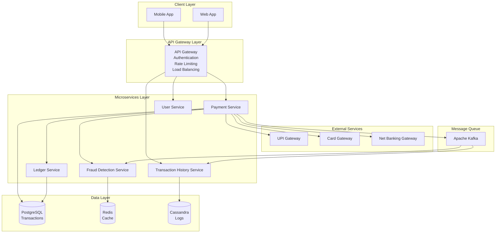
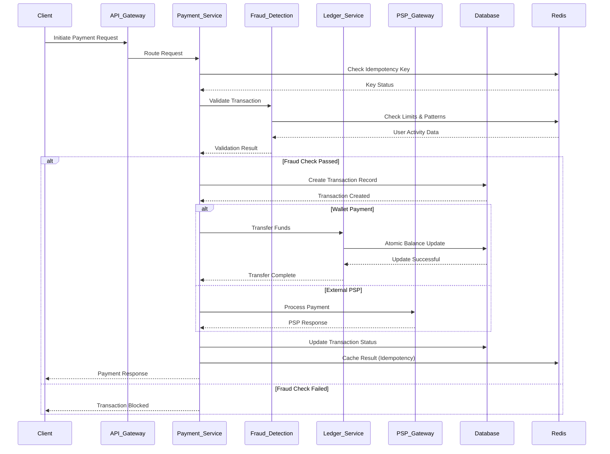
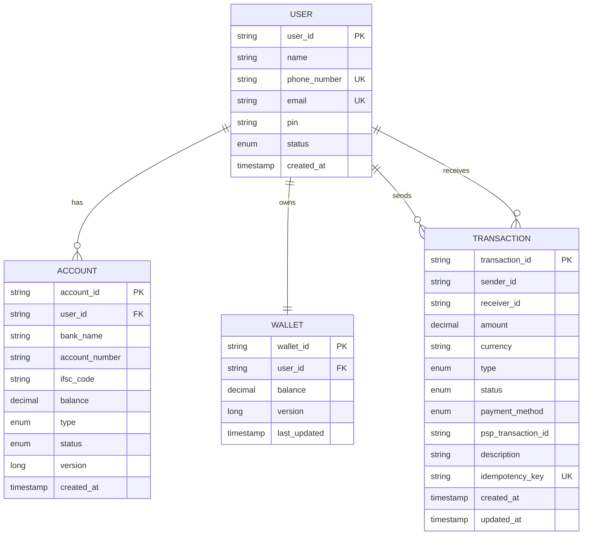
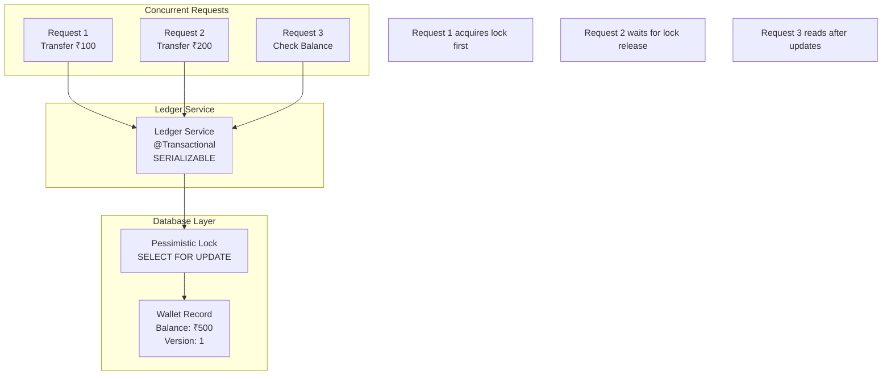
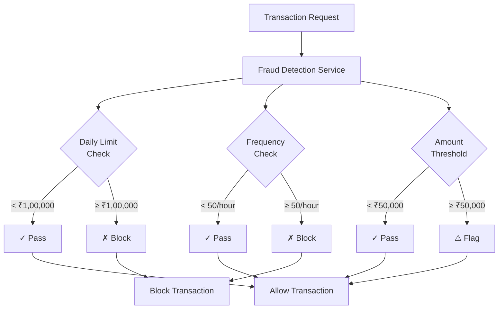
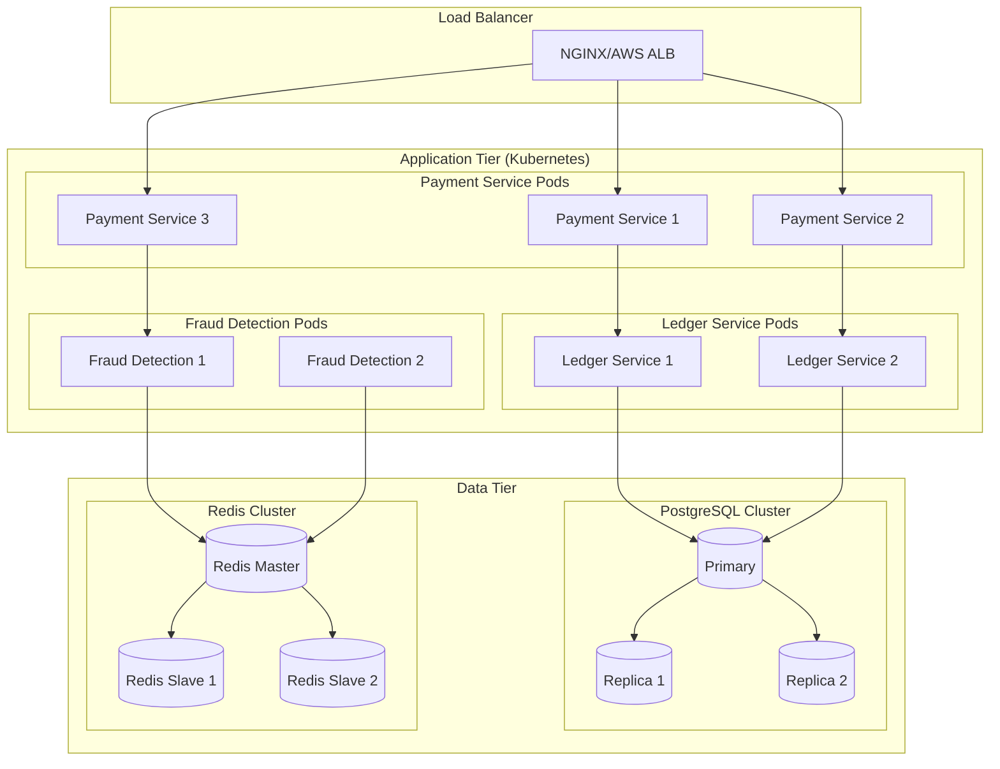

# Digital Payment Platform - Architecture Diagrams

## Understanding Payment System Architecture

### What Makes Payment Architecture Different?
Payment systems require unique architectural considerations compared to regular applications:

1. **Financial Accuracy**: Never lose or duplicate money
2. **Regulatory Compliance**: Meet banking and financial regulations
3. **Security**: Protect against fraud and unauthorized access
4. **Atomicity**: Transactions must be all-or-nothing
5. **Auditability**: Complete transaction trails for compliance

### Key Architectural Principles

#### Microservices for Payment Systems
- **Payment Service**: Orchestrates payment flow
- **Ledger Service**: Manages account balances with ACID properties
- **Fraud Detection**: Real-time risk assessment
- **User Service**: Authentication and user management
- **Transaction History**: Audit trails and reporting

#### Why Separate Ledger Service?
```java
// Wrong: Payment service directly updating balances
public class PaymentService {
    public void transfer(String from, String to, BigDecimal amount) {
        Account fromAccount = accountRepo.findById(from);
        Account toAccount = accountRepo.findById(to);
        
        fromAccount.setBalance(fromAccount.getBalance().subtract(amount));
        toAccount.setBalance(toAccount.getBalance().add(amount));
        
        accountRepo.save(fromAccount);
        accountRepo.save(toAccount); // Risk: Partial failure!
    }
}

// Correct: Dedicated ledger service with atomic operations
public class LedgerService {
    @Transactional(isolation = Isolation.SERIALIZABLE)
    public void atomicTransfer(String from, String to, BigDecimal amount) {
        // Acquire locks in consistent order to prevent deadlocks
        Account fromAccount = accountRepo.findByIdForUpdate(from);
        Account toAccount = accountRepo.findByIdForUpdate(to);
        
        if (fromAccount.getBalance().compareTo(amount) < 0) {
            throw new InsufficientFundsException();
        }
        
        fromAccount.setBalance(fromAccount.getBalance().subtract(amount));
        toAccount.setBalance(toAccount.getBalance().add(amount));
        
        // Both updates happen atomically
        accountRepo.saveAll(Arrays.asList(fromAccount, toAccount));
    }
}
```

#### API Gateway for Payment Security
- **Authentication**: JWT token validation
- **Rate Limiting**: Prevent abuse and DDoS
- **Request Validation**: Input sanitization
- **Audit Logging**: Track all API calls

### Payment Flow Patterns

#### Synchronous vs Asynchronous Processing

##### Synchronous Flow (Simple but Limited)
```
Client → API Gateway → Payment Service → PSP → Response → Client
                                    ↓
                              Blocking Wait
```
**Problems**: 
- Timeout issues with slow PSPs
- Poor user experience
- Limited throughput

##### Asynchronous Flow (Scalable)
```
Client → API Gateway → Payment Service → Queue → PSP Processor
                            ↓                        ↓
                      Immediate Response         Callback/Webhook
```
**Benefits**:
- Fast response to user
- Higher throughput
- Better fault tolerance

### Database Design for Financial Systems

#### Why PostgreSQL for Payments?
1. **ACID Compliance**: Guaranteed transaction integrity
2. **Mature Ecosystem**: Well-tested for financial applications
3. **Complex Queries**: Support for financial reporting
4. **Concurrent Control**: Proper locking mechanisms

#### Schema Design Principles
```sql
-- Immutable transaction records (never update, only insert)
CREATE TABLE transactions (
    id UUID PRIMARY KEY,
    from_account_id UUID NOT NULL,
    to_account_id UUID NOT NULL,
    amount DECIMAL(15,2) NOT NULL,
    status VARCHAR(20) NOT NULL,
    created_at TIMESTAMP NOT NULL DEFAULT NOW(),
    -- Never add updated_at for financial records!
    idempotency_key VARCHAR(255) UNIQUE NOT NULL
);

-- Versioned account balances for optimistic locking
CREATE TABLE accounts (
    id UUID PRIMARY KEY,
    user_id UUID NOT NULL,
    balance DECIMAL(15,2) NOT NULL DEFAULT 0,
    version BIGINT NOT NULL DEFAULT 1, -- For optimistic locking
    updated_at TIMESTAMP NOT NULL DEFAULT NOW()
);
```

#### Idempotency in Database Design
```sql
-- Prevent duplicate transactions
CREATE UNIQUE INDEX idx_idempotency_key ON transactions(idempotency_key);

-- Function to handle duplicate requests
CREATE OR REPLACE FUNCTION process_payment(
    p_idempotency_key VARCHAR(255),
    p_from_account UUID,
    p_to_account UUID,
    p_amount DECIMAL(15,2)
) RETURNS UUID AS $$
DECLARE
    existing_txn_id UUID;
    new_txn_id UUID;
BEGIN
    -- Check if transaction already exists
    SELECT id INTO existing_txn_id 
    FROM transactions 
    WHERE idempotency_key = p_idempotency_key;
    
    IF existing_txn_id IS NOT NULL THEN
        RETURN existing_txn_id; -- Return existing transaction
    END IF;
    
    -- Create new transaction
    INSERT INTO transactions (id, from_account_id, to_account_id, amount, status, idempotency_key)
    VALUES (gen_random_uuid(), p_from_account, p_to_account, p_amount, 'PENDING', p_idempotency_key)
    RETURNING id INTO new_txn_id;
    
    RETURN new_txn_id;
END;
$$ LANGUAGE plpgsql;
```

## High-Level System Architecture

### Architecture Explanation
This diagram shows the complete payment platform architecture with clear separation of concerns:

1. **Client Layer**: Mobile and web applications
2. **API Gateway**: Single entry point with security controls
3. **Microservices**: Specialized services for different functions
4. **External Services**: Payment service providers (PSPs)
5. **Data Layer**: Persistent storage with different databases for different needs
6. **Message Queue**: Asynchronous communication between services



## Payment Flow Sequence Diagram

### Understanding the Payment Flow
This sequence diagram illustrates the complete payment processing flow with all security checks and data consistency measures:

#### Step-by-Step Flow Analysis

1. **Request Initiation**: Client sends payment request with idempotency key
2. **Gateway Processing**: API Gateway validates authentication and routes request
3. **Idempotency Check**: Prevent duplicate processing of same request
4. **Fraud Detection**: Real-time risk assessment before processing
5. **Payment Processing**: Different flows for wallet vs external PSP payments
6. **Result Caching**: Store result for future duplicate requests

#### Critical Decision Points

##### Idempotency Check Logic
```java
public PaymentResult processPayment(PaymentRequest request) {
    String idempotencyKey = request.getIdempotencyKey();
    
    // Check Redis cache first (fast)
    PaymentResult cachedResult = redisTemplate.opsForValue().get(idempotencyKey);
    if (cachedResult != null) {
        return cachedResult; // Return cached result immediately
    }
    
    // Check database for older requests
    Optional<Transaction> existingTxn = transactionRepo.findByIdempotencyKey(idempotencyKey);
    if (existingTxn.isPresent()) {
        PaymentResult result = PaymentResult.fromTransaction(existingTxn.get());
        // Cache for future requests
        redisTemplate.opsForValue().set(idempotencyKey, result, Duration.ofHours(24));
        return result;
    }
    
    // Process new payment
    return executeNewPayment(request);
}
```

##### Fraud Detection Decision Tree
```java
public FraudCheckResult validateTransaction(PaymentRequest request) {
    FraudScore score = new FraudScore();
    
    // Check daily transaction limit
    BigDecimal dailyTotal = getDailyTransactionTotal(request.getUserId());
    if (dailyTotal.add(request.getAmount()).compareTo(DAILY_LIMIT) > 0) {
        return FraudCheckResult.block("Daily limit exceeded");
    }
    
    // Check transaction frequency
    int hourlyCount = getHourlyTransactionCount(request.getUserId());
    if (hourlyCount >= MAX_HOURLY_TRANSACTIONS) {
        return FraudCheckResult.block("Too many transactions");
    }
    
    // Check amount threshold
    if (request.getAmount().compareTo(HIGH_VALUE_THRESHOLD) > 0) {
        score.addRisk("HIGH_AMOUNT", 30);
    }
    
    return score.getTotalScore() > FRAUD_THRESHOLD ? 
           FraudCheckResult.block("High fraud risk") : 
           FraudCheckResult.allow();
}
```



## Database Schema Design



## Concurrency Control Architecture



## Fraud Detection Flow



## Deployment Architecture



These diagrams illustrate the comprehensive architecture of the digital payment platform, showing the flow of data, security measures, and scalability considerations.