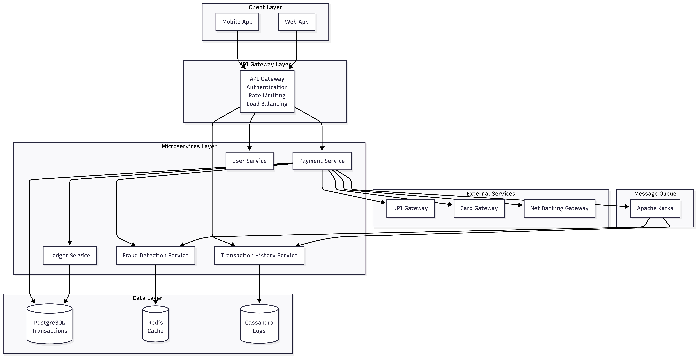
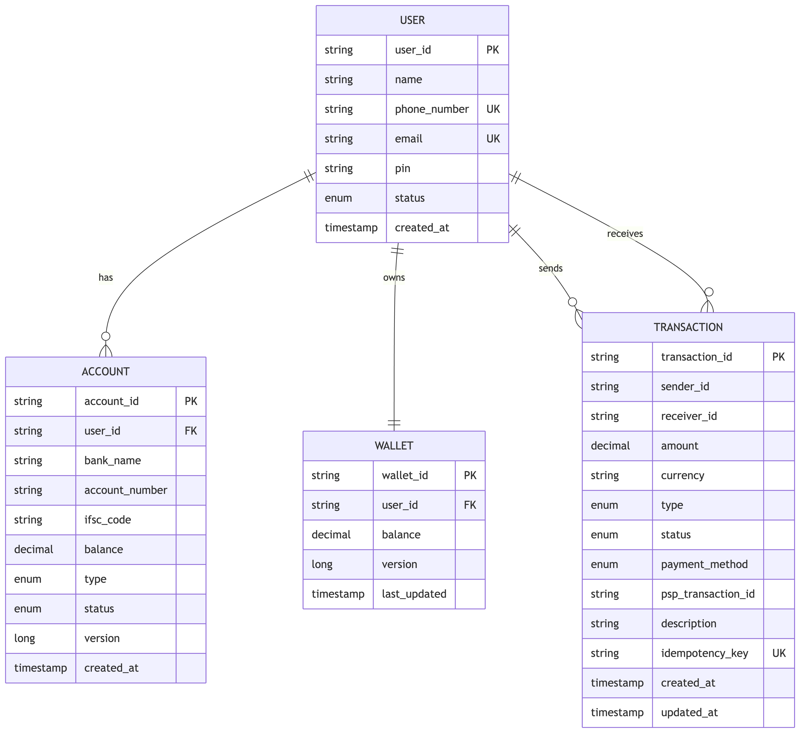
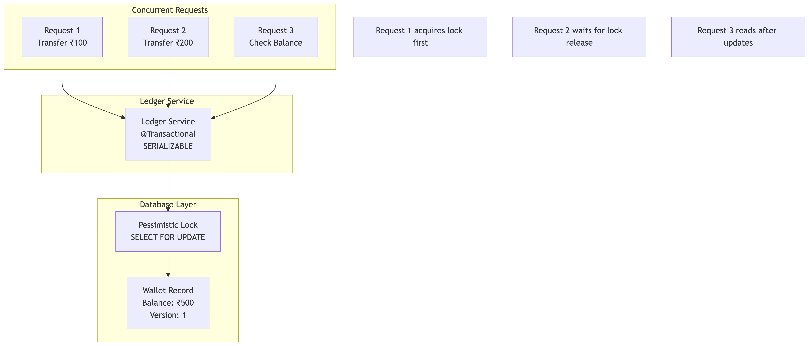
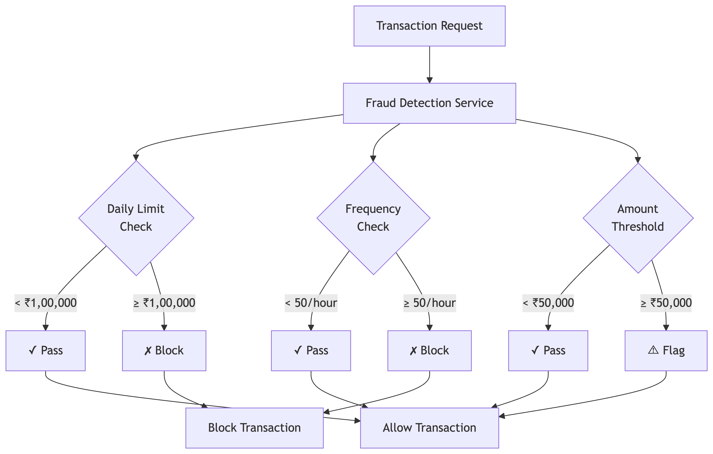
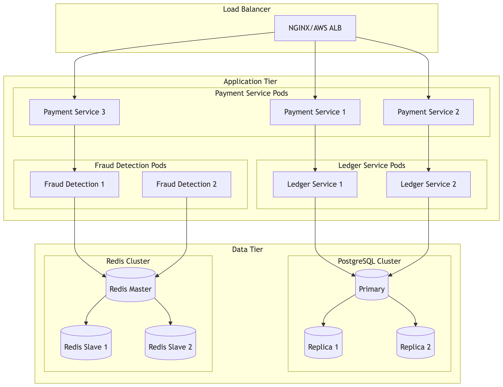

# Digital Payment Platform - Architecture Diagrams

## Understanding Payment System Architecture

### What Makes Payment Architecture Different?
Payment systems require unique architectural considerations compared to regular applications:

1. **Financial Accuracy**: Never lose or duplicate money
2. **Regulatory Compliance**: Meet banking and financial regulations
3. **Security**: Protect against fraud and unauthorized access
4. **Atomicity**: Transactions must be all-or-nothing
5. **Auditability**: Complete transaction trails for compliance

### Key Architectural Principles

#### Microservices for Payment Systems
- **Payment Service**: Orchestrates payment flow
- **Ledger Service**: Manages account balances with ACID properties
- **Fraud Detection**: Real-time risk assessment
- **User Service**: Authentication and user management
- **Transaction History**: Audit trails and reporting

#### Why Separate Ledger Service?
```java
// Wrong: Payment service directly updating balances
public class PaymentService {
    public void transfer(String from, String to, BigDecimal amount) {
        Account fromAccount = accountRepo.findById(from);
        Account toAccount = accountRepo.findById(to);
        
        fromAccount.setBalance(fromAccount.getBalance().subtract(amount));
        toAccount.setBalance(toAccount.getBalance().add(amount));
        
        accountRepo.save(fromAccount);
        accountRepo.save(toAccount); // Risk: Partial failure!
    }
}

// Correct: Dedicated ledger service with atomic operations
public class LedgerService {
    @Transactional(isolation = Isolation.SERIALIZABLE)
    public void atomicTransfer(String from, String to, BigDecimal amount) {
        // Acquire locks in consistent order to prevent deadlocks
        Account fromAccount = accountRepo.findByIdForUpdate(from);
        Account toAccount = accountRepo.findByIdForUpdate(to);
        
        if (fromAccount.getBalance().compareTo(amount) < 0) {
            throw new InsufficientFundsException();
        }
        
        fromAccount.setBalance(fromAccount.getBalance().subtract(amount));
        toAccount.setBalance(toAccount.getBalance().add(amount));
        
        // Both updates happen atomically
        accountRepo.saveAll(Arrays.asList(fromAccount, toAccount));
    }
}
```

#### API Gateway for Payment Security
- **Authentication**: JWT token validation
- **Rate Limiting**: Prevent abuse and DDoS
- **Request Validation**: Input sanitization
- **Audit Logging**: Track all API calls

### Payment Flow Patterns

#### Synchronous vs Asynchronous Processing

##### Synchronous Flow (Simple but Limited)
```
Client → API Gateway → Payment Service → PSP → Response → Client
                                    ↓
                              Blocking Wait
```
**Problems**: 
- Timeout issues with slow PSPs
- Poor user experience
- Limited throughput

##### Asynchronous Flow (Scalable)
```
Client → API Gateway → Payment Service → Queue → PSP Processor
                            ↓                        ↓
                      Immediate Response         Callback/Webhook
```
**Benefits**:
- Fast response to user
- Higher throughput
- Better fault tolerance

### Database Design for Financial Systems

#### Why PostgreSQL for Payments?
1. **ACID Compliance**: Guaranteed transaction integrity
2. **Mature Ecosystem**: Well-tested for financial applications
3. **Complex Queries**: Support for financial reporting
4. **Concurrent Control**: Proper locking mechanisms

#### Schema Design Principles
```sql
-- Immutable transaction records (never update, only insert)
CREATE TABLE transactions (
    id UUID PRIMARY KEY,
    from_account_id UUID NOT NULL,
    to_account_id UUID NOT NULL,
    amount DECIMAL(15,2) NOT NULL,
    status VARCHAR(20) NOT NULL,
    created_at TIMESTAMP NOT NULL DEFAULT NOW(),
    -- Never add updated_at for financial records!
    idempotency_key VARCHAR(255) UNIQUE NOT NULL
);

-- Versioned account balances for optimistic locking
CREATE TABLE accounts (
    id UUID PRIMARY KEY,
    user_id UUID NOT NULL,
    balance DECIMAL(15,2) NOT NULL DEFAULT 0,
    version BIGINT NOT NULL DEFAULT 1, -- For optimistic locking
    updated_at TIMESTAMP NOT NULL DEFAULT NOW()
);
```

#### Idempotency in Database Design
```sql
-- Prevent duplicate transactions
CREATE UNIQUE INDEX idx_idempotency_key ON transactions(idempotency_key);

-- Function to handle duplicate requests
CREATE OR REPLACE FUNCTION process_payment(
    p_idempotency_key VARCHAR(255),
    p_from_account UUID,
    p_to_account UUID,
    p_amount DECIMAL(15,2)
) RETURNS UUID AS $$
DECLARE
    existing_txn_id UUID;
    new_txn_id UUID;
BEGIN
    -- Check if transaction already exists
    SELECT id INTO existing_txn_id 
    FROM transactions 
    WHERE idempotency_key = p_idempotency_key;
    
    IF existing_txn_id IS NOT NULL THEN
        RETURN existing_txn_id; -- Return existing transaction
    END IF;
    
    -- Create new transaction
    INSERT INTO transactions (id, from_account_id, to_account_id, amount, status, idempotency_key)
    VALUES (gen_random_uuid(), p_from_account, p_to_account, p_amount, 'PENDING', p_idempotency_key)
    RETURNING id INTO new_txn_id;
    
    RETURN new_txn_id;
END;
$$ LANGUAGE plpgsql;
```

## High-Level System Architecture

### Architecture Explanation
This diagram shows the complete payment platform architecture with clear separation of concerns:

1. **Client Layer**: Mobile and web applications
2. **API Gateway**: Single entry point with security controls
3. **Microservices**: Specialized services for different functions
4. **External Services**: Payment service providers (PSPs)
5. **Data Layer**: Persistent storage with different databases for different needs
6. **Message Queue**: Asynchronous communication between services



## Payment Flow Sequence Diagram

### Understanding the Payment Flow
This sequence diagram illustrates the complete payment processing flow with all security checks and data consistency measures:

#### Step-by-Step Flow Analysis

1. **Request Initiation**: Client sends payment request with idempotency key
2. **Gateway Processing**: API Gateway validates authentication and routes request
3. **Idempotency Check**: Prevent duplicate processing of same request
4. **Fraud Detection**: Real-time risk assessment before processing
5. **Payment Processing**: Different flows for wallet vs external PSP payments
6. **Result Caching**: Store result for future duplicate requests

#### Critical Decision Points

##### Idempotency Check Logic
```java
public PaymentResult processPayment(PaymentRequest request) {
    String idempotencyKey = request.getIdempotencyKey();
    
    // Check Redis cache first (fast)
    PaymentResult cachedResult = redisTemplate.opsForValue().get(idempotencyKey);
    if (cachedResult != null) {
        return cachedResult; // Return cached result immediately
    }
    
    // Check database for older requests
    Optional<Transaction> existingTxn = transactionRepo.findByIdempotencyKey(idempotencyKey);
    if (existingTxn.isPresent()) {
        PaymentResult result = PaymentResult.fromTransaction(existingTxn.get());
        // Cache for future requests
        redisTemplate.opsForValue().set(idempotencyKey, result, Duration.ofHours(24));
        return result;
    }
    
    // Process new payment
    return executeNewPayment(request);
}
```

##### Fraud Detection Decision Tree
```java
public FraudCheckResult validateTransaction(PaymentRequest request) {
    FraudScore score = new FraudScore();
    
    // Check daily transaction limit
    BigDecimal dailyTotal = getDailyTransactionTotal(request.getUserId());
    if (dailyTotal.add(request.getAmount()).compareTo(DAILY_LIMIT) > 0) {
        return FraudCheckResult.block("Daily limit exceeded");
    }
    
    // Check transaction frequency
    int hourlyCount = getHourlyTransactionCount(request.getUserId());
    if (hourlyCount >= MAX_HOURLY_TRANSACTIONS) {
        return FraudCheckResult.block("Too many transactions");
    }
    
    // Check velocity (rapid successive transactions)
    if (isVelocityAnomaly(request.getUserId())) {
        return FraudCheckResult.review("Unusual transaction velocity");
    }
    
    return FraudCheckResult.allow();
}IONS) {
        return FraudCheckResult.block("Too many transactions");
    }
    
    // Check amount threshold
    if (request.getAmount().compareTo(HIGH_VALUE_THRESHOLD) > 0) {
        score.addRisk("HIGH_AMOUNT", 30);
    }
    
    return score.getTotalScore() > FRAUD_THRESHOLD ? 
           FraudCheckResult.block("High fraud risk") : 
           FraudCheckResult.allow();
}
```


## Database Schema Design



## Concurrency Control Architecture



## Fraud Detection Flow



## Deployment Architecture



These diagrams illustrate the comprehensive architecture of the digital payment platform, showing the flow of data, security measures, and scalability considerations.


## P2P Transaction Flow Diagram

### Complete P2P Money Transfer Flow

This diagram shows the end-to-end flow for a Person-to-Person (P2P) money transfer, including all validation, fraud checks, and atomic balance updates.


### Key Components Explained

#### 1. Idempotency Protection
```java
// Prevents duplicate transactions from network retries
@PostMapping("/api/v1/payments/transfer")
public ResponseEntity<PaymentResponse> transfer(
    @RequestHeader("X-Idempotency-Key") String idempotencyKey,
    @RequestBody TransferRequest request) {
    
    // Check cache first (fast path)
    PaymentResponse cached = redisTemplate.opsForValue().get(idempotencyKey);
    if (cached != null) {
        return ResponseEntity.ok(cached); // Return immediately
    }
    
    // Process new transaction
    PaymentResponse response = paymentService.processTransfer(request, idempotencyKey);
    
    // Cache result for 24 hours
    redisTemplate.opsForValue().set(idempotencyKey, response, Duration.ofHours(24));
    
    return ResponseEntity.ok(response);
}
```

#### 2. Fraud Detection Logic
```java
public FraudCheckResult checkFraud(String userId, BigDecimal amount) {
    int riskScore = 0;
    
    // Check 1: Daily transaction limit (₹50,000)
    BigDecimal dailyTotal = getDailyTotal(userId);
    if (dailyTotal.add(amount).compareTo(new BigDecimal("50000")) > 0) {
        riskScore += 50;
    }
    
    // Check 2: Transaction velocity (max 10 txns/hour)
    int hourlyCount = getHourlyTransactionCount(userId);
    if (hourlyCount >= 10) {
        riskScore += 30;
    }
    
    // Check 3: Unusual amount (>3x average)
    BigDecimal avgAmount = getAverageTransactionAmount(userId);
    if (amount.compareTo(avgAmount.multiply(new BigDecimal("3"))) > 0) {
        riskScore += 20;
    }
    
    // Decision
    if (riskScore >= 80) {
        return FraudCheckResult.BLOCKED;
    } else if (riskScore >= 50) {
        return FraudCheckResult.REVIEW_REQUIRED;
    } else {
        return FraudCheckResult.APPROVED;
    }
}
```

#### 3. Atomic Balance Transfer (Ledger Service)
```java
@Transactional(isolation = Isolation.SERIALIZABLE)
public void atomicTransfer(String fromAccountId, String toAccountId, 
                          BigDecimal amount, String transactionId) {
    
    // Acquire locks in consistent order (prevent deadlocks)
    String firstLock = fromAccountId.compareTo(toAccountId) < 0 ? fromAccountId : toAccountId;
    String secondLock = fromAccountId.compareTo(toAccountId) < 0 ? toAccountId : fromAccountId;
    
    // Pessimistic locking (FOR UPDATE)
    Account firstAccount = accountRepo.findByIdForUpdate(firstLock);
    Account secondAccount = accountRepo.findByIdForUpdate(secondLock);
    
    Account fromAccount = fromAccountId.equals(firstLock) ? firstAccount : secondAccount;
    Account toAccount = toAccountId.equals(firstLock) ? firstAccount : secondAccount;
    
    // Validate sufficient balance
    if (fromAccount.getBalance().compareTo(amount) < 0) {
        throw new InsufficientFundsException("Balance: " + fromAccount.getBalance());
    }
    
    // Atomic debit and credit
    fromAccount.setBalance(fromAccount.getBalance().subtract(amount));
    toAccount.setBalance(toAccount.getBalance().add(amount));
    
    // Save both accounts (atomic within transaction)
    accountRepo.saveAll(Arrays.asList(fromAccount, toAccount));
    
    // Create ledger entries for audit trail
    ledgerEntryRepo.save(new LedgerEntry(transactionId, fromAccountId, "DEBIT", amount));
    ledgerEntryRepo.save(new LedgerEntry(transactionId, toAccountId, "CREDIT", amount));
    
    // Transaction commits here (all or nothing)
}
```

#### 4. Database Transaction Isolation
```sql
-- SERIALIZABLE isolation level prevents race conditions
BEGIN TRANSACTION ISOLATION LEVEL SERIALIZABLE;

-- Lock accounts in consistent order (alphabetically by ID)
SELECT * FROM accounts 
WHERE id IN ('sender_id', 'receiver_id')
ORDER BY id
FOR UPDATE;

-- Validate balance
SELECT balance FROM accounts WHERE id = 'sender_id';
-- If balance < amount, ROLLBACK

-- Atomic updates
UPDATE accounts SET balance = balance - 1000 WHERE id = 'sender_id';
UPDATE accounts SET balance = balance + 1000 WHERE id = 'receiver_id';

-- Audit trail
INSERT INTO ledger_entries (txn_id, account_id, type, amount) 
VALUES ('txn_123', 'sender_id', 'DEBIT', 1000);

INSERT INTO ledger_entries (txn_id, account_id, type, amount) 
VALUES ('txn_123', 'receiver_id', 'CREDIT', 1000);

COMMIT; -- All changes applied atomically
```

### Error Handling Scenarios

#### Scenario 1: Network Timeout (Client Retry)
```
Request 1: Client sends transfer → Network timeout → No response
Request 2: Client retries with SAME idempotency key
Result: System returns cached result from Request 1 (no duplicate charge)
```

#### Scenario 2: Insufficient Balance
```
User Balance: ₹500
Transfer Amount: ₹1000
Result: Transaction fails at ledger service, status=FAILED, user notified
```

#### Scenario 3: Concurrent Transfers (Race Condition)
```
Thread 1: Transfer ₹500 from Account A
Thread 2: Transfer ₹600 from Account A (simultaneously)
Account A Balance: ₹800

Solution: Pessimistic locking (FOR UPDATE)
- Thread 1 acquires lock first, deducts ₹500 → Balance = ₹300
- Thread 2 waits for lock, then checks balance → Insufficient funds → FAILED
```

#### Scenario 4: Database Failure Mid-Transaction
```
Step 1: Debit sender account ✓
Step 2: Credit receiver account ✗ (Database crash)
Result: Transaction ROLLBACK, no money lost (ACID properties)
```

### Performance Optimizations

#### 1. Redis Caching Strategy
```java
// Cache hot data to reduce database load
public Account getAccount(String accountId) {
    // Check L1 cache (Redis)
    Account cached = redisTemplate.opsForValue().get("account:" + accountId);
    if (cached != null) {
        return cached;
    }
    
    // Cache miss - fetch from database
    Account account = accountRepo.findById(accountId).orElseThrow();
    
    // Cache for 5 minutes
    redisTemplate.opsForValue().set("account:" + accountId, account, Duration.ofMinutes(5));
    
    return account;
}
```

#### 2. Async Notifications
```java
// Don't block payment response for notifications
@Async
public void sendTransactionNotifications(Transaction transaction) {
    // Send push notification to sender
    notificationService.sendPush(
        transaction.getSenderId(),
        "Payment sent successfully",
        "₹" + transaction.getAmount() + " sent to " + transaction.getReceiverName()
    );
    
    // Send push notification to receiver
    notificationService.sendPush(
        transaction.getReceiverId(),
        "Payment received",
        "₹" + transaction.getAmount() + " received from " + transaction.getSenderName()
    );
    
    // Send SMS (optional)
    smsService.sendTransactionSMS(transaction);
}
```

#### 3. Database Connection Pooling
```yaml
spring:
  datasource:
    hikari:
      maximum-pool-size: 50        # Max connections
      minimum-idle: 10             # Min idle connections
      connection-timeout: 30000    # 30 seconds
      idle-timeout: 600000         # 10 minutes
      max-lifetime: 1800000        # 30 minutes
```

### Monitoring & Alerts

#### Key Metrics to Track
```java
// Transaction success rate
@Timed(value = "payment.transfer.duration", percentiles = {0.5, 0.95, 0.99})
@Counted(value = "payment.transfer.total")
public PaymentResponse processTransfer(TransferRequest request) {
    try {
        PaymentResponse response = executeTransfer(request);
        meterRegistry.counter("payment.transfer.success").increment();
        return response;
    } catch (Exception e) {
        meterRegistry.counter("payment.transfer.failed", "reason", e.getClass().getSimpleName()).increment();
        throw e;
    }
}

// Alert thresholds
// - Transaction failure rate > 5%
// - P95 latency > 2 seconds
// - Fraud detection rate > 10%
// - Database connection pool exhaustion
```

### Security Considerations

1. **Authentication**: JWT tokens with 15-minute expiry
2. **Authorization**: User can only transfer from their own account
3. **Rate Limiting**: 100 requests/minute per user
4. **Input Validation**: Amount > 0, valid account IDs
5. **Encryption**: TLS 1.3 for data in transit
6. **PCI Compliance**: No card data stored (tokenization)
7. **Audit Logging**: All transactions logged to Cassandra

