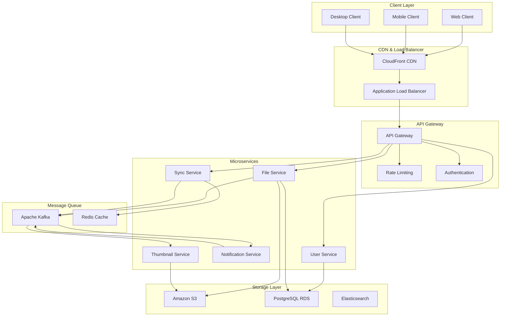
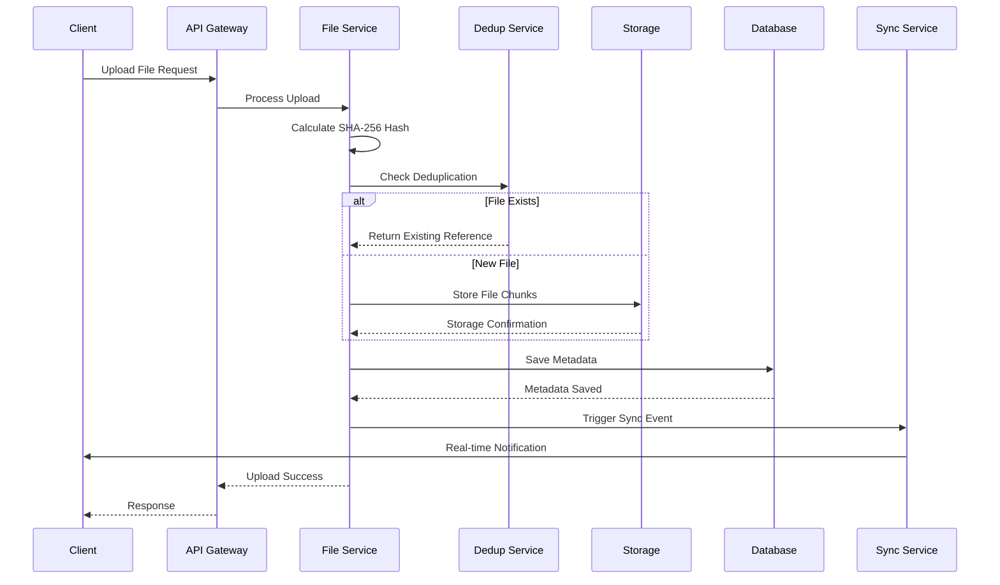
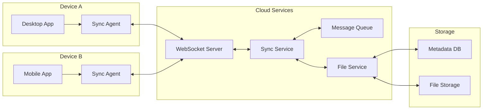
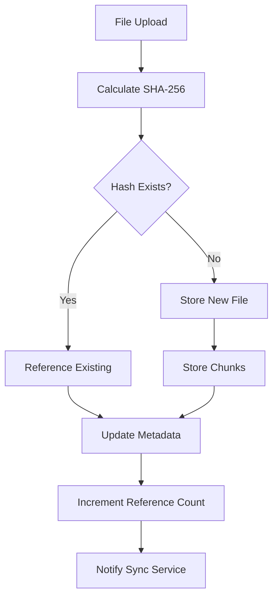
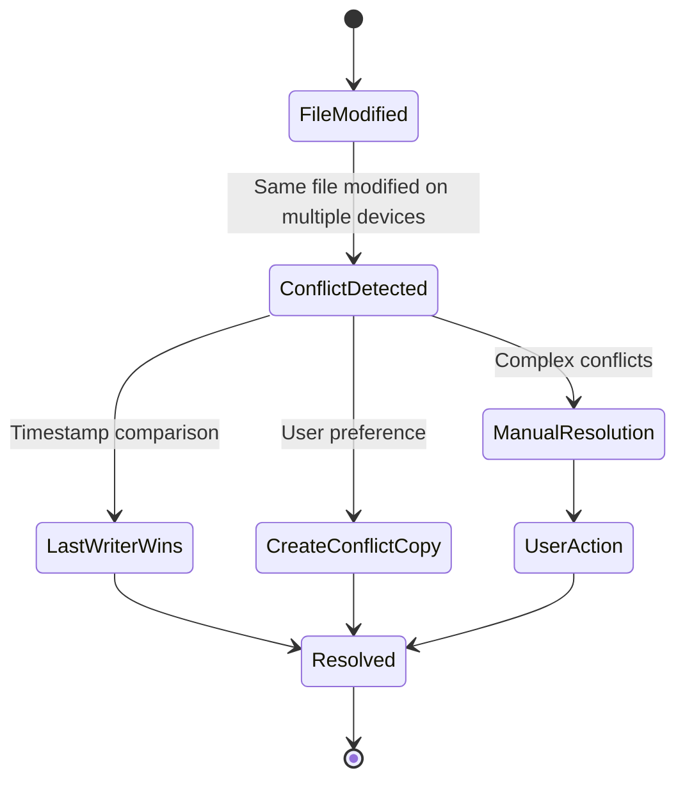
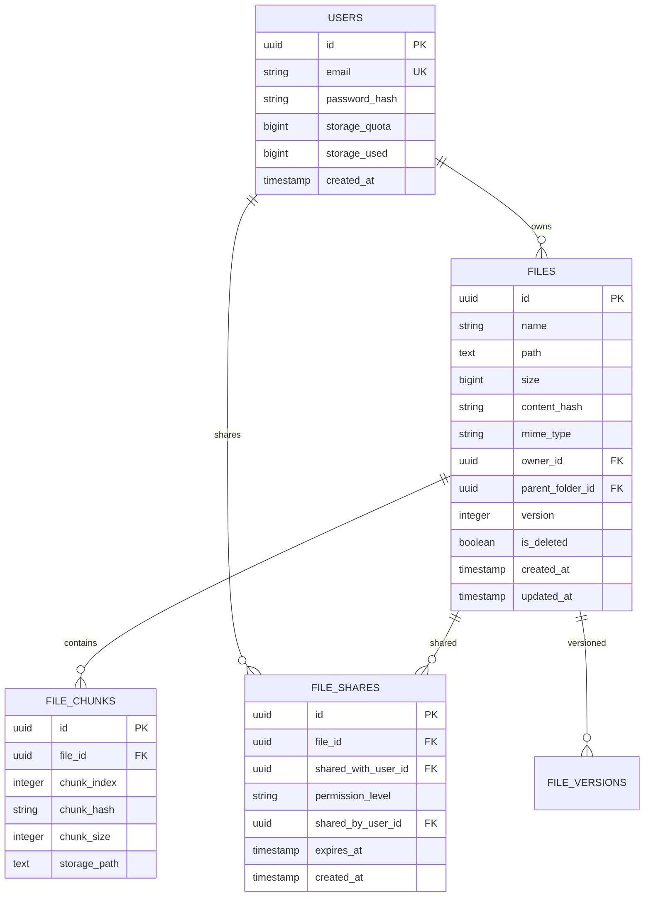
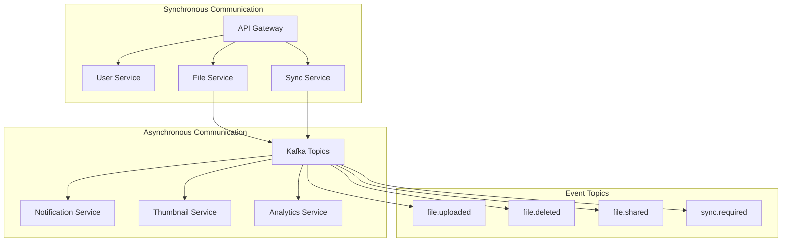
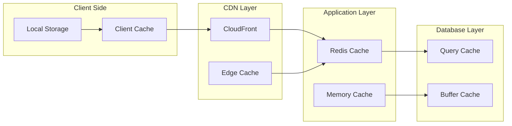
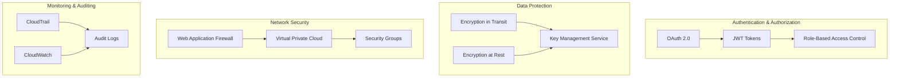
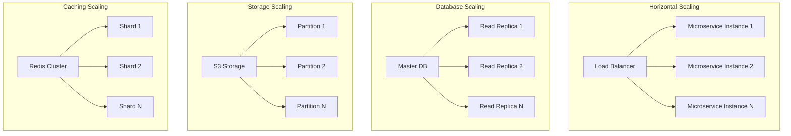

# Cloud Storage System - Architecture Diagrams

## Understanding Cloud Storage Architecture

### What Makes Cloud Storage Complex?
Cloud storage systems like Dropbox face unique challenges:

1. **File Synchronization**: Keep files consistent across multiple devices
2. **Conflict Resolution**: Handle simultaneous edits to the same file
3. **Data Deduplication**: Avoid storing duplicate content
4. **Version Control**: Track file changes over time
5. **Real-time Updates**: Notify all devices of changes instantly

### Key Architectural Decisions

#### Microservices vs Monolith for File Storage

**Why Microservices for Dropbox?**
- **Independent Scaling**: File service needs different scaling than user service
- **Technology Diversity**: Use specialized databases for different needs
- **Team Autonomy**: Different teams can work on sync vs storage
- **Fault Isolation**: Thumbnail generation failure doesn't affect file uploads

#### Service Responsibilities
```java
// User Service - Handles authentication and user management
@RestController
public class UserController {
    @PostMapping("/login")
    public AuthResponse login(@RequestBody LoginRequest request) {
        User user = userService.authenticate(request.getEmail(), request.getPassword());
        String token = jwtService.generateToken(user.getId());
        return new AuthResponse(token, user.getStorageQuota(), user.getStorageUsed());
    }
}

// File Service - Handles file operations and metadata
@RestController
public class FileController {
    @PostMapping("/upload")
    public FileResponse uploadFile(@RequestParam MultipartFile file, 
                                 @RequestHeader("Authorization") String token) {
        Long userId = jwtService.extractUserId(token);
        
        // Calculate hash for deduplication
        String fileHash = hashService.calculateSHA256(file.getBytes());
        
        // Check if file already exists
        Optional<FileMetadata> existing = fileService.findByHash(fileHash);
        if (existing.isPresent()) {
            return fileService.createReference(userId, file.getOriginalFilename(), existing.get());
        }
        
        // Store new file
        return fileService.storeNewFile(userId, file, fileHash);
    }
}

// Sync Service - Handles real-time synchronization
@Component
public class SyncService {
    @EventListener
    public void handleFileChange(FileChangeEvent event) {
        // Get all devices for the user
        List<String> deviceIds = deviceService.getActiveDevices(event.getUserId());
        
        // Send real-time notifications
        for (String deviceId : deviceIds) {
            webSocketService.sendToDevice(deviceId, new SyncNotification(
                event.getFileId(), 
                event.getChangeType(), 
                event.getTimestamp()
            ));
        }
    }
}
```

#### CDN Strategy for File Delivery
```
Traditional Approach:
User in Tokyo → US Server → File Storage (300ms latency)

CDN Approach:
User in Tokyo → Tokyo Edge Server → Cached File (50ms latency)
                      ↓ (Cache Miss)
                 US Origin Server
```

### Data Flow Patterns

#### Upload Flow Design Decisions
1. **Chunked Upload**: Handle large files and resume capability
2. **Hash Calculation**: Client-side to reduce server load
3. **Deduplication Check**: Before storage to save space
4. **Async Processing**: Thumbnail generation doesn't block upload

#### Sync Flow Patterns
```java
// Push-based Sync (Real-time)
public class PushSyncService {
    public void notifyFileChange(FileChangeEvent event) {
        // Immediate notification to all connected devices
        List<WebSocketSession> sessions = getActiveSessionsForUser(event.getUserId());
        
        SyncMessage message = new SyncMessage(
            event.getFileId(),
            event.getChangeType(),
            event.getFileVersion(),
            event.getTimestamp()
        );
        
        sessions.forEach(session -> {
            try {
                session.sendMessage(new TextMessage(objectMapper.writeValueAsString(message)));
            } catch (Exception e) {
                log.error("Failed to send sync message to session: {}", session.getId(), e);
            }
        });
    }
}

// Pull-based Sync (Polling fallback)
public class PullSyncService {
    public List<FileChange> getChangesSince(Long userId, Long timestamp) {
        return fileChangeRepository.findByUserIdAndTimestampAfter(userId, timestamp);
    }
}
```

## 1. High-Level System Architecture



## 2. File Upload Flow



### File Deduplication Deep Dive

#### Why Deduplication Matters
```
Scenario: 1 million users upload the same 10MB video
Without deduplication: 1M × 10MB = 10TB storage
With deduplication: 1 × 10MB = 10MB storage
Savings: 99.9999% storage reduction
```

#### Deduplication Strategies

##### File-Level Deduplication
```java
public class FileLevelDeduplication {
    public FileUploadResult uploadFile(MultipartFile file, Long userId) {
        // Calculate hash of entire file
        String fileHash = DigestUtils.sha256Hex(file.getBytes());
        
        // Check if file already exists
        Optional<StoredFile> existingFile = fileRepository.findByHash(fileHash);
        
        if (existingFile.isPresent()) {
            // Create reference to existing file
            FileMetadata metadata = new FileMetadata();
            metadata.setUserId(userId);
            metadata.setFileName(file.getOriginalFilename());
            metadata.setStoredFileId(existingFile.get().getId());
            
            // Increment reference count
            existingFile.get().incrementReferenceCount();
            
            return FileUploadResult.deduplicated(metadata);
        }
        
        // Store new file
        return storeNewFile(file, fileHash, userId);
    }
}
```

##### Block-Level Deduplication (More Efficient)
```java
public class BlockLevelDeduplication {
    private static final int BLOCK_SIZE = 4 * 1024 * 1024; // 4MB blocks
    
    public FileUploadResult uploadFileWithBlockDedup(MultipartFile file, Long userId) {
        List<FileBlock> blocks = new ArrayList<>();
        byte[] fileData = file.getBytes();
        
        // Split file into blocks
        for (int i = 0; i < fileData.length; i += BLOCK_SIZE) {
            int blockSize = Math.min(BLOCK_SIZE, fileData.length - i);
            byte[] blockData = Arrays.copyOfRange(fileData, i, i + blockSize);
            String blockHash = DigestUtils.sha256Hex(blockData);
            
            // Check if block already exists
            Optional<StoredBlock> existingBlock = blockRepository.findByHash(blockHash);
            
            if (existingBlock.isPresent()) {
                // Reference existing block
                blocks.add(new FileBlock(blockHash, existingBlock.get().getStoragePath(), i));
                existingBlock.get().incrementReferenceCount();
            } else {
                // Store new block
                String storagePath = storageService.storeBlock(blockData, blockHash);
                StoredBlock newBlock = new StoredBlock(blockHash, storagePath, 1);
                blockRepository.save(newBlock);
                blocks.add(new FileBlock(blockHash, storagePath, i));
            }
        }
        
        // Create file metadata with block references
        FileMetadata metadata = new FileMetadata();
        metadata.setUserId(userId);
        metadata.setFileName(file.getOriginalFilename());
        metadata.setBlocks(blocks);
        
        return FileUploadResult.success(metadata);
    }
}
```

## 3. File Synchronization Architecture

### Understanding Sync Complexity

This diagram shows how multiple devices stay synchronized. The key challenges are:

1. **Real-time Communication**: WebSocket connections for instant updates
2. **Offline Handling**: Queue changes when devices are offline
3. **Conflict Detection**: Identify when same file is modified on multiple devices
4. **Bandwidth Optimization**: Only sync changed parts of files

#### Sync Agent Responsibilities
```java
public class SyncAgent {
    private final WebSocketClient webSocketClient;
    private final LocalFileWatcher fileWatcher;
    private final ConflictResolver conflictResolver;
    
    @PostConstruct
    public void initialize() {
        // Watch local file system for changes
        fileWatcher.onFileChanged(this::handleLocalFileChange);
        
        // Connect to sync service
        webSocketClient.connect(syncServiceUrl);
        webSocketClient.onMessage(this::handleRemoteFileChange);
    }
    
    private void handleLocalFileChange(FileChangeEvent event) {
        // Calculate file hash
        String newHash = calculateFileHash(event.getFilePath());
        
        // Send change to server
        SyncMessage message = new SyncMessage(
            event.getFilePath(),
            newHash,
            System.currentTimeMillis(),
            getDeviceId()
        );
        
        webSocketClient.send(message);
    }
    
    private void handleRemoteFileChange(SyncMessage message) {
        String localPath = message.getFilePath();
        File localFile = new File(localPath);
        
        if (localFile.exists()) {
            String localHash = calculateFileHash(localPath);
            
            if (!localHash.equals(message.getFileHash())) {
                // Conflict detected
                ConflictResolution resolution = conflictResolver.resolve(
                    localFile, message);
                
                switch (resolution.getStrategy()) {
                    case KEEP_LOCAL:
                        // Do nothing
                        break;
                    case KEEP_REMOTE:
                        downloadAndReplaceFile(message);
                        break;
                    case KEEP_BOTH:
                        createConflictCopy(localFile);
                        downloadAndReplaceFile(message);
                        break;
                }
            }
        } else {
            // File doesn't exist locally, download it
            downloadFile(message);
        }
    }
}
```



## 4. Data Deduplication Process



## 5. Conflict Resolution Flow



## 6. Database Schema Relationships



## 7. Microservices Communication



## 8. Caching Strategy



## 9. Security Architecture



## 10. Scalability Patterns

