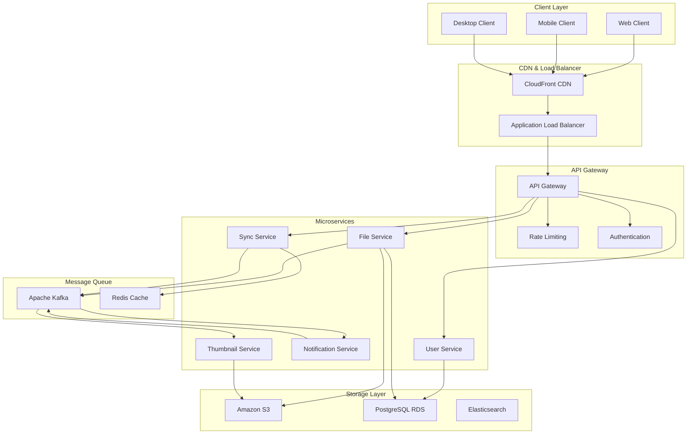
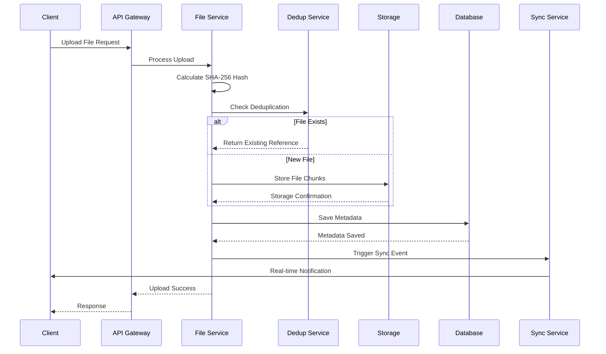
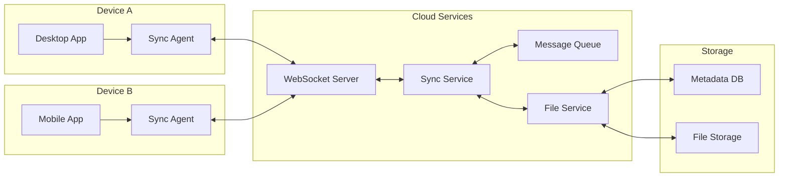
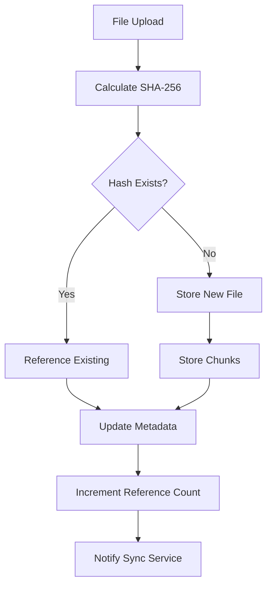
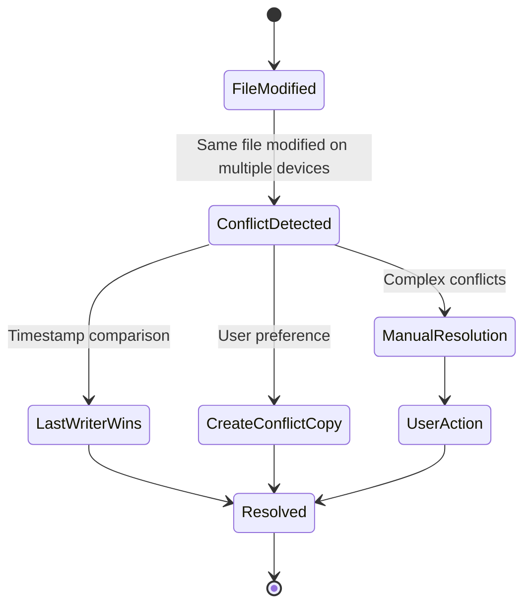
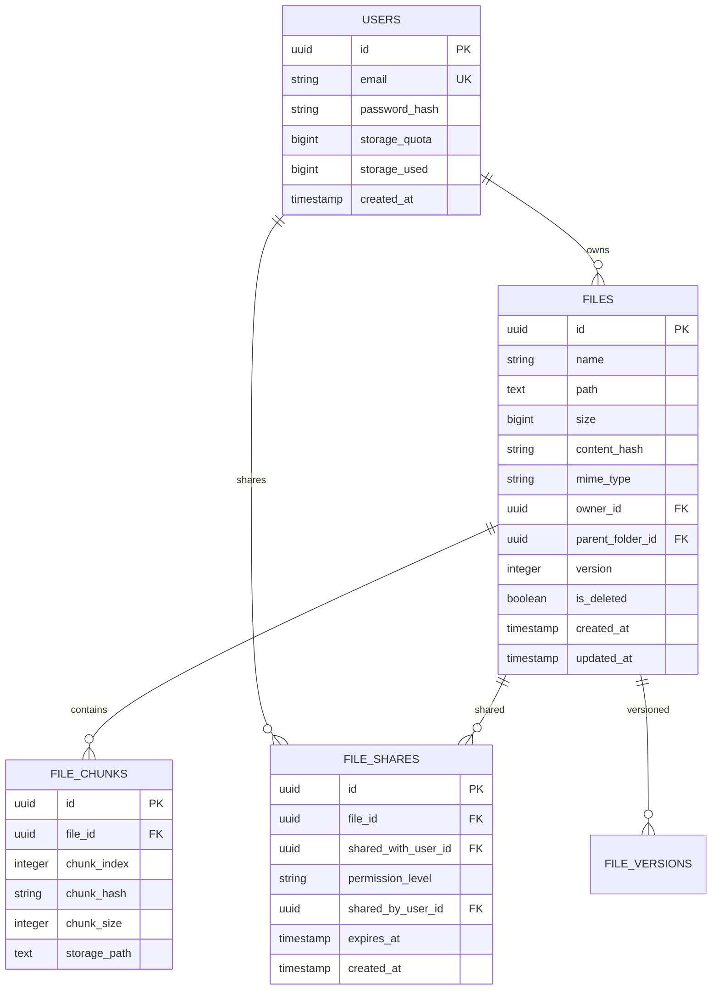
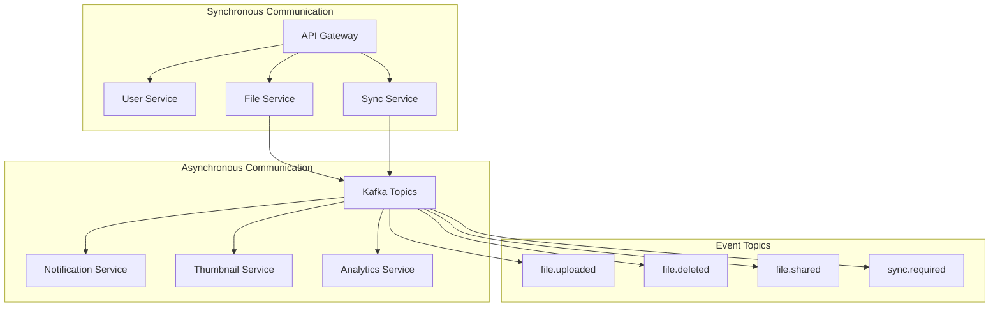
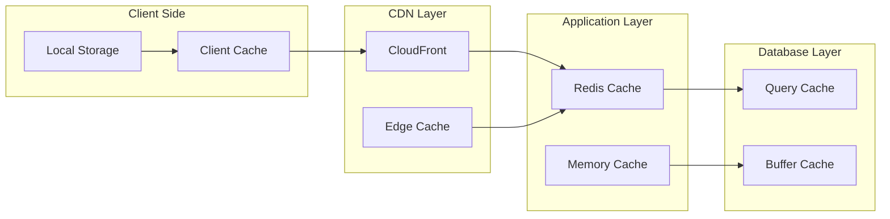
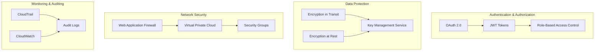
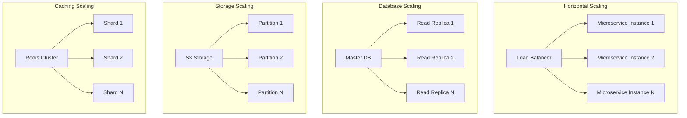

# Cloud Storage System - Architecture Diagrams

## 1. High-Level System Architecture

## 2. File Upload Flow

## 3. File Synchronization Architecture

## 4. Data Deduplication Process

## 5. Conflict Resolution Flow

## 6. Database Schema Relationships

## 7. Microservices Communication

## 8. Caching Strategy

## 9. Security Architecture

## 10. Scalability Patterns

