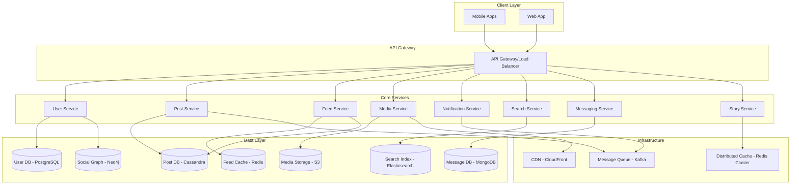

# Instagram Clone - System Design

## Understanding System Design

### What is System Design?
System design is the process of defining the architecture, components, modules, interfaces, and data for a system to satisfy specified requirements. For Instagram, we're designing a system that can handle billions of users sharing photos and videos in real-time.

### Why System Design Matters?
1. **Scalability**: Handle growth from 1 user to 2 billion users
2. **Reliability**: System should work 99.99% of the time
3. **Performance**: Users expect fast responses (<200ms)
4. **Cost**: Efficient use of resources saves millions of dollars
5. **Maintainability**: Code should be easy to update and debug

### System Design Process
1. **Gather Requirements**: What features do we need?
2. **Estimate Scale**: How many users, requests, data?
3. **Design High-Level**: Major components and their interactions
4. **Design Low-Level**: Detailed implementation of each component
5. **Scale the Design**: Handle bottlenecks and failures

## 1. Requirements

### Understanding Requirements Gathering
Before building any system, we must clearly define what it should do. Requirements are divided into two types:

#### Functional Requirements (What the system does)
These define the features and capabilities:
- **User Management**: Users can create accounts, login, manage profiles
- **Content Sharing**: Users can upload photos/videos with captions
- **Social Features**: Users can follow others, like posts, comment
- **Feed Generation**: Users see personalized timeline of posts
- **Search**: Users can find other users, posts, hashtags
- **Messaging**: Private communication between users
- **Stories**: Temporary content that expires in 24 hours

#### Non-Functional Requirements (How well the system performs)
These define quality attributes:
- **Scale**: Support 2 billion users, 100 million daily active users
- **Performance**: Feed loads in <200ms, interactions in <100ms
- **Availability**: 99.99% uptime (only 52 minutes downtime per year)
- **Consistency**: User sees their own posts immediately (strong consistency)
- **Durability**: Never lose user photos/videos (99.999999999% durability)
- **Security**: Protect user data, prevent unauthorized access

### Functional Requirements
- **User Management**: Registration, authentication, profile management
- **Content Management**: Photo/video upload, stories, reels
- **Social Features**: Follow/unfollow, likes, comments, shares
- **News Feed**: Personalized timeline with posts from followed users
- **Search**: Users, hashtags, locations
- **Direct Messaging**: Private messaging between users
- **Notifications**: Real-time notifications for interactions
- **Stories**: 24-hour temporary content
- **Live Streaming**: Real-time video broadcasting

### Non-Functional Requirements
- **Scale**: 2B users, 100M DAU, 500M posts/day
- **Availability**: 99.99% uptime
- **Latency**: <200ms for feed, <100ms for interactions
- **Durability**: 99.999999999% (11 9's) for media storage
- **Consistency**: Eventual consistency for social features, strong consistency for financial data
- **Security**: End-to-end encryption, data privacy compliance

### Requirements Trade-offs
In system design, we often face trade-offs:
- **Consistency vs Availability**: Can't have both perfect consistency and 100% availability
- **Performance vs Cost**: Faster systems cost more money
- **Features vs Simplicity**: More features make system more complex

For Instagram, we prioritize:
1. **Availability over Consistency**: Better to show slightly stale data than no data
2. **Performance over Cost**: User experience is worth the extra cost
3. **Scalability over Simplicity**: Handle billions of users even if it's complex

## 2. Capacity Estimation

### Why Capacity Planning Matters
Capacity estimation helps us:
1. **Choose Right Technology**: Different databases for different scales
2. **Plan Infrastructure**: How many servers do we need?
3. **Estimate Costs**: What will this system cost to run?
4. **Identify Bottlenecks**: Where will the system break first?

### Estimation Methodology
We use "back-of-the-envelope" calculations:
1. **Start with Users**: How many total and daily active users?
2. **Estimate Usage**: How much do users use the system?
3. **Calculate Resources**: Storage, bandwidth, compute needed
4. **Add Safety Margin**: Real usage is often higher than estimates

### Key Estimation Principles
- **Round Numbers**: Use 1M instead of 1,234,567 for simplicity
- **Conservative Estimates**: Better to over-estimate than under-estimate
- **Peak vs Average**: System must handle peak load, not just average
- **Growth Factor**: Plan for 3-5 years of growth

### Storage Requirements
- **Users**: 2B users × 1KB metadata = 2TB
- **Posts**: 500M posts/day × 365 days × 5 years × 2MB avg = 1.8PB
- **Media**: 100M photos/day × 2MB + 10M videos/day × 50MB = 700TB/day
- **Total**: ~10PB over 5 years

### Bandwidth Requirements
- **Read**: 100M DAU × 50 posts viewed × 2MB = 10TB/day = 115GB/s
- **Write**: 500M posts/day × 2MB = 1TB/day = 11.5GB/s
- **Peak**: 3x average = 345GB/s read, 34.5GB/s write

### QPS Estimation
- **Feed Generation**: 100M DAU × 10 refreshes/day = 11.5K QPS
- **Post Interactions**: 100M DAU × 100 interactions/day = 115K QPS
- **Media Uploads**: 500M posts/day = 5.8K QPS
- **Search**: 100M DAU × 5 searches/day = 5.8K QPS

### Storage Calculation Breakdown
```
User Data Calculation:
- 2B users × 1KB per user = 2TB
- Why 1KB? Username (50B) + email (100B) + profile info (850B)

Post Data Calculation:
- 500M posts/day × 365 days × 5 years = 912.5B posts
- Each post metadata: 2KB (caption, hashtags, timestamps)
- Total: 912.5B × 2KB = 1.8PB

Media Storage Calculation:
- Photos: 100M photos/day × 2MB avg = 200TB/day
- Videos: 10M videos/day × 50MB avg = 500TB/day
- Total: 700TB/day × 365 × 5 years = 1.28PB
```

### Bandwidth Calculation Breakdown
```
Read Traffic:
- 100M DAU × 50 posts viewed × 2MB = 10PB/day
- 10PB/day ÷ 86,400 seconds = 115GB/s
- Peak (3x average) = 345GB/s

Write Traffic:
- 500M posts/day × 2MB = 1TB/day
- 1TB/day ÷ 86,400 seconds = 11.5GB/s
- Peak (5x average) = 57.5GB/s
```

## 3. High-Level Design

### Design Philosophy
High-Level Design (HLD) focuses on the big picture:
1. **Major Components**: What are the main building blocks?
2. **Component Interactions**: How do they communicate?
3. **Data Flow**: How does data move through the system?
4. **Technology Choices**: What databases, frameworks to use?

### Microservices vs Monolith

#### Monolithic Architecture
- **Structure**: One large application with all features
- **Pros**: Simple to develop, test, and deploy initially
- **Cons**: Hard to scale, technology lock-in, team bottlenecks
- **Good for**: Small teams, simple applications

#### Microservices Architecture
- **Structure**: Multiple small, independent services
- **Pros**: Independent scaling, technology diversity, team autonomy
- **Cons**: Complex deployment, network overhead, data consistency
- **Good for**: Large teams, complex applications, high scale

### Why Microservices for Instagram?
1. **Scale**: Different services have different scaling needs
2. **Team Structure**: Different teams can own different services
3. **Technology**: Use best database for each use case
4. **Reliability**: Failure in one service doesn't bring down everything

### Microservices Architecture



### Service Communication Patterns

#### Synchronous Communication (HTTP/REST)
- **When**: Real-time requests (user login, get profile)
- **Pros**: Simple, immediate response
- **Cons**: Services must be available, can create cascading failures

#### Asynchronous Communication (Message Queues)
- **When**: Background processing (send notification, process media)
- **Pros**: Decoupled, fault-tolerant, scalable
- **Cons**: Eventual consistency, more complex

### Load Balancer Strategy
- **Round Robin**: Distribute requests evenly across servers
- **Least Connections**: Send to server with fewest active connections
- **Health Checks**: Don't send requests to unhealthy servers
- **Sticky Sessions**: Send user's requests to same server (if needed)

## 4. Database Design

### Database Selection Criteria
Choosing the right database is crucial for performance and scalability:

#### ACID Properties (Traditional Databases)
- **Atomicity**: All operations in transaction succeed or fail together
- **Consistency**: Database remains in valid state after transactions
- **Isolation**: Concurrent transactions don't interfere
- **Durability**: Committed data survives system failures

#### CAP Theorem (Distributed Systems)
You can only guarantee 2 out of 3:
- **Consistency**: All nodes see same data simultaneously
- **Availability**: System remains operational
- **Partition Tolerance**: System continues despite network failures

### Database Choices Explained

#### PostgreSQL for User Data
- **Why**: ACID compliance for critical user data
- **ACID Needed**: User accounts, passwords, financial data
- **Features**: Strong consistency, complex queries, transactions
- **Trade-off**: Less scalable than NoSQL, but data integrity is crucial

#### Cassandra for Posts
- **Why**: Handles massive write loads, eventual consistency OK
- **Scale**: Designed for billions of records
- **Features**: Auto-sharding, multi-region replication
- **Trade-off**: Eventual consistency, limited query flexibility

#### Redis for Caching
- **Why**: In-memory storage for ultra-fast reads
- **Use Cases**: Session data, feed cache, frequently accessed data
- **Features**: Sub-millisecond latency, data structures
- **Trade-off**: Expensive (RAM costs more than disk)

#### Neo4j for Social Graph
- **Why**: Optimized for relationship queries
- **Use Cases**: "Friends of friends", recommendation algorithms
- **Features**: Graph traversal, relationship-first design
- **Trade-off**: Specialized use case, learning curve

### User Service - PostgreSQL
```sql
-- Users table
CREATE TABLE users (
    user_id BIGSERIAL PRIMARY KEY,
    username VARCHAR(50) UNIQUE NOT NULL,
    email VARCHAR(255) UNIQUE NOT NULL,
    password_hash VARCHAR(255) NOT NULL,
    full_name VARCHAR(255),
    bio TEXT,
    profile_picture_url VARCHAR(500),
    is_verified BOOLEAN DEFAULT FALSE,
    is_private BOOLEAN DEFAULT FALSE,
    follower_count INTEGER DEFAULT 0,
    following_count INTEGER DEFAULT 0,
    post_count INTEGER DEFAULT 0,
    created_at TIMESTAMP DEFAULT CURRENT_TIMESTAMP,
    updated_at TIMESTAMP DEFAULT CURRENT_TIMESTAMP
);

-- User sessions
CREATE TABLE user_sessions (
    session_id VARCHAR(255) PRIMARY KEY,
    user_id BIGINT REFERENCES users(user_id),
    device_info JSONB,
    created_at TIMESTAMP DEFAULT CURRENT_TIMESTAMP,
    expires_at TIMESTAMP NOT NULL
);
```

### Social Graph - Neo4j
```cypher
// User nodes
CREATE (u:User {
    userId: $userId,
    username: $username,
    createdAt: datetime()
})

// Follow relationships
CREATE (u1:User)-[:FOLLOWS {createdAt: datetime()}]->(u2:User)

// Block relationships
CREATE (u1:User)-[:BLOCKS {createdAt: datetime()}]->(u2:User)
```

### Post Service - Cassandra
```cql
-- Posts table (partitioned by user_id for efficient user timeline queries)
CREATE TABLE posts (
    post_id UUID,
    user_id BIGINT,
    content TEXT,
    media_urls LIST<TEXT>,
    hashtags SET<TEXT>,
    location TEXT,
    like_count COUNTER,
    comment_count COUNTER,
    share_count COUNTER,
    created_at TIMESTAMP,
    PRIMARY KEY (user_id, created_at, post_id)
) WITH CLUSTERING ORDER BY (created_at DESC);

-- Global posts index (for feed generation)
CREATE TABLE posts_by_time (
    time_bucket TEXT, -- YYYY-MM-DD-HH for partitioning
    created_at TIMESTAMP,
    post_id UUID,
    user_id BIGINT,
    PRIMARY KEY (time_bucket, created_at, post_id)
) WITH CLUSTERING ORDER BY (created_at DESC);

-- Likes table
CREATE TABLE post_likes (
    post_id UUID,
    user_id BIGINT,
    created_at TIMESTAMP,
    PRIMARY KEY (post_id, user_id)
);

-- Comments table
CREATE TABLE post_comments (
    comment_id UUID,
    post_id UUID,
    user_id BIGINT,
    content TEXT,
    parent_comment_id UUID,
    like_count COUNTER,
    created_at TIMESTAMP,
    PRIMARY KEY (post_id, created_at, comment_id)
) WITH CLUSTERING ORDER BY (created_at DESC);
```

### Messaging Service - MongoDB
```javascript
// Messages collection
{
  _id: ObjectId,
  conversationId: String,
  senderId: Long,
  receiverId: Long,
  messageType: String, // text, image, video
  content: String,
  mediaUrl: String,
  isRead: Boolean,
  createdAt: Date,
  updatedAt: Date
}

// Conversations collection
{
  _id: ObjectId,
  participants: [Long],
  lastMessage: {
    content: String,
    senderId: Long,
    timestamp: Date
  },
  unreadCount: Map, // userId -> count
  createdAt: Date,
  updatedAt: Date
}
```

### Database Schema Design Principles

#### Normalization vs Denormalization
- **Normalization**: Reduce data duplication, maintain consistency
- **Denormalization**: Duplicate data for faster reads
- **Instagram Choice**: Normalize user data, denormalize for performance

#### Indexing Strategy
- **Primary Index**: Unique identifier (user_id, post_id)
- **Secondary Index**: Query optimization (username, created_at)
- **Composite Index**: Multiple columns (user_id + created_at)
- **Trade-off**: Faster reads, slower writes, more storage

#### Partitioning/Sharding
- **Horizontal Partitioning**: Split rows across multiple databases
- **Vertical Partitioning**: Split columns across databases
- **Sharding Key**: How to decide which shard (user_id hash)
- **Benefits**: Distribute load, scale beyond single server limits

### Data Consistency Models

#### Strong Consistency
- **Definition**: All reads get the most recent write
- **Use Case**: User profile updates, financial transactions
- **Implementation**: Synchronous replication, locks

#### Eventual Consistency
- **Definition**: System will become consistent over time
- **Use Case**: Social media posts, likes, comments
- **Implementation**: Asynchronous replication, conflict resolution

#### Weak Consistency
- **Definition**: No guarantees about when data becomes consistent
- **Use Case**: Analytics, logging, non-critical data
- **Implementation**: Fire-and-forget, best effort

## 5. API Design

### REST API Principles
Representational State Transfer (REST) is an architectural style for web services:

#### REST Constraints
1. **Stateless**: Each request contains all needed information
2. **Client-Server**: Separation of concerns
3. **Cacheable**: Responses can be cached for performance
4. **Uniform Interface**: Consistent API design
5. **Layered System**: Can add proxies, gateways

#### HTTP Methods
- **GET**: Retrieve data (idempotent, safe)
- **POST**: Create new resource
- **PUT**: Update entire resource (idempotent)
- **PATCH**: Partial update
- **DELETE**: Remove resource (idempotent)

#### Status Codes
- **200 OK**: Successful request
- **201 Created**: Resource created successfully
- **400 Bad Request**: Invalid request data
- **401 Unauthorized**: Authentication required
- **403 Forbidden**: Access denied
- **404 Not Found**: Resource doesn't exist
- **500 Internal Server Error**: Server error

### API Design Best Practices

#### Versioning
- **URL Versioning**: `/api/v1/users`
- **Header Versioning**: `Accept: application/vnd.api+json;version=1`
- **Why Needed**: Backward compatibility, gradual migration

#### Pagination
- **Offset-based**: `?page=2&size=20`
- **Cursor-based**: `?cursor=abc123&size=20`
- **Why Needed**: Large datasets, performance, user experience

#### Rate Limiting
- **Purpose**: Prevent abuse, ensure fair usage
- **Implementation**: Token bucket, sliding window
- **Headers**: `X-RateLimit-Remaining`, `X-RateLimit-Reset`

### User Service APIs
```yaml
# User Registration
POST /api/v1/users/register
Request:
  username: string
  email: string
  password: string
  fullName: string
Response:
  userId: long
  accessToken: string
  refreshToken: string

# User Login
POST /api/v1/users/login
Request:
  email: string
  password: string
Response:
  userId: long
  accessToken: string
  refreshToken: string

# Get User Profile
GET /api/v1/users/{userId}
Response:
  userId: long
  username: string
  fullName: string
  bio: string
  profilePictureUrl: string
  isVerified: boolean
  isPrivate: boolean
  followerCount: int
  followingCount: int
  postCount: int

# Follow User
POST /api/v1/users/{userId}/follow
Request:
  targetUserId: long
Response:
  success: boolean

# Get Followers
GET /api/v1/users/{userId}/followers?page=0&size=20
Response:
  users: [UserProfile]
  hasNext: boolean
```

### Post Service APIs
```yaml
# Create Post
POST /api/v1/posts
Request:
  content: string
  mediaUrls: [string]
  hashtags: [string]
  location: string
Response:
  postId: string
  createdAt: timestamp

# Get Post
GET /api/v1/posts/{postId}
Response:
  postId: string
  userId: long
  username: string
  content: string
  mediaUrls: [string]
  hashtags: [string]
  location: string
  likeCount: int
  commentCount: int
  shareCount: int
  isLiked: boolean
  createdAt: timestamp

# Like Post
POST /api/v1/posts/{postId}/like
Response:
  success: boolean
  likeCount: int

# Add Comment
POST /api/v1/posts/{postId}/comments
Request:
  content: string
  parentCommentId: string (optional)
Response:
  commentId: string
  createdAt: timestamp
```

### Feed Service APIs
```yaml
# Get News Feed
GET /api/v1/feed?page=0&size=20
Response:
  posts: [PostDetails]
  hasNext: boolean
  nextCursor: string

# Get User Timeline
GET /api/v1/users/{userId}/posts?page=0&size=20
Response:
  posts: [PostDetails]
  hasNext: boolean
```

### Authentication & Authorization

#### JWT (JSON Web Tokens)
- **Structure**: Header.Payload.Signature
- **Benefits**: Stateless, scalable, secure
- **Contains**: User ID, permissions, expiry
- **Verification**: Cryptographic signature prevents tampering

#### OAuth 2.0
- **Purpose**: Third-party authentication (Google, Facebook login)
- **Flow**: Redirect to provider → User consents → Get access token
- **Benefits**: User doesn't share password with Instagram

#### Session Management
- **Access Token**: Short-lived (1 hour), used for API requests
- **Refresh Token**: Long-lived (30 days), used to get new access tokens
- **Why Both**: Security (limit exposure) + User experience (don't login often)

## 6. Detailed Component Design

### Component Design Philosophy
Detailed component design focuses on:
1. **Internal Architecture**: How does each service work internally?
2. **Algorithms**: What algorithms solve our problems efficiently?
3. **Data Structures**: How do we organize data in memory?
4. **Performance Optimization**: How do we make it fast?

### Feed Generation Deep Dive

#### The Timeline Problem
Generating a user's timeline is Instagram's core technical challenge:
- **Input**: User follows 1000 people
- **Challenge**: Show most relevant recent posts
- **Constraints**: <200ms response time, personalized ranking
- **Scale**: 100M users requesting feeds simultaneously

#### Algorithm Comparison

##### Pull Model (Fan-out on Read)
```python
def generate_feed_pull(user_id):
    following = get_following_list(user_id)  # 1000 users
    posts = []
    for followed_user in following:
        user_posts = get_recent_posts(followed_user, limit=10)
        posts.extend(user_posts)
    
    # Sort by relevance score
    posts.sort(key=lambda p: calculate_score(p, user_id))
    return posts[:20]
```
**Pros**: Always fresh, no storage overhead
**Cons**: Slow (1000 database queries), expensive CPU

##### Push Model (Fan-out on Write)
```python
def fanout_post(post_id, author_id):
    followers = get_followers(author_id)  # Could be millions
    for follower_id in followers:
        add_to_feed_cache(follower_id, post_id)
        
def generate_feed_push(user_id):
    return get_cached_feed(user_id)  # Single fast query
```
**Pros**: Fast reads (pre-computed)
**Cons**: Storage overhead, celebrity problem

##### Hybrid Model (Best of Both)
```python
def fanout_post_hybrid(post_id, author_id):
    followers = get_followers(author_id)
    
    if len(followers) > CELEBRITY_THRESHOLD:  # 1M followers
        # Don't fanout for celebrities
        mark_as_celebrity_post(post_id)
    else:
        # Fanout for regular users
        for follower_id in followers:
            add_to_feed_cache(follower_id, post_id)

def generate_feed_hybrid(user_id):
    # Get cached posts from regular users
    cached_posts = get_cached_feed(user_id)
    
    # Get recent posts from celebrities user follows
    celebrities = get_followed_celebrities(user_id)
    celebrity_posts = get_recent_celebrity_posts(celebrities)
    
    # Merge and rank
    all_posts = cached_posts + celebrity_posts
    return rank_posts(all_posts, user_id)
```

### Feed Generation Algorithm

#### Pull Model (On-demand)
```python
def generate_feed(user_id, page_size=20, cursor=None):
    # Get user's following list from cache
    following_list = redis.get(f"following:{user_id}")
    
    if not following_list:
        following_list = get_following_from_db(user_id)
        redis.setex(f"following:{user_id}", 3600, following_list)
    
    # Fetch recent posts from followed users
    posts = []
    for followed_user in following_list:
        user_posts = cassandra.execute(
            "SELECT * FROM posts WHERE user_id = ? AND created_at > ? LIMIT ?",
            [followed_user, cursor or datetime.now() - timedelta(days=7), 10]
        )
        posts.extend(user_posts)
    
    # Sort by engagement score and recency
    posts.sort(key=lambda p: calculate_engagement_score(p), reverse=True)
    
    return posts[:page_size]

def calculate_engagement_score(post):
    age_hours = (datetime.now() - post.created_at).total_seconds() / 3600
    return (post.like_count * 1.0 + post.comment_count * 2.0 + post.share_count * 3.0) / (age_hours + 1)
```

#### Push Model (Pre-computed for celebrities)
```python
def fanout_post(post_id, user_id):
    # Get followers (limit fanout for celebrities)
    followers = get_followers(user_id)
    
    if len(followers) > 1000000:  # Celebrity threshold
        # Use pull model for celebrities
        return
    
    # Push to followers' feeds
    for follower_id in followers:
        redis.zadd(
            f"feed:{follower_id}",
            {post_id: time.time()}
        )
        # Keep only recent 1000 posts
        redis.zremrangebyrank(f"feed:{follower_id}", 0, -1001)
```

### Media Processing Pipeline

```python
class MediaProcessor:
    def process_upload(self, file, user_id):
        # Generate unique filename
        file_id = generate_uuid()
        
        # Upload original to S3
        s3_key = f"media/{user_id}/{file_id}/original"
        s3.upload_file(file, bucket, s3_key)
        
        # Queue for async processing
        kafka.send('media-processing', {
            'fileId': file_id,
            'userId': user_id,
            's3Key': s3_key,
            'mediaType': detect_media_type(file)
        })
        
        return file_id
    
    def process_media_async(self, message):
        file_id = message['fileId']
        s3_key = message['s3Key']
        
        if message['mediaType'] == 'image':
            # Generate thumbnails
            sizes = [(150, 150), (320, 320), (640, 640), (1080, 1080)]
            for width, height in sizes:
                thumbnail = resize_image(s3_key, width, height)
                s3.upload_file(thumbnail, bucket, f"media/{file_id}/thumb_{width}x{height}")
        
        elif message['mediaType'] == 'video':
            # Generate video thumbnails and different quality versions
            generate_video_thumbnail(s3_key, f"media/{file_id}/thumbnail.jpg")
            transcode_video(s3_key, f"media/{file_id}/720p.mp4", "720p")
            transcode_video(s3_key, f"media/{file_id}/480p.mp4", "480p")
```

### Real-time Notifications

```python
class NotificationService:
    def send_notification(self, user_id, notification_type, data):
        notification = {
            'userId': user_id,
            'type': notification_type,
            'data': data,
            'timestamp': time.time()
        }
        
        # Store in database
        mongo.notifications.insert_one(notification)
        
        # Send real-time via WebSocket
        websocket_manager.send_to_user(user_id, notification)
        
        # Send push notification
        push_service.send_push(user_id, notification)
    
    def handle_post_like(self, post_id, liker_id):
        post = get_post(post_id)
        if post.user_id != liker_id:  # Don't notify self-likes
            self.send_notification(
                post.user_id,
                'POST_LIKED',
                {
                    'postId': post_id,
                    'likerId': liker_id,
                    'likerUsername': get_username(liker_id)
                }
            )
```

### Search Service

```python
class SearchService:
    def index_post(self, post):
        doc = {
            'postId': post.post_id,
            'userId': post.user_id,
            'username': get_username(post.user_id),
            'content': post.content,
            'hashtags': post.hashtags,
            'location': post.location,
            'createdAt': post.created_at,
            'likeCount': post.like_count
        }
        
        elasticsearch.index(
            index='posts',
            id=post.post_id,
            body=doc
        )
    
    def search_posts(self, query, filters=None):
        search_body = {
            'query': {
                'bool': {
                    'should': [
                        {'match': {'content': {'query': query, 'boost': 2}}},
                        {'match': {'hashtags': {'query': query, 'boost': 3}}},
                        {'match': {'username': {'query': query, 'boost': 1}}}
                    ]
                }
            },
            'sort': [
                {'_score': {'order': 'desc'}},
                {'createdAt': {'order': 'desc'}}
            ]
        }
        
        if filters:
            search_body['query']['bool']['filter'] = filters
        
        return elasticsearch.search(index='posts', body=search_body)
```

### Ranking Algorithm Deep Dive

#### Engagement Score Calculation
```python
def calculate_engagement_score(post, user):
    # Time decay: newer posts get higher scores
    age_hours = (now() - post.created_at).hours
    time_score = 1.0 / (1 + age_hours * 0.1)
    
    # Engagement signals
    like_score = post.like_count * 1.0
    comment_score = post.comment_count * 2.0  # Comments worth more
    share_score = post.share_count * 3.0      # Shares worth most
    
    # User relationship strength
    relationship_score = get_relationship_strength(user, post.author)
    
    # Content type preference
    content_score = get_content_preference(user, post.type)
    
    return (like_score + comment_score + share_score) * \
           time_score * relationship_score * content_score
```

#### Machine Learning Enhancement
- **Training Data**: User interactions (likes, comments, time spent)
- **Features**: Post content, author, time, user history
- **Model**: Neural network predicting engagement probability
- **A/B Testing**: Compare ML model vs simple algorithm

### Media Processing Architecture

#### Async Processing Benefits
1. **User Experience**: Upload appears instant
2. **Scalability**: Process on separate servers
3. **Reliability**: Retry failed processing
4. **Cost**: Use cheaper batch processing

#### Processing Pipeline
```python
class MediaProcessor:
    def process_upload(self, file, user_id):
        # 1. Quick validation
        if not self.is_valid_file(file):
            raise InvalidFileError()
        
        # 2. Generate unique ID
        media_id = generate_uuid()
        
        # 3. Upload original to temporary storage
        temp_url = upload_to_temp_storage(file, media_id)
        
        # 4. Queue for processing
        self.queue_processing_job({
            'media_id': media_id,
            'user_id': user_id,
            'temp_url': temp_url,
            'file_type': detect_file_type(file)
        })
        
        return media_id  # Return immediately
    
    def process_async(self, job):
        # This runs on background workers
        media_id = job['media_id']
        
        # Download from temp storage
        original_file = download_file(job['temp_url'])
        
        if job['file_type'] == 'image':
            self.process_image(original_file, media_id)
        elif job['file_type'] == 'video':
            self.process_video(original_file, media_id)
        
        # Clean up temp storage
        delete_temp_file(job['temp_url'])
```

## 7. Scalability Considerations

### Understanding Scalability
Scalability is the ability to handle increased load by adding resources to the system.

#### Types of Scaling

##### Vertical Scaling (Scale Up)
- **Definition**: Add more power to existing servers
- **Example**: Upgrade from 4 CPU cores to 16 CPU cores
- **Pros**: Simple, no code changes needed
- **Cons**: Hardware limits, expensive, single point of failure
- **When to Use**: Quick fix, legacy systems

##### Horizontal Scaling (Scale Out)
- **Definition**: Add more servers to the system
- **Example**: Go from 10 servers to 100 servers
- **Pros**: No theoretical limit, cost-effective, fault-tolerant
- **Cons**: Complex, requires stateless design
- **When to Use**: High growth, modern architectures

### Scaling Strategies by Component

#### Application Tier Scaling
- **Stateless Design**: Servers don't store user session data
- **Load Balancing**: Distribute requests across multiple servers
- **Auto-scaling**: Automatically add/remove servers based on load
- **Health Checks**: Remove unhealthy servers from rotation

#### Database Scaling

##### Read Replicas
- **Purpose**: Handle read-heavy workloads
- **Setup**: Master handles writes, replicas handle reads
- **Benefits**: Distribute read load, improve performance
- **Challenges**: Replication lag, data consistency

##### Sharding (Horizontal Partitioning)
- **Purpose**: Distribute data across multiple databases
- **Sharding Key**: Determine which shard (user_id % num_shards)
- **Benefits**: Scale beyond single server limits
- **Challenges**: Cross-shard queries, rebalancing

```python
class DatabaseSharding:
    def __init__(self, num_shards=100):
        self.num_shards = num_shards
        self.shards = [connect_to_db(f"shard_{i}") for i in range(num_shards)]
    
    def get_shard(self, user_id):
        shard_id = hash(user_id) % self.num_shards
        return self.shards[shard_id]
    
    def get_user(self, user_id):
        shard = self.get_shard(user_id)
        return shard.query("SELECT * FROM users WHERE user_id = ?", user_id)
```

### Horizontal Scaling
- **Stateless Services**: All microservices are stateless for easy horizontal scaling
- **Database Sharding**: Cassandra auto-sharding, PostgreSQL sharded by user_id
- **CDN**: Global CDN for media delivery with edge caching
- **Load Balancing**: Multiple load balancer layers with health checks

### Caching Strategy
- **L1 Cache**: Application-level caching (Caffeine)
- **L2 Cache**: Redis cluster for distributed caching
- **L3 Cache**: CDN for static content
- **Cache Patterns**: Write-through for critical data, write-behind for analytics

### Data Partitioning
- **User Data**: Sharded by user_id hash
- **Posts**: Partitioned by user_id and time
- **Social Graph**: Distributed across Neo4j cluster
- **Messages**: Sharded by conversation_id

### Caching Strategy Deep Dive

#### Cache Levels
1. **L1 (Application Cache)**: In-memory cache within each server
2. **L2 (Distributed Cache)**: Redis cluster shared across servers
3. **L3 (CDN Cache)**: Global edge locations for static content

#### Cache Patterns

##### Cache-Aside (Lazy Loading)
```python
def get_user_profile(user_id):
    # Try cache first
    profile = cache.get(f"user:{user_id}")
    if profile:
        return profile  # Cache hit
    
    # Cache miss - get from database
    profile = database.get_user(user_id)
    
    # Store in cache for next time
    cache.set(f"user:{user_id}", profile, ttl=3600)
    return profile
```

##### Write-Through
```python
def update_user_profile(user_id, profile):
    # Update database first
    database.update_user(user_id, profile)
    
    # Update cache
    cache.set(f"user:{user_id}", profile, ttl=3600)
```

##### Write-Behind (Write-Back)
```python
def update_user_profile(user_id, profile):
    # Update cache immediately
    cache.set(f"user:{user_id}", profile, ttl=3600)
    
    # Queue database update for later
    queue_db_update(user_id, profile)
```

#### Cache Invalidation
- **TTL (Time To Live)**: Automatic expiry after time period
- **Manual Invalidation**: Remove when data changes
- **Cache Warming**: Pre-populate cache with likely-needed data

### Content Delivery Network (CDN)

#### How CDN Works
1. **User Request**: User in Tokyo requests image
2. **Edge Server**: Request goes to Tokyo edge server
3. **Cache Check**: Edge server checks if it has the image
4. **Origin Fetch**: If not cached, fetch from origin server
5. **Cache & Serve**: Cache image locally and serve to user
6. **Future Requests**: Subsequent requests served from Tokyo cache

#### CDN Benefits
- **Latency**: Serve content from nearby servers
- **Bandwidth**: Reduce load on origin servers
- **Availability**: Content available even if origin is down
- **DDoS Protection**: Absorb malicious traffic at edge

## 8. Security & Privacy

### Security Fundamentals

#### CIA Triad
1. **Confidentiality**: Only authorized users access data
2. **Integrity**: Data hasn't been tampered with
3. **Availability**: System is accessible when needed

#### Defense in Depth
Multiple layers of security controls:
1. **Physical Security**: Secure data centers
2. **Network Security**: Firewalls, VPNs
3. **Application Security**: Input validation, authentication
4. **Data Security**: Encryption, access controls

### Common Security Threats

#### SQL Injection
```sql
-- Vulnerable code
query = "SELECT * FROM users WHERE username = '" + username + "'"

-- Malicious input: username = "admin'; DROP TABLE users; --"
-- Results in: SELECT * FROM users WHERE username = 'admin'; DROP TABLE users; --'
```

**Prevention**: Use parameterized queries
```python
# Safe code
cursor.execute("SELECT * FROM users WHERE username = ?", (username,))
```

#### Cross-Site Scripting (XSS)
```html
<!-- Vulnerable: Directly inserting user input -->
<div>Welcome, {{username}}</div>

<!-- If username = "<script>alert('XSS')</script>" -->
<!-- Results in: <div>Welcome, <script>alert('XSS')</script></div> -->
```

**Prevention**: Escape user input
```html
<!-- Safe: Escaped output -->
<div>Welcome, {{username|escape}}</div>
```

#### Cross-Site Request Forgery (CSRF)
- **Attack**: Trick user into making unintended requests
- **Example**: Malicious site makes user follow someone on Instagram
- **Prevention**: CSRF tokens, SameSite cookies

### Authentication Deep Dive

#### Password Security
```python
import bcrypt

def hash_password(password):
    # Generate salt and hash password
    salt = bcrypt.gensalt()
    hashed = bcrypt.hashpw(password.encode('utf-8'), salt)
    return hashed

def verify_password(password, hashed):
    return bcrypt.checkpw(password.encode('utf-8'), hashed)
```

#### Multi-Factor Authentication (MFA)
1. **Something you know**: Password
2. **Something you have**: Phone (SMS code)
3. **Something you are**: Fingerprint, face recognition

### Data Privacy Compliance

#### GDPR (General Data Protection Regulation)
- **Scope**: EU residents' data
- **Rights**: Access, rectification, erasure, portability
- **Penalties**: Up to 4% of annual revenue
- **Implementation**: Data mapping, consent management, breach notification

#### Data Minimization
- **Principle**: Collect only necessary data
- **Example**: Don't store full credit card numbers if not needed
- **Benefits**: Reduced risk, compliance, user trust

### Authentication & Authorization
- **JWT Tokens**: Stateless authentication with refresh tokens
- **OAuth2**: Third-party login integration
- **Rate Limiting**: Per-user and per-IP rate limits
- **API Security**: Input validation, SQL injection prevention

### Data Privacy
- **Encryption**: AES-256 for data at rest, TLS 1.3 for data in transit
- **GDPR Compliance**: Right to deletion, data portability
- **Privacy Controls**: Private accounts, content visibility settings
- **Audit Logging**: Comprehensive audit trails

### Content Moderation
- **AI Moderation**: Automated content scanning for inappropriate content
- **Human Review**: Escalation to human moderators
- **Community Guidelines**: Clear policies and enforcement
- **Reporting System**: User reporting and appeals process

### Encryption Implementation

#### Data at Rest
```python
from cryptography.fernet import Fernet

class DataEncryption:
    def __init__(self):
        self.key = Fernet.generate_key()  # Store securely
        self.cipher = Fernet(self.key)
    
    def encrypt_data(self, data):
        return self.cipher.encrypt(data.encode())
    
    def decrypt_data(self, encrypted_data):
        return self.cipher.decrypt(encrypted_data).decode()
```

#### Data in Transit
- **TLS 1.3**: Encrypt all network communication
- **Certificate Management**: Proper SSL certificate handling
- **HSTS**: Force HTTPS connections

## 9. Monitoring & Observability

### Observability vs Monitoring

#### Monitoring (Traditional)
- **Definition**: Watching known problems
- **Approach**: Set thresholds, alert when exceeded
- **Example**: Alert when CPU > 80%
- **Good for**: Known failure modes

#### Observability (Modern)
- **Definition**: Understanding system behavior from outputs
- **Approach**: Collect rich data, explore to find problems
- **Example**: Trace slow requests across all services
- **Good for**: Unknown problems, complex systems

### The Three Pillars

#### 1. Metrics (What happened?)
```python
# Counter: Things that only increase
post_creation_count = Counter('posts_created_total', 'Total posts created')
post_creation_count.inc()  # Increment by 1

# Gauge: Values that go up and down
active_users = Gauge('active_users_current', 'Current active users')
active_users.set(1500)  # Set to specific value

# Histogram: Distribution of values
request_duration = Histogram('request_duration_seconds', 'Request duration')
with request_duration.time():
    process_request()  # Automatically measure duration
```

#### 2. Logs (What happened in detail?)
```python
import logging
import json

# Structured logging
logger = logging.getLogger(__name__)

def create_post(user_id, content):
    logger.info("Creating post", extra={
        "user_id": user_id,
        "content_length": len(content),
        "timestamp": time.time(),
        "trace_id": get_trace_id()
    })
```

#### 3. Traces (How did it flow?)
```python
from opentelemetry import trace

tracer = trace.get_tracer(__name__)

def create_post(user_id, content):
    with tracer.start_as_current_span("create_post") as span:
        span.set_attribute("user.id", user_id)
        
        # This creates child spans automatically
        validate_content(content)
        save_to_database(user_id, content)
        update_feed_cache(user_id)
```

### Key Metrics for Instagram

#### Business Metrics
- **Daily Active Users (DAU)**: Unique users per day
- **Monthly Active Users (MAU)**: Unique users per month
- **Engagement Rate**: (Likes + Comments + Shares) / Posts
- **Content Creation Rate**: Posts/Stories created per day
- **Revenue per User**: Ad revenue / Active users

#### Technical Metrics
- **Latency Percentiles**: P50, P95, P99 response times
- **Error Rate**: Failed requests / Total requests
- **Throughput**: Requests per second
- **Availability**: Uptime percentage

#### Infrastructure Metrics
- **CPU Utilization**: Percentage of CPU used
- **Memory Usage**: RAM consumption
- **Disk I/O**: Read/write operations per second
- **Network Bandwidth**: Data transfer rates

### Alerting Strategy

#### Alert Fatigue Prevention
- **Meaningful Alerts**: Only alert on actionable issues
- **Proper Thresholds**: Avoid false positives
- **Alert Grouping**: Combine related alerts
- **Escalation**: Route to appropriate team members

#### SLI/SLO/SLA Framework
- **SLI (Service Level Indicator)**: What you measure (latency, error rate)
- **SLO (Service Level Objective)**: Target you want to achieve (99.9% uptime)
- **SLA (Service Level Agreement)**: Contract with users (99.5% guaranteed)

```python
# Example SLI calculation
def calculate_availability_sli():
    total_requests = get_total_requests_last_hour()
    successful_requests = get_successful_requests_last_hour()
    return (successful_requests / total_requests) * 100

# Alert if SLI drops below SLO
if calculate_availability_sli() < 99.9:
    send_alert("Availability SLO breach")
```

### Metrics
- **Business Metrics**: DAU, engagement rate, content creation rate
- **Technical Metrics**: Latency, throughput, error rates, resource utilization
- **Infrastructure Metrics**: CPU, memory, disk, network usage

### Logging
- **Structured Logging**: JSON format with correlation IDs
- **Centralized Logging**: ELK stack for log aggregation
- **Log Levels**: DEBUG, INFO, WARN, ERROR with appropriate sampling

### Alerting
- **SLA Monitoring**: 99.99% availability target
- **Performance Alerts**: Latency > 200ms, error rate > 0.1%
- **Capacity Alerts**: Resource utilization > 80%
- **Business Alerts**: Significant drops in key metrics

### Error Budget Concept
- **Definition**: Amount of unreliability you can tolerate
- **Calculation**: (100% - SLO) × Time period
- **Example**: 99.9% SLO = 0.1% error budget = 43.2 minutes/month
- **Usage**: Balance reliability vs feature velocity

## 10. Disaster Recovery

### Understanding Disasters
Disasters are events that significantly impact system availability:
- **Natural**: Earthquakes, floods, power outages
- **Human**: Accidental deletions, misconfigurations
- **Technical**: Hardware failures, software bugs
- **Malicious**: Cyber attacks, data breaches

### Recovery Metrics

#### RTO (Recovery Time Objective)
- **Definition**: Maximum acceptable downtime
- **Example**: "System must be restored within 4 hours"
- **Factors**: Business impact, customer expectations, costs

#### RPO (Recovery Point Objective)
- **Definition**: Maximum acceptable data loss
- **Example**: "Can lose at most 15 minutes of data"
- **Implementation**: Backup frequency, replication lag

### Disaster Recovery Strategies

#### Backup and Restore
- **RTO**: Hours to days
- **RPO**: Hours (last backup)
- **Cost**: Low
- **Use Case**: Non-critical systems

#### Pilot Light
- **Setup**: Minimal version running in DR site
- **RTO**: 10s of minutes
- **RPO**: Minutes
- **Cost**: Medium

#### Warm Standby
- **Setup**: Scaled-down version running
- **RTO**: Minutes
- **RPO**: Minutes
- **Cost**: Medium-High

#### Multi-Site Active/Active
- **Setup**: Full production in multiple regions
- **RTO**: Seconds
- **RPO**: Near zero
- **Cost**: High

### Implementation Example
```python
class DisasterRecoveryManager:
    def __init__(self):
        self.primary_region = "us-east-1"
        self.dr_region = "us-west-2"
        self.health_checker = HealthChecker()
    
    def monitor_primary_health(self):
        if not self.health_checker.is_healthy(self.primary_region):
            self.initiate_failover()
    
    def initiate_failover(self):
        # 1. Stop writes to primary
        self.stop_writes(self.primary_region)
        
        # 2. Promote DR to primary
        self.promote_to_primary(self.dr_region)
        
        # 3. Update DNS to point to DR
        self.update_dns_records(self.dr_region)
        
        # 4. Notify operations team
        self.send_alert("Failover completed to DR region")
```

### Data Backup Strategy

#### 3-2-1 Rule
- **3 copies**: Original + 2 backups
- **2 different media**: Disk + tape/cloud
- **1 offsite**: Geographic separation

#### Backup Types
- **Full Backup**: Complete copy of all data
- **Incremental**: Only changed data since last backup
- **Differential**: Changed data since last full backup

```python
class BackupManager:
    def __init__(self):
        self.backup_schedule = {
            'full': 'weekly',
            'incremental': 'daily',
            'transaction_log': 'every_15_minutes'
        }
    
    def create_backup(self, backup_type):
        timestamp = datetime.now().isoformat()
        backup_name = f"{backup_type}_{timestamp}"
        
        if backup_type == 'full':
            self.create_full_backup(backup_name)
        elif backup_type == 'incremental':
            self.create_incremental_backup(backup_name)
        
        # Verify backup integrity
        if self.verify_backup(backup_name):
            self.upload_to_offsite_storage(backup_name)
        else:
            self.alert_backup_failure(backup_name)
```

### Chaos Engineering
- **Purpose**: Proactively find weaknesses
- **Approach**: Intentionally break things in controlled way
- **Examples**: Kill random servers, introduce network latency
- **Benefits**: Build confidence, improve resilience

```python
class ChaosMonkey:
    def __init__(self):
        self.enabled = os.getenv('CHAOS_ENABLED', False)
    
    def random_server_failure(self):
        if not self.enabled:
            return
        
        servers = self.get_non_critical_servers()
        target = random.choice(servers)
        
        # Safely terminate server
        self.terminate_server(target)
        
        # Monitor system response
        self.monitor_system_health()
```

This comprehensive system design provides a robust, scalable, and secure foundation for an Instagram-like social media platform capable of handling billions of users and massive amounts of content while maintaining high performance and availability. The detailed explanations help freshers understand both the theoretical concepts and practical implementations needed for large-scale system design.

### Backup Strategy
- **Database Backups**: Daily full backups, continuous WAL archiving
- **Media Backups**: Cross-region S3 replication
- **Configuration Backups**: Infrastructure as code in version control

### High Availability
- **Multi-AZ Deployment**: Services deployed across multiple availability zones
- **Auto-failover**: Automatic failover for database and services
- **Circuit Breakers**: Prevent cascade failures
- **Graceful Degradation**: Reduced functionality during outages

### Recovery Procedures
- **RTO**: 15 minutes for critical services
- **RPO**: 5 minutes for user data
- **Runbooks**: Detailed procedures for common failure scenarios
- **Regular Drills**: Monthly disaster recovery testing

This system design provides a robust, scalable, and secure foundation for an Instagram-like social media platform capable of handling billions of users and massive amounts of content while maintaining high performance and availability.