# Job Scheduler - Architecture Diagrams

## 1. High-Level System Architecture

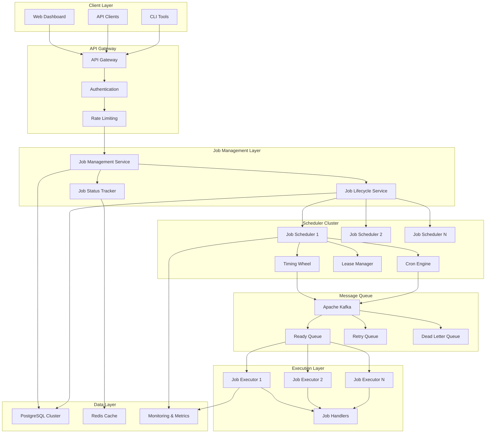

## 2. Job Scheduling Flow

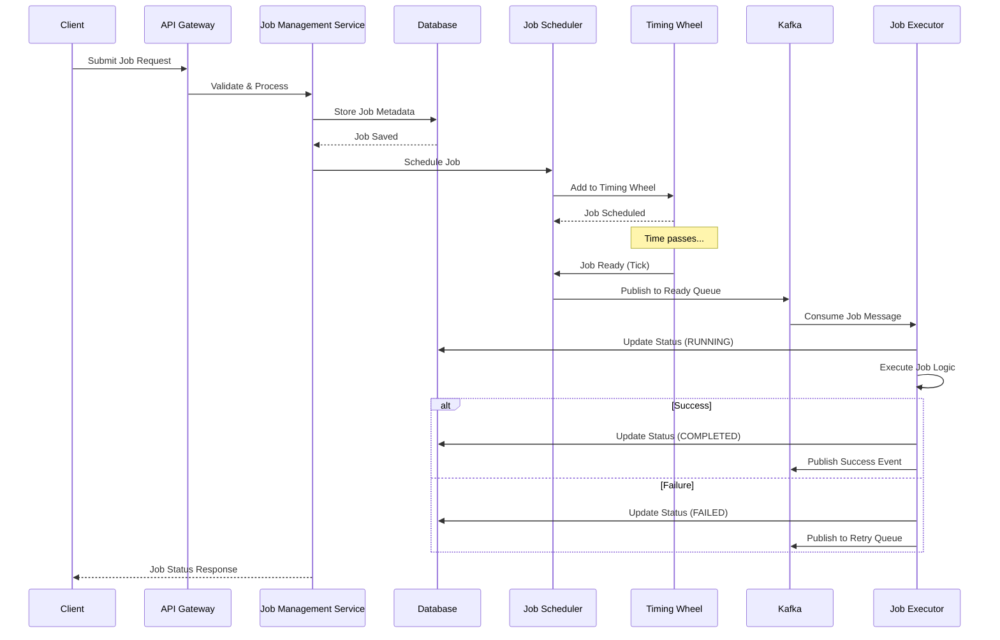

## 3. Timing Wheel Architecture

```mermaid
graph TD
    subgraph "Hierarchical Timing Wheel"
        L1[Level 1: Seconds<br/>3600 buckets × 1s]
        L2[Level 2: Minutes<br/>1440 buckets × 1m]
        L3[Level 3: Hours<br/>720 buckets × 1h]
        L4[Level 4: Days<br/>365 buckets × 1d]
    end
    
    subgraph "Bucket Structure"
        B1[Bucket 0<br/>Jobs: J1, J5]
        B2[Bucket 1<br/>Jobs: J2, J7]
        B3[Bucket 2<br/>Jobs: J3]
        B4[Bucket N<br/>Jobs: J4, J6]
    end
    
    subgraph "Operations"
        ADD[Add Job<br/>O(1)]
        TICK[Tick Process<br/>O(1)]
        CANCEL[Cancel Job<br/>O(1)]
    end
    
    L1 --> L2
    L2 --> L3
    L3 --> L4
    
    L1 --> B1
    L1 --> B2
    L1 --> B3
    L1 --> B4
    
    ADD --> L1
    TICK --> L1
    CANCEL --> L1
    
    style L1 fill:#e1f5fe
    style ADD fill:#c8e6c9
    style TICK fill:#c8e6c9
    style CANCEL fill:#ffcdd2
```

## 4. Distributed Coordination with Leases

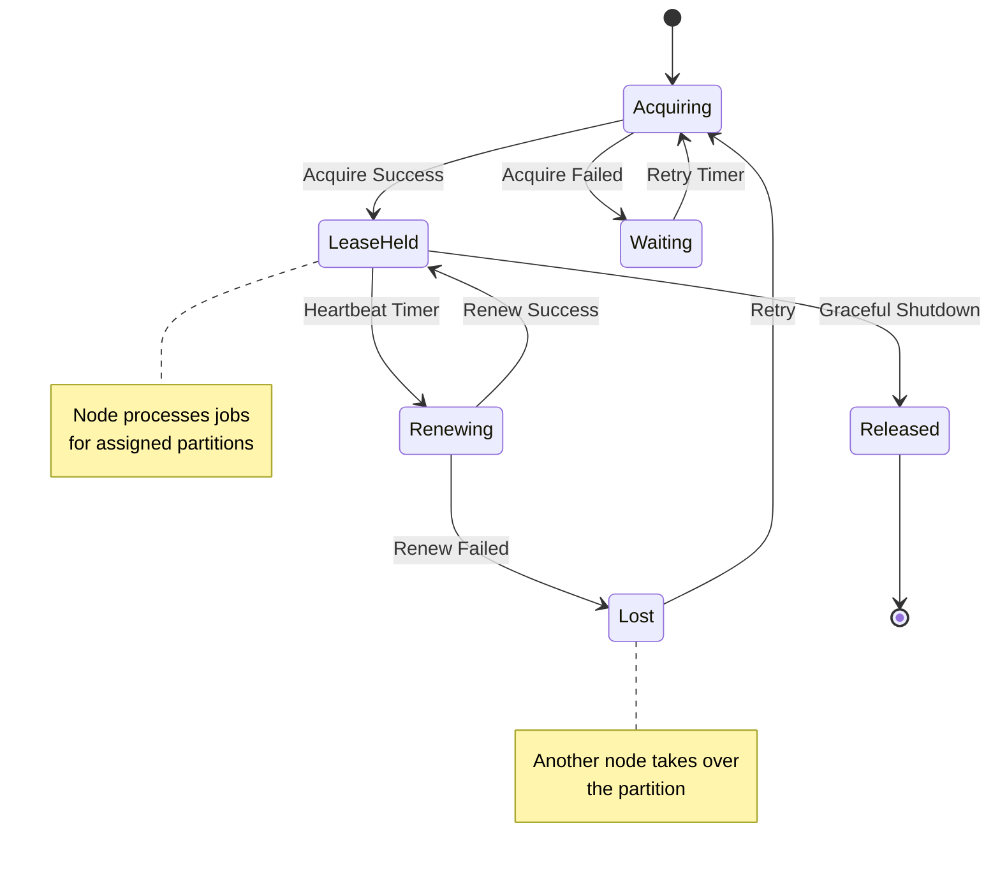

## 5. Job Lifecycle State Machine

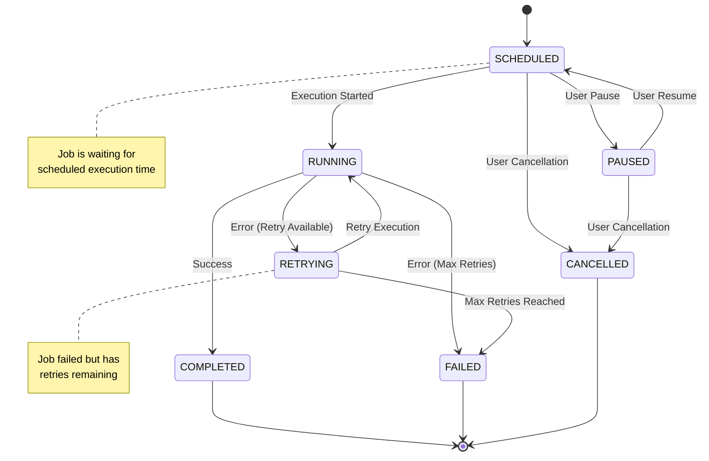

## 6. Retry Mechanism with Exponential Backoff

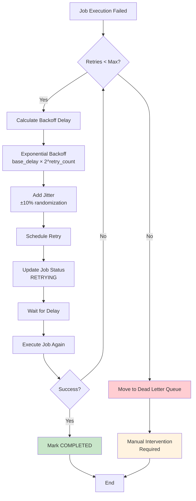

## 7. Cron Expression Processing

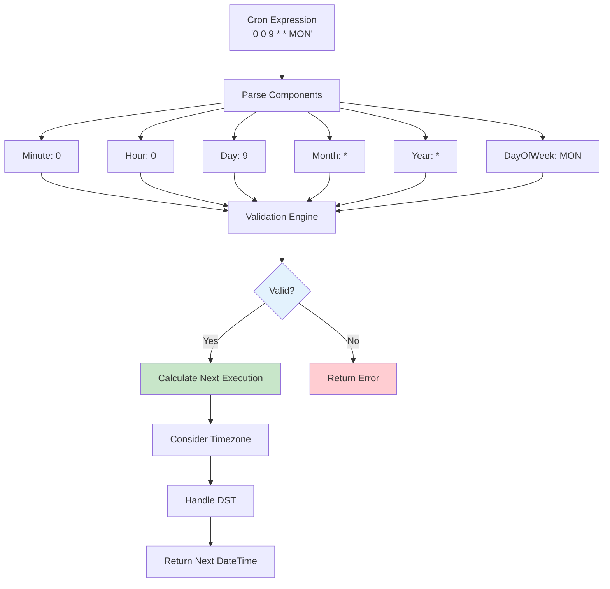

## 8. Database Schema Relationships

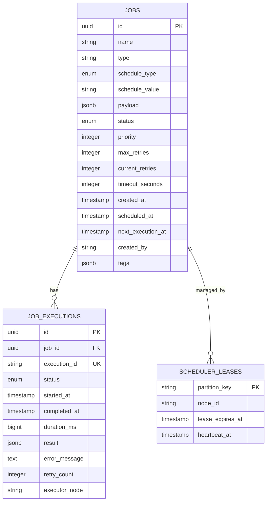

## 9. Message Queue Architecture

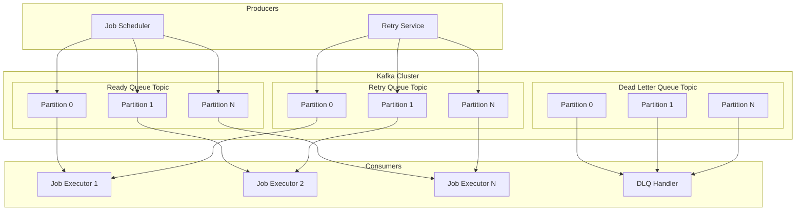

## 10. Monitoring and Alerting Architecture

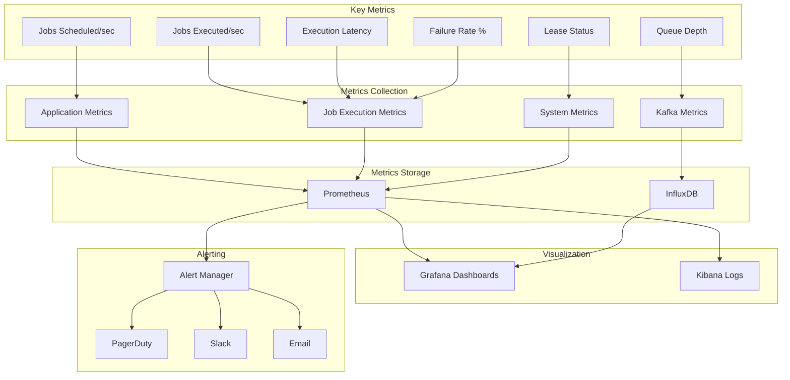

## 11. Auto-Scaling Architecture

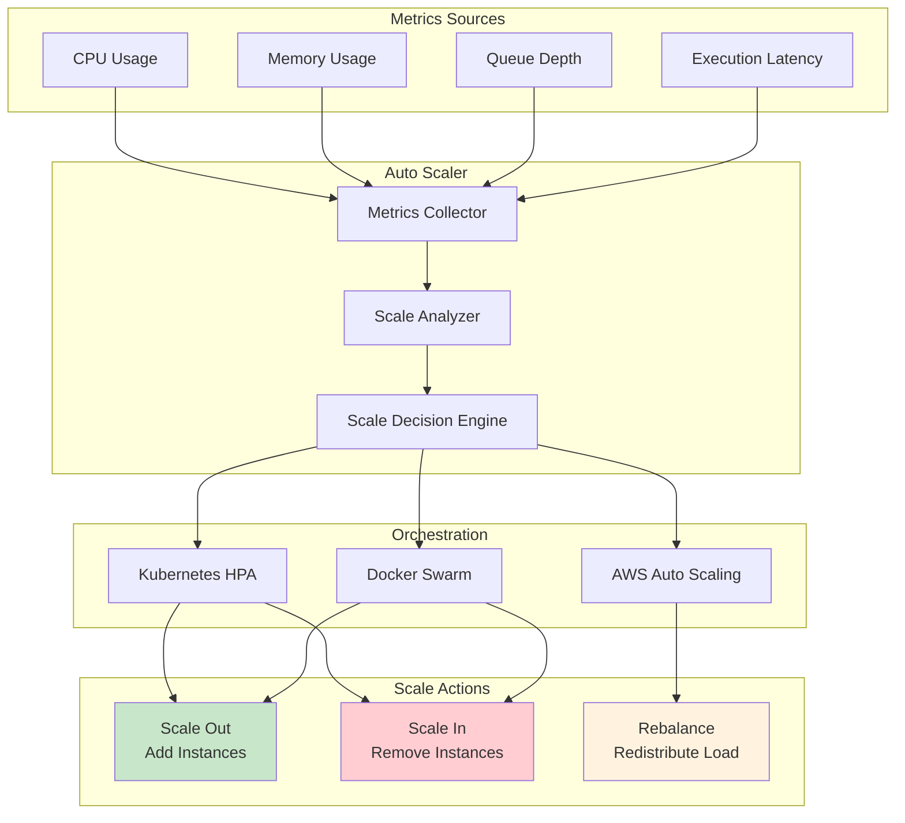

## 12. Disaster Recovery Architecture

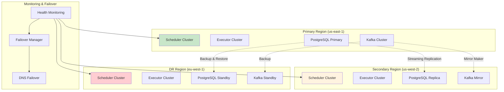