# Notification System - Architecture Diagrams

## 1. High-Level System Architecture

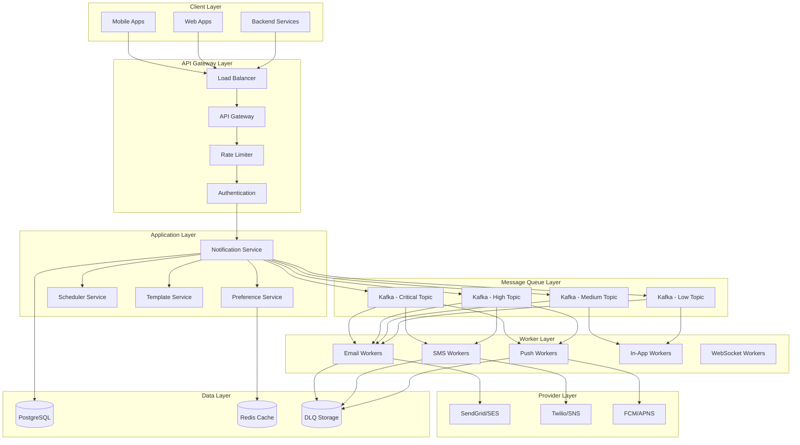
```mermaid
graph TB
    subgraph "Client Layer"
        A[Mobile Apps]
        B[Web Apps]
        C[Backend Services]
    end
    
    subgraph "API Gateway Layer"
        D[Load Balancer]
        E[API Gateway]
        F[Rate Limiter]
        G[Authentication]
    end
    
    subgraph "Application Layer"
        H[Notification Service]
        I[Preference Service]
        J[Scheduler Service]
        K[Template Service]
    end
    
    subgraph "Message Queue Layer"
        L[Kafka - Critical Topic]
        M[Kafka - High Topic]
        N[Kafka - Medium Topic]
        O[Kafka - Low Topic]
    end
    
    subgraph "Worker Layer"
        P[Email Workers]
        Q[SMS Workers]
        R[Push Workers]
        S[In-App Workers]
        T[WebSocket Workers]
    end
    
    subgraph "Provider Layer"
        U[SendGrid/SES]
        V[Twilio/SNS]
        W[FCM/APNS]
    end
    
    subgraph "Data Layer"
        X[(PostgreSQL)]
        Y[(Redis Cache)]
        Z[(DLQ Storage)]
    end
    
    A --> D
    B --> D
    C --> D
    D --> E
    E --> F
    F --> G
    G --> H
    H --> I
    H --> J
    H --> K
    H --> L
    H --> M
    H --> N
    H --> O
    L --> P
    M --> P
    N --> P
    O --> P
    L --> Q
    M --> Q
    L --> R
    M --> R
    N --> S
    O --> S
    P --> U
    Q --> V
    R --> W
    H --> X
    I --> Y
    P --> Z
    Q --> Z
    R --> Z
```

## 2. Request Flow Diagram

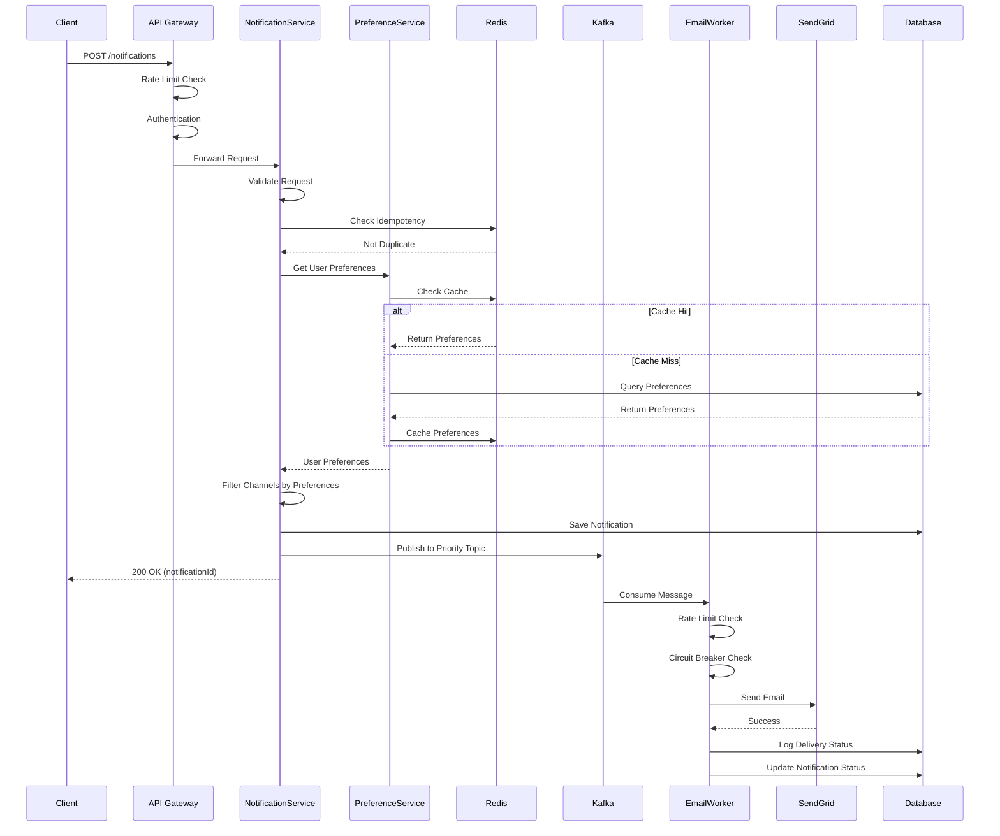
```mermaid
sequenceDiagram
    participant Client
    participant API Gateway
    participant NotificationService
    participant PreferenceService
    participant Redis
    participant Kafka
    participant EmailWorker
    participant SendGrid
    participant Database
    
    Client->>API Gateway: POST /notifications
    API Gateway->>API Gateway: Rate Limit Check
    API Gateway->>API Gateway: Authentication
    API Gateway->>NotificationService: Forward Request
    
    NotificationService->>NotificationService: Validate Request
    NotificationService->>Redis: Check Idempotency
    Redis-->>NotificationService: Not Duplicate
    
    NotificationService->>PreferenceService: Get User Preferences
    PreferenceService->>Redis: Check Cache
    alt Cache Hit
        Redis-->>PreferenceService: Return Preferences
    else Cache Miss
        PreferenceService->>Database: Query Preferences
        Database-->>PreferenceService: Return Preferences
        PreferenceService->>Redis: Cache Preferences
    end
    PreferenceService-->>NotificationService: User Preferences
    
    NotificationService->>NotificationService: Filter Channels by Preferences
    NotificationService->>Database: Save Notification
    NotificationService->>Kafka: Publish to Priority Topic
    NotificationService-->>Client: 200 OK (notificationId)
    
    Kafka->>EmailWorker: Consume Message
    EmailWorker->>EmailWorker: Rate Limit Check
    EmailWorker->>EmailWorker: Circuit Breaker Check
    EmailWorker->>SendGrid: Send Email
    SendGrid-->>EmailWorker: Success
    EmailWorker->>Database: Log Delivery Status
    EmailWorker->>Database: Update Notification Status
```

## 3. Retry Mechanism with Exponential Backoff

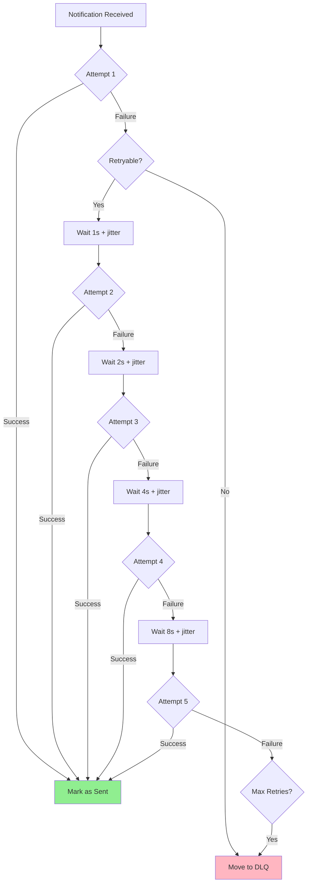
```mermaid
graph TD
    A[Notification Received] --> B{Attempt 1}
    B -->|Success| C[Mark as Sent]
    B -->|Failure| D{Retryable?}
    D -->|No| E[Move to DLQ]
    D -->|Yes| F[Wait 1s + jitter]
    F --> G{Attempt 2}
    G -->|Success| C
    G -->|Failure| H[Wait 2s + jitter]
    H --> I{Attempt 3}
    I -->|Success| C
    I -->|Failure| J[Wait 4s + jitter]
    J --> K{Attempt 4}
    K -->|Success| C
    K -->|Failure| L[Wait 8s + jitter]
    L --> M{Attempt 5}
    M -->|Success| C
    M -->|Failure| N{Max Retries?}
    N -->|Yes| E
    
    style C fill:#90EE90
    style E fill:#FFB6C1
```

## 4. Circuit Breaker State Machine

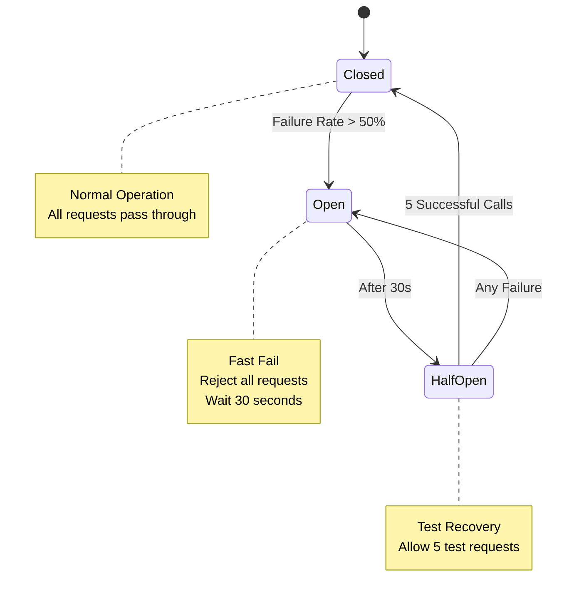
```mermaid
stateDiagram-v2
    [*] --> Closed
    Closed --> Open: Failure Rate > 50%
    Open --> HalfOpen: After 30s
    HalfOpen --> Closed: 5 Successful Calls
    HalfOpen --> Open: Any Failure
    
    note right of Closed
        Normal Operation
        All requests pass through
    end note
    
    note right of Open
        Fast Fail
        Reject all requests
        Wait 30 seconds
    end note
    
    note right of HalfOpen
        Test Recovery
        Allow 5 test requests
    end note
```

## 5. Fan-Out Architecture for Broadcast

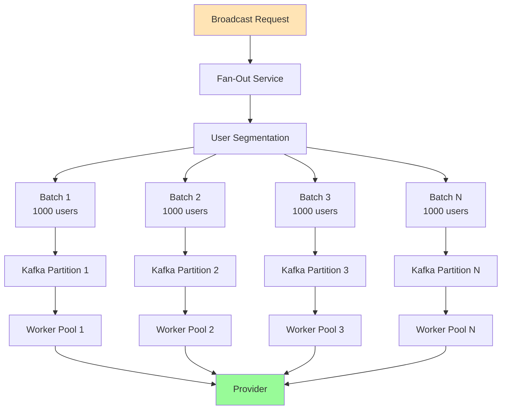
```mermaid
graph TB
    A[Broadcast Request] --> B[Fan-Out Service]
    B --> C[User Segmentation]
    C --> D[Batch 1<br/>1000 users]
    C --> E[Batch 2<br/>1000 users]
    C --> F[Batch 3<br/>1000 users]
    C --> G[Batch N<br/>1000 users]
    
    D --> H[Kafka Partition 1]
    E --> I[Kafka Partition 2]
    F --> J[Kafka Partition 3]
    G --> K[Kafka Partition N]
    
    H --> L[Worker Pool 1]
    I --> M[Worker Pool 2]
    J --> N[Worker Pool 3]
    K --> O[Worker Pool N]
    
    L --> P[Provider]
    M --> P
    N --> P
    O --> P
    
    style A fill:#FFE4B5
    style P fill:#98FB98
```

## 6. User Preference Decision Tree

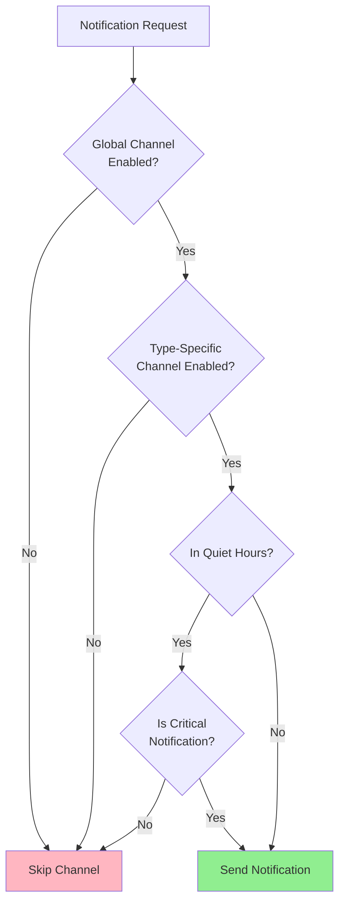
```mermaid
graph TD
    A[Notification Request] --> B{Global Channel<br/>Enabled?}
    B -->|No| C[Skip Channel]
    B -->|Yes| D{Type-Specific<br/>Channel Enabled?}
    D -->|No| C
    D -->|Yes| E{In Quiet Hours?}
    E -->|Yes| F{Is Critical<br/>Notification?}
    F -->|No| C
    F -->|Yes| G[Send Notification]
    E -->|No| G
    
    style C fill:#FFB6C1
    style G fill:#90EE90
```

## 7. Priority-Based Topic Routing

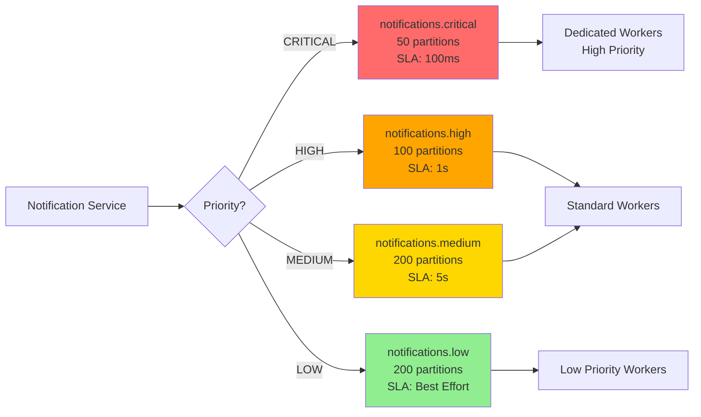
```mermaid
graph LR
    A[Notification Service] --> B{Priority?}
    B -->|CRITICAL| C[notifications.critical<br/>50 partitions<br/>SLA: 100ms]
    B -->|HIGH| D[notifications.high<br/>100 partitions<br/>SLA: 1s]
    B -->|MEDIUM| E[notifications.medium<br/>200 partitions<br/>SLA: 5s]
    B -->|LOW| F[notifications.low<br/>200 partitions<br/>SLA: Best Effort]
    
    C --> G[Dedicated Workers<br/>High Priority]
    D --> H[Standard Workers]
    E --> H
    F --> I[Low Priority Workers]
    
    style C fill:#FF6B6B
    style D fill:#FFA500
    style E fill:#FFD700
    style F fill:#90EE90
```

## 8. Dead Letter Queue Processing

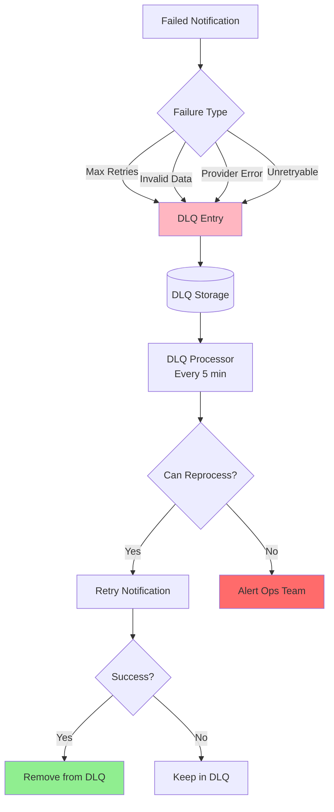
```mermaid
graph TB
    A[Failed Notification] --> B{Failure Type}
    B -->|Max Retries| C[DLQ Entry]
    B -->|Invalid Data| C
    B -->|Provider Error| C
    B -->|Unretryable| C
    
    C --> D[(DLQ Storage)]
    D --> E[DLQ Processor<br/>Every 5 min]
    E --> F{Can Reprocess?}
    F -->|Yes| G[Retry Notification]
    F -->|No| H[Alert Ops Team]
    
    G --> I{Success?}
    I -->|Yes| J[Remove from DLQ]
    I -->|No| K[Keep in DLQ]
    
    style C fill:#FFB6C1
    style H fill:#FF6B6B
    style J fill:#90EE90
```

## 9. Multi-Channel Worker Architecture

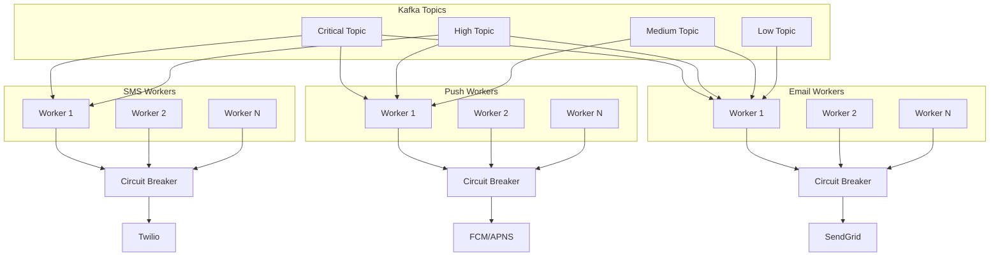
```mermaid
graph TB
    subgraph "Kafka Topics"
        A[Critical Topic]
        B[High Topic]
        C[Medium Topic]
        D[Low Topic]
    end
    
    subgraph "Email Workers"
        E1[Worker 1]
        E2[Worker 2]
        E3[Worker N]
    end
    
    subgraph "SMS Workers"
        S1[Worker 1]
        S2[Worker 2]
        S3[Worker N]
    end
    
    subgraph "Push Workers"
        P1[Worker 1]
        P2[Worker 2]
        P3[Worker N]
    end
    
    A --> E1
    B --> E1
    C --> E1
    D --> E1
    
    A --> S1
    B --> S1
    
    A --> P1
    B --> P1
    C --> P1
    
    E1 --> F[Circuit Breaker]
    E2 --> F
    E3 --> F
    F --> G[SendGrid]
    
    S1 --> H[Circuit Breaker]
    S2 --> H
    S3 --> H
    H --> I[Twilio]
    
    P1 --> J[Circuit Breaker]
    P2 --> J
    P3 --> J
    J --> K[FCM/APNS]
```

## 10. Database Sharding Strategy

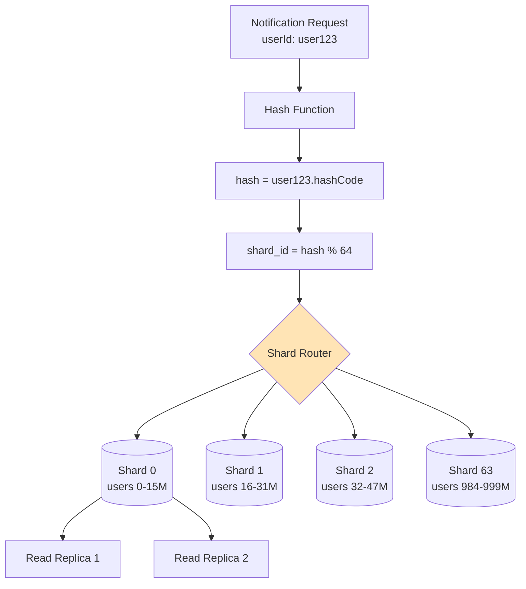
```mermaid
graph TB
    A[Notification Request<br/>userId: user123] --> B[Hash Function]
    B --> C[hash = user123.hashCode]
    C --> D[shard_id = hash % 64]
    D --> E{Shard Router}
    
    E --> F[(Shard 0<br/>users 0-15M)]
    E --> G[(Shard 1<br/>users 16-31M)]
    E --> H[(Shard 2<br/>users 32-47M)]
    E --> I[(Shard 63<br/>users 984-999M)]
    
    F --> J[Read Replica 1]
    F --> K[Read Replica 2]
    
    style E fill:#FFE4B5
```

## 11. Caching Strategy

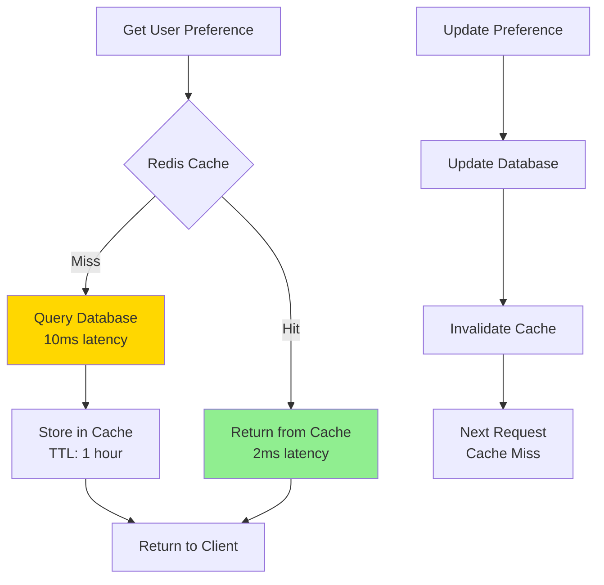
```mermaid
graph TB
    A[Get User Preference] --> B{Redis Cache}
    B -->|Hit| C[Return from Cache<br/>2ms latency]
    B -->|Miss| D[Query Database<br/>10ms latency]
    D --> E[Store in Cache<br/>TTL: 1 hour]
    E --> F[Return to Client]
    C --> F
    
    G[Update Preference] --> H[Update Database]
    H --> I[Invalidate Cache]
    I --> J[Next Request<br/>Cache Miss]
    
    style C fill:#90EE90
    style D fill:#FFD700
```

## 12. Idempotency Implementation

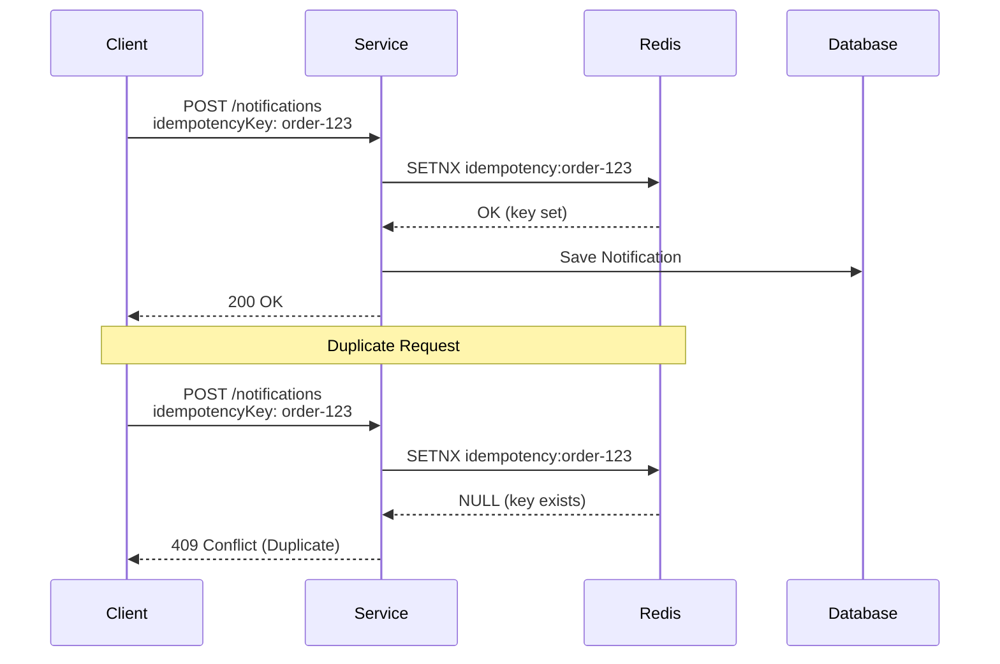
```mermaid
sequenceDiagram
    participant Client
    participant Service
    participant Redis
    participant Database
    
    Client->>Service: POST /notifications<br/>idempotencyKey: order-123
    Service->>Redis: SETNX idempotency:order-123
    Redis-->>Service: OK (key set)
    Service->>Database: Save Notification
    Service-->>Client: 200 OK
    
    Note over Client,Redis: Duplicate Request
    
    Client->>Service: POST /notifications<br/>idempotencyKey: order-123
    Service->>Redis: SETNX idempotency:order-123
    Redis-->>Service: NULL (key exists)
    Service-->>Client: 409 Conflict (Duplicate)
```

## 13. Monitoring and Alerting Flow

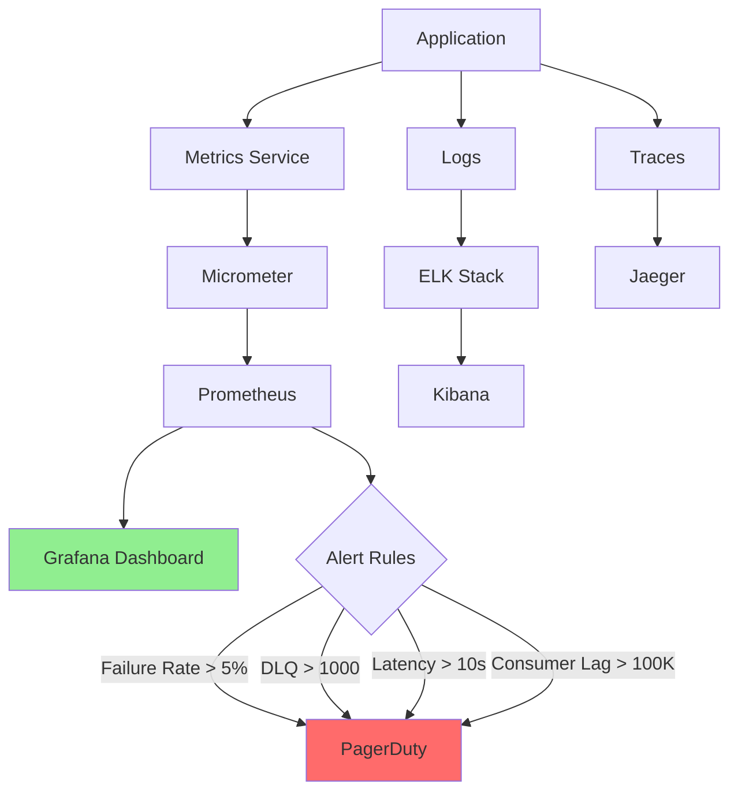
```mermaid
graph TB
    A[Application] --> B[Metrics Service]
    B --> C[Micrometer]
    C --> D[Prometheus]
    D --> E[Grafana Dashboard]
    
    D --> F{Alert Rules}
    F -->|Failure Rate > 5%| G[PagerDuty]
    F -->|DLQ > 1000| G
    F -->|Latency > 10s| G
    F -->|Consumer Lag > 100K| G
    
    A --> H[Logs]
    H --> I[ELK Stack]
    I --> J[Kibana]
    
    A --> K[Traces]
    K --> L[Jaeger]
    
    style G fill:#FF6B6B
    style E fill:#90EE90
```

## 14. Multi-Region Deployment

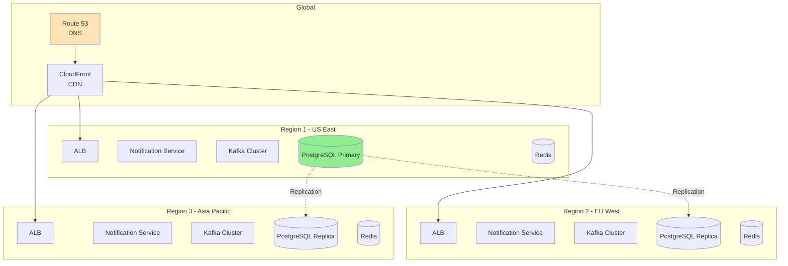
```mermaid
graph TB
    subgraph "Global"
        A[Route 53<br/>DNS]
        B[CloudFront<br/>CDN]
    end
    
    subgraph "Region 1 - US East"
        C[ALB]
        D[Notification Service]
        E[Kafka Cluster]
        F[(PostgreSQL Primary)]
        G[(Redis)]
    end
    
    subgraph "Region 2 - EU West"
        H[ALB]
        I[Notification Service]
        J[Kafka Cluster]
        K[(PostgreSQL Replica)]
        L[(Redis)]
    end
    
    subgraph "Region 3 - Asia Pacific"
        M[ALB]
        N[Notification Service]
        O[Kafka Cluster]
        P[(PostgreSQL Replica)]
        Q[(Redis)]
    end
    
    A --> B
    B --> C
    B --> H
    B --> M
    
    F -.->|Replication| K
    F -.->|Replication| P
    
    style A fill:#FFE4B5
    style F fill:#90EE90
```

## 15. Scheduled Notification Flow

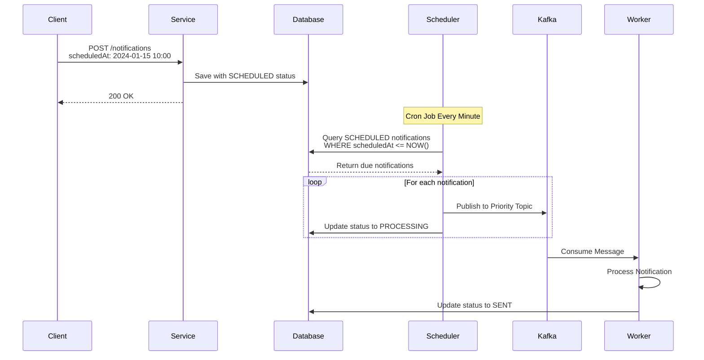
```mermaid
sequenceDiagram
    participant Client
    participant Service
    participant Database
    participant Scheduler
    participant Kafka
    participant Worker
    
    Client->>Service: POST /notifications<br/>scheduledAt: 2024-01-15 10:00
    Service->>Database: Save with SCHEDULED status
    Service-->>Client: 200 OK
    
    Note over Scheduler: Cron Job Every Minute
    
    Scheduler->>Database: Query SCHEDULED notifications<br/>WHERE scheduledAt <= NOW()
    Database-->>Scheduler: Return due notifications
    
    loop For each notification
        Scheduler->>Kafka: Publish to Priority Topic
        Scheduler->>Database: Update status to PROCESSING
    end
    
    Kafka->>Worker: Consume Message
    Worker->>Worker: Process Notification
    Worker->>Database: Update status to SENT
```

## 16. Rate Limiting Architecture

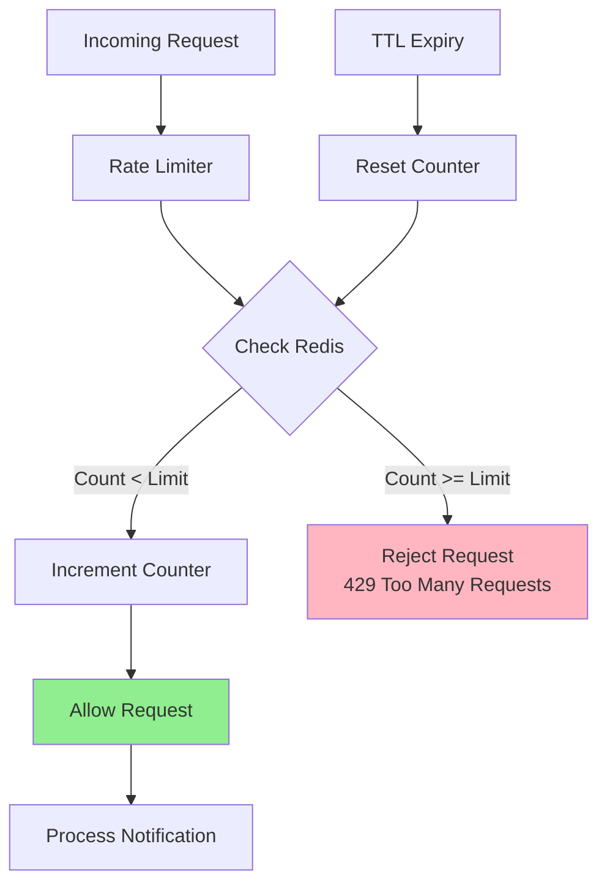
```mermaid
graph TB
    A[Incoming Request] --> B[Rate Limiter]
    B --> C{Check Redis}
    C -->|Count < Limit| D[Increment Counter]
    D --> E[Allow Request]
    C -->|Count >= Limit| F[Reject Request<br/>429 Too Many Requests]
    
    E --> G[Process Notification]
    
    H[TTL Expiry] --> I[Reset Counter]
    I --> C
    
    style E fill:#90EE90
    style F fill:#FFB6C1
```

## 17. Template Rendering Flow

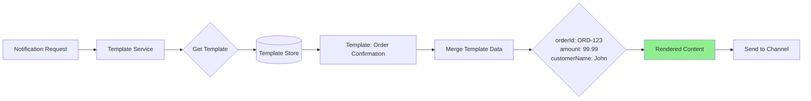
```mermaid
graph LR
    A[Notification Request] --> B[Template Service]
    B --> C{Get Template}
    C --> D[(Template Store)]
    D --> E[Template: Order Confirmation]
    E --> F[Merge Template Data]
    F --> G{orderId: ORD-123<br/>amount: 99.99<br/>customerName: John}
    G --> H[Rendered Content]
    H --> I[Send to Channel]
    
    style H fill:#90EE90
```

## 18. Webhook Processing for Delivery Status

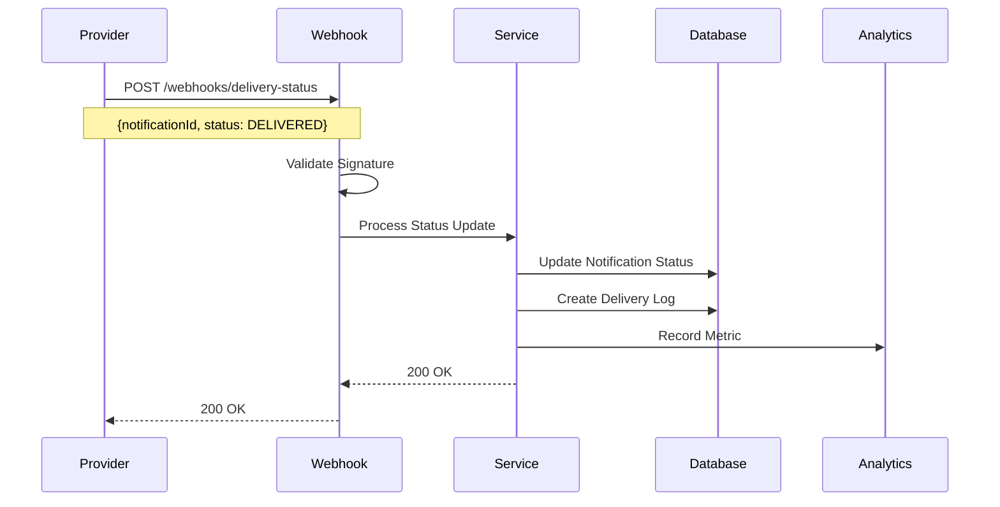
```mermaid
sequenceDiagram
    participant Provider
    participant Webhook
    participant Service
    participant Database
    participant Analytics
    
    Provider->>Webhook: POST /webhooks/delivery-status
    Note over Provider,Webhook: {notificationId, status: DELIVERED}
    
    Webhook->>Webhook: Validate Signature
    Webhook->>Service: Process Status Update
    Service->>Database: Update Notification Status
    Service->>Database: Create Delivery Log
    Service->>Analytics: Record Metric
    Service-->>Webhook: 200 OK
    Webhook-->>Provider: 200 OK
```

---

## Key Architecture Principles

### 1. **Separation of Concerns**
- API layer handles routing and authentication
- Service layer handles business logic
- Worker layer handles channel-specific delivery
- Data layer handles persistence

### 2. **Asynchronous Processing**
- Kafka decouples request handling from delivery
- Non-blocking API responses
- Background workers process notifications

### 3. **Fault Tolerance**
- Circuit breakers prevent cascade failures
- Retry mechanism handles transient errors
- DLQ captures unrecoverable failures

### 4. **Scalability**
- Horizontal scaling at every layer
- Kafka partitioning for parallel processing
- Database sharding for data distribution

### 5. **Observability**
- Metrics for monitoring
- Logs for debugging
- Traces for request tracking
- Alerts for proactive response
