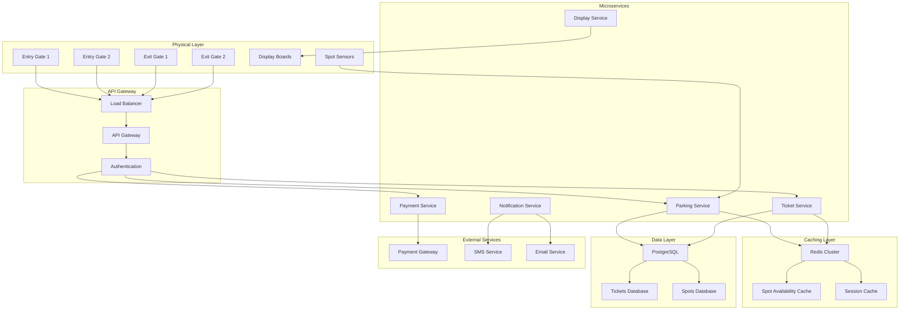
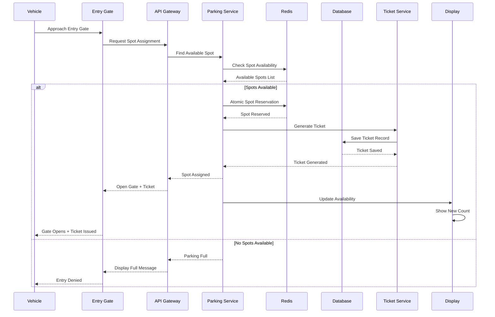
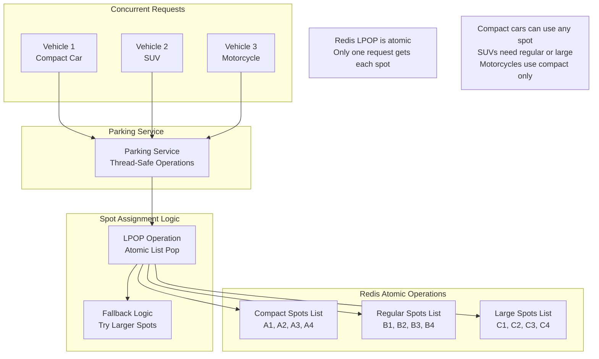
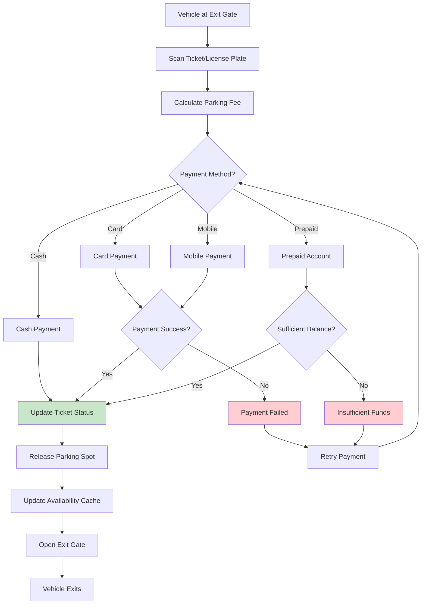
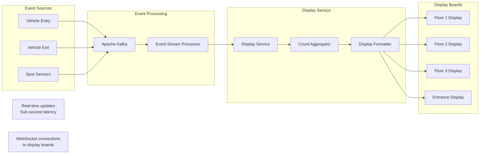
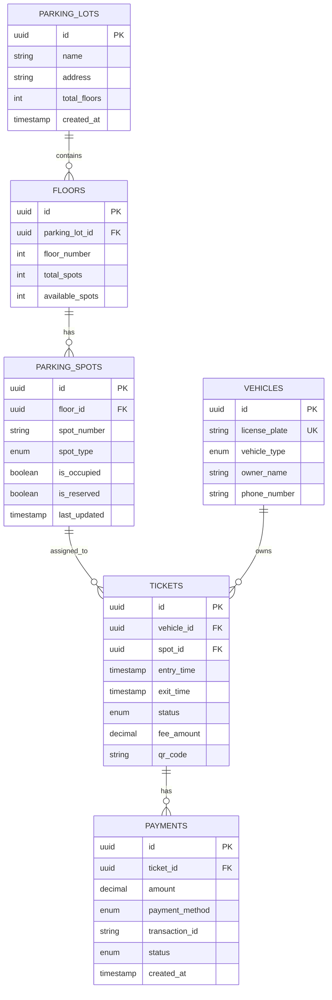
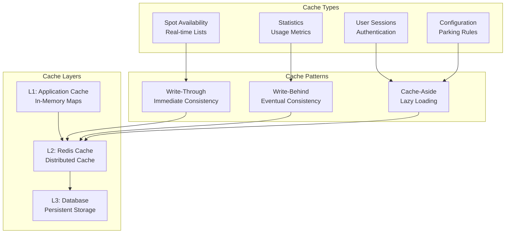
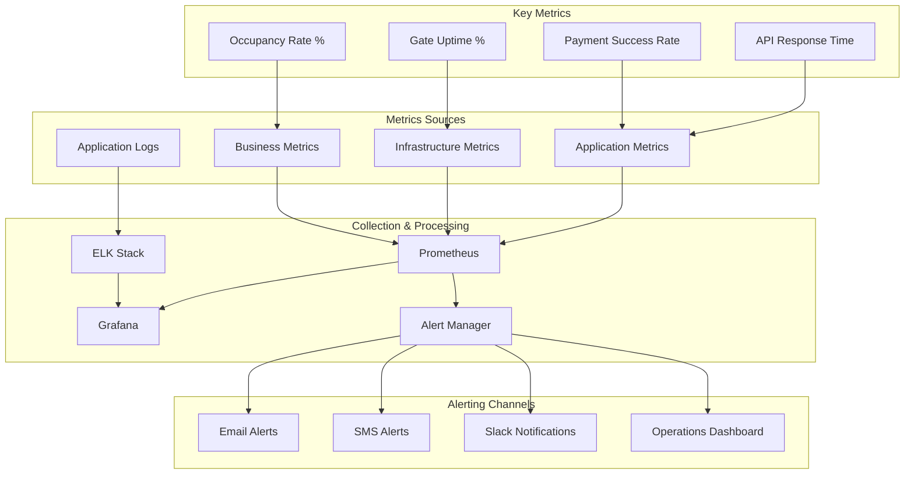

# Parking Lot Management System - Architecture Diagrams

## Understanding Parking System Architecture

### What Makes Parking Systems Unique?
Parking systems have specific challenges that require careful architectural design:

1. **Real-time Inventory**: Track spot availability in real-time
2. **Concurrency Control**: Handle multiple vehicles entering simultaneously
3. **Atomic Operations**: Prevent double-booking of parking spots
4. **Payment Integration**: Handle various payment methods reliably
5. **Physical Integration**: Interface with gates, sensors, and display boards

### Key Architectural Decisions

#### Cache-First vs Database-First Architecture

**Database-First Approach (Traditional)**
```java
// Slow and doesn't scale
public boolean assignSpot(Vehicle vehicle) {
    ParkingSpot spot = database.findAvailableSpot(vehicle.getType());
    if (spot != null) {
        spot.setOccupied(true);
        database.save(spot);
        return true;
    }
    return false;
}
```
**Problems**: 
- Database becomes bottleneck
- Slow response times
- Poor user experience

**Cache-First Approach (Optimized)**
```java
// Fast and scalable
public boolean assignSpotOptimized(Vehicle vehicle) {
    String cacheKey = "available_spots:" + vehicle.getType();
    
    // Atomic operation in Redis
    String spotId = redisTemplate.opsForList().leftPop(cacheKey);
    
    if (spotId != null) {
        // Async update to database
        asyncUpdateDatabase(spotId, true);
        return true;
    }
    return false;
}
```
**Benefits**:
- Sub-millisecond response times
- Handles high concurrency
- Better user experience

#### Microservices for Parking Systems
- **Parking Service**: Core spot allocation logic
- **Ticket Service**: Ticket lifecycle management
- **Payment Service**: Fee calculation and payment processing
- **Display Service**: Real-time availability updates

## 1. High-Level System Architecture



### Architecture Explanation
This diagram shows a distributed parking system with:

1. **Physical Integration**: Gates and sensors connected to the system
2. **High Availability**: Load balancer distributes traffic across multiple instances
3. **Caching Strategy**: Redis for real-time data, PostgreSQL for persistent data
4. **Microservices**: Specialized services for different functions
5. **External Integration**: Payment gateways and notification services

## 2. Vehicle Entry Flow



### Flow Analysis
This sequence shows the critical path for vehicle entry:

1. **Atomic Reservation**: Redis ensures no double-booking
2. **Async Updates**: Display boards updated without blocking entry
3. **Graceful Failure**: Clear messaging when parking is full
4. **Ticket Generation**: Immediate ticket creation for tracking

## 3. Concurrency Control Architecture



### Concurrency Control Implementation
```java
@Service
public class ParkingService {
    
    @Autowired
    private RedisTemplate<String, String> redisTemplate;
    
    public ParkingResult assignSpot(Vehicle vehicle) {
        VehicleType type = vehicle.getType();
        
        // Try spots in order of preference
        String[] spotTypes = getSpotTypesForVehicle(type);
        
        for (String spotType : spotTypes) {
            String listKey = "available_spots:" + spotType;
            
            // Atomic operation - only one thread gets the spot
            String spotId = redisTemplate.opsForList().leftPop(listKey);
            
            if (spotId != null) {
                // Successfully reserved spot
                ParkingSpot spot = new ParkingSpot(spotId, spotType);
                
                // Async database update
                asyncUpdateSpotStatus(spotId, true);
                
                // Generate ticket
                Ticket ticket = ticketService.generateTicket(vehicle, spot);
                
                return ParkingResult.success(ticket, spot);
            }
        }
        
        return ParkingResult.failure("No available spots");
    }
    
    private String[] getSpotTypesForVehicle(VehicleType type) {
        switch (type) {
            case MOTORCYCLE:
                return new String[]{"compact"};
            case COMPACT_CAR:
                return new String[]{"compact", "regular", "large"};
            case SUV:
                return new String[]{"regular", "large"};
            case TRUCK:
                return new String[]{"large"};
            default:
                return new String[]{"regular"};
        }
    }
}
```

## 4. Payment Processing Flow



### Payment Integration Architecture
```java
@Service
public class PaymentService {
    
    private final Map<PaymentMethod, PaymentProcessor> processors;
    private final CircuitBreaker circuitBreaker;
    
    public PaymentResult processPayment(PaymentRequest request) {
        PaymentProcessor processor = processors.get(request.getMethod());
        
        return circuitBreaker.executeSupplier(() -> {
            try {
                // Process payment with external gateway
                PaymentResponse response = processor.processPayment(request);
                
                if (response.isSuccess()) {
                    // Update ticket status
                    ticketService.markPaid(request.getTicketId(), response.getTransactionId());
                    
                    // Release parking spot
                    releaseSpot(request.getTicketId());
                    
                    return PaymentResult.success(response.getTransactionId());
                } else {
                    return PaymentResult.failure(response.getErrorMessage());
                }
                
            } catch (PaymentGatewayException e) {
                log.error("Payment gateway error for ticket: {}", request.getTicketId(), e);
                return PaymentResult.failure("Payment service temporarily unavailable");
            }
        });
    }
    
    private void releaseSpot(String ticketId) {
        Ticket ticket = ticketService.getTicket(ticketId);
        ParkingSpot spot = ticket.getSpot();
        
        // Add spot back to available list
        String listKey = "available_spots:" + spot.getType();
        redisTemplate.opsForList().rightPush(listKey, spot.getId());
        
        // Update display boards
        displayService.updateAvailability(spot.getFloor(), spot.getType(), 1);
        
        // Async database update
        asyncUpdateSpotStatus(spot.getId(), false);
    }
}
```

## 5. Real-time Display Board Architecture



### Display Update Implementation
```java
@Component
public class DisplayService {
    
    @Autowired
    private WebSocketTemplate webSocketTemplate;
    
    @EventListener
    public void handleSpotChange(SpotChangeEvent event) {
        // Update availability count
        String cacheKey = String.format("availability:%s:%s", 
                                       event.getFloor(), 
                                       event.getSpotType());
        
        Long newCount = redisTemplate.opsForValue().increment(cacheKey, event.getChange());
        
        // Create display message
        DisplayMessage message = new DisplayMessage(
            event.getFloor(),
            event.getSpotType(),
            newCount.intValue(),
            System.currentTimeMillis()
        );
        
        // Send to all display boards on the floor
        String topic = "/topic/floor/" + event.getFloor();
        webSocketTemplate.convertAndSend(topic, message);
        
        // Send to entrance displays
        webSocketTemplate.convertAndSend("/topic/entrance", message);
        
        log.info("Updated display for floor {} {}: {} spots available", 
                event.getFloor(), event.getSpotType(), newCount);
    }
    
    @Scheduled(fixedRate = 30000) // Every 30 seconds
    public void sendHeartbeat() {
        // Send heartbeat to all displays to detect disconnections
        HeartbeatMessage heartbeat = new HeartbeatMessage(System.currentTimeMillis());
        webSocketTemplate.convertAndSend("/topic/heartbeat", heartbeat);
    }
}
```

## 6. Database Schema Relationships



## 7. Caching Strategy Architecture



### Cache Implementation Strategy
```java
@Configuration
public class CacheConfig {
    
    @Bean
    public CacheManager cacheManager() {
        RedisCacheManager.Builder builder = RedisCacheManager
            .RedisCacheManagerBuilder
            .fromConnectionFactory(redisConnectionFactory())
            .cacheDefaults(cacheConfiguration());
        
        return builder.build();
    }
    
    private RedisCacheConfiguration cacheConfiguration() {
        return RedisCacheConfiguration.defaultCacheConfig()
            .entryTtl(Duration.ofMinutes(10))
            .serializeKeysWith(RedisSerializationContext.SerializationPair
                .fromSerializer(new StringRedisSerializer()))
            .serializeValuesWith(RedisSerializationContext.SerializationPair
                .fromSerializer(new GenericJackson2JsonRedisSerializer()));
    }
}

@Service
public class SpotAvailabilityService {
    
    // Cache spot availability with short TTL
    @Cacheable(value = "spot-availability", key = "#floor + ':' + #spotType")
    public int getAvailableSpots(String floor, SpotType spotType) {
        return spotRepository.countAvailableSpots(floor, spotType);
    }
    
    // Evict cache when spots are assigned/released
    @CacheEvict(value = "spot-availability", key = "#floor + ':' + #spotType")
    public void updateSpotAvailability(String floor, SpotType spotType, int change) {
        // Update will be reflected in next cache miss
    }
}
```

## 8. Monitoring and Alerting Architecture



This comprehensive architecture ensures the parking system can handle high concurrency, provide real-time updates, and maintain data consistency while offering excellent user experience through fast response times and reliable payment processing.