# Payment Service - Architecture Diagrams

## Understanding Payment Service Architecture

### What Makes Payment Architecture Critical?
Payment services are the backbone of financial systems and require specialized architectural patterns:

1. **Financial Accuracy**: Never lose or duplicate money
2. **Regulatory Compliance**: Meet PCI DSS and banking regulations
3. **Fault Tolerance**: Handle external service failures gracefully
4. **Exactly-Once Processing**: Prevent duplicate transactions
5. **Audit Trails**: Complete transaction history for compliance

### Key Architectural Patterns

#### Idempotency Pattern
```java
// The core challenge: Network failures can cause duplicate requests
public class PaymentController {
    
    @PostMapping("/process")
    public PaymentResponse processPayment(
            @RequestBody PaymentRequest request,
            @RequestHeader("Idempotency-Key") String idempotencyKey) {
        
        // Check if we've seen this request before
        PaymentResponse cachedResponse = idempotencyService.getCachedResponse(idempotencyKey);
        if (cachedResponse != null) {
            return cachedResponse; // Return same result for duplicate request
        }
        
        // Process payment for the first time
        PaymentResponse response = paymentService.processPayment(request);
        
        // Cache the response for future duplicate requests
        idempotencyService.cacheResponse(idempotencyKey, response, Duration.ofHours(24));
        
        return response;
    }
}
```

#### Circuit Breaker Pattern for External Services
```java
// Prevent cascade failures when payment processors are down
@Component
public class PaymentProcessorCircuitBreaker {
    private volatile CircuitState state = CircuitState.CLOSED;
    private final AtomicInteger failureCount = new AtomicInteger(0);
    private final AtomicLong lastFailureTime = new AtomicLong(0);
    
    public PaymentResult callProcessor(PaymentRequest request) {
        if (state == CircuitState.OPEN) {
            if (shouldAttemptReset()) {
                state = CircuitState.HALF_OPEN;
            } else {
                return PaymentResult.failure("Payment processor unavailable");
            }
        }
        
        try {
            PaymentResult result = actualProcessorCall(request);
            onSuccess();
            return result;
        } catch (Exception e) {
            onFailure();
            throw e;
        }
    }
}
```

#### Saga Pattern for Distributed Transactions
```java
// Handle complex payment flows across multiple services
public class PaymentSaga {
    public void executePayment(PaymentRequest request) {
        SagaTransaction saga = new SagaTransaction();
        
        try {
            // Step 1: Reserve funds
            saga.addStep(
                () -> walletService.reserveFunds(request.getUserId(), request.getAmount()),
                () -> walletService.releaseFunds(request.getUserId(), request.getAmount())
            );
            
            // Step 2: Process with external gateway
            saga.addStep(
                () -> paymentGateway.charge(request),
                () -> paymentGateway.refund(request.getTransactionId())
            );
            
            // Step 3: Update ledger
            saga.addStep(
                () -> ledgerService.recordTransaction(request),
                () -> ledgerService.reverseTransaction(request.getTransactionId())
            );
            
            // Execute all steps
            saga.execute();
            
        } catch (Exception e) {
            // Compensate all completed steps in reverse order
            saga.compensate();
            throw e;
        }
    }
}
```

### Database Design for Financial Systems

#### Immutable Transaction Records
```sql
-- Financial records should NEVER be updated, only inserted
CREATE TABLE payment_transactions (
    id UUID PRIMARY KEY DEFAULT gen_random_uuid(),
    idempotency_key VARCHAR(255) UNIQUE NOT NULL,
    amount DECIMAL(15,2) NOT NULL,
    currency VARCHAR(3) NOT NULL,
    status VARCHAR(20) NOT NULL,
    created_at TIMESTAMP NOT NULL DEFAULT NOW(),
    -- Notice: NO updated_at column!
    -- Financial records are immutable
    
    CONSTRAINT positive_amount CHECK (amount > 0)
);

-- Status changes are tracked in separate table
CREATE TABLE transaction_status_history (
    id UUID PRIMARY KEY DEFAULT gen_random_uuid(),
    transaction_id UUID NOT NULL REFERENCES payment_transactions(id),
    old_status VARCHAR(20),
    new_status VARCHAR(20) NOT NULL,
    reason TEXT,
    created_at TIMESTAMP NOT NULL DEFAULT NOW()
);
```

#### Optimistic Locking for Account Balances
```sql
-- Prevent lost updates in concurrent scenarios
CREATE TABLE account_balances (
    account_id UUID PRIMARY KEY,
    balance DECIMAL(15,2) NOT NULL DEFAULT 0,
    version BIGINT NOT NULL DEFAULT 1, -- For optimistic locking
    updated_at TIMESTAMP NOT NULL DEFAULT NOW(),
    
    CONSTRAINT non_negative_balance CHECK (balance >= 0)
);

-- Update with version check
UPDATE account_balances 
SET balance = balance - ?, 
    version = version + 1,
    updated_at = NOW()
WHERE account_id = ? 
  AND version = ? -- This prevents lost updates
  AND balance >= ?; -- Ensure sufficient funds
```

## 1. High-Level System Architecture

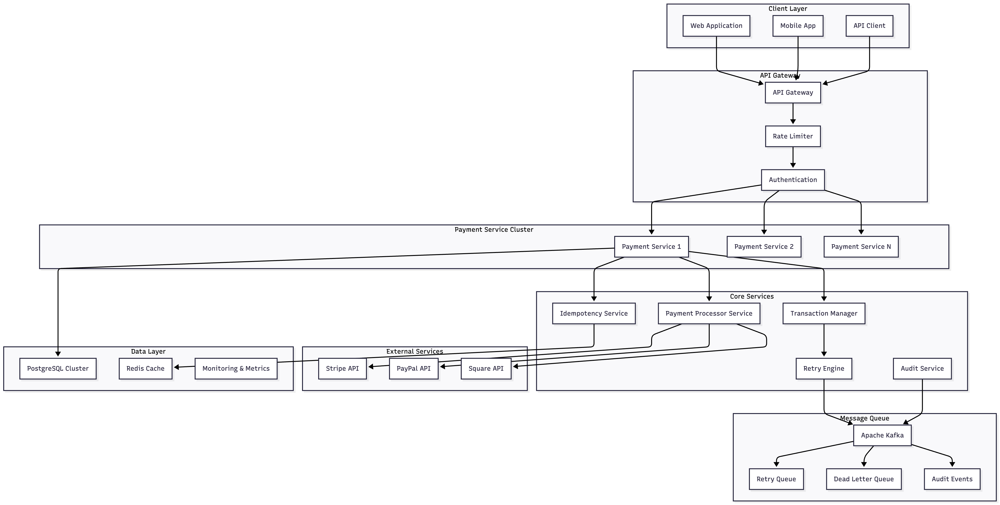

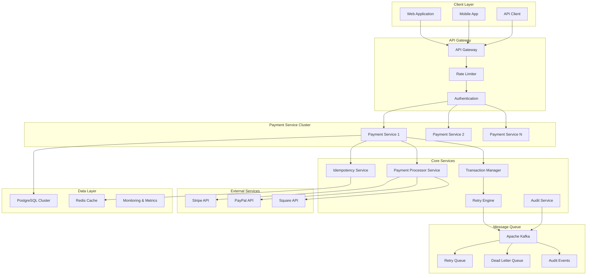
```mermaid
graph TB
    subgraph "Client Layer"
        WEB[Web Application]
        MOBILE[Mobile App]
        API_CLIENT[API Client]
    end
    
    subgraph "API Gateway"
        GATEWAY[API Gateway]
        RATE_LIMIT[Rate Limiter]
        AUTH[Authentication]
    end
    
    subgraph "Payment Service Cluster"
        PS1[Payment Service 1]
        PS2[Payment Service 2]
        PS3[Payment Service N]
    end
    
    subgraph "Core Services"
        IDEMPOTENCY[Idempotency Service]
        PROCESSOR[Payment Processor Service]
        TRANSACTION_MGR[Transaction Manager]
        RETRY_ENGINE[Retry Engine]
        AUDIT[Audit Service]
    end
    
    subgraph "Message Queue"
        KAFKA[Apache Kafka]
        RETRY_QUEUE[Retry Queue]
        DLQ[Dead Letter Queue]
        AUDIT_QUEUE[Audit Events]
    end
    
    subgraph "External Services"
        STRIPE[Stripe API]
        PAYPAL[PayPal API]
        SQUARE[Square API]
    end
    
    subgraph "Data Layer"
        POSTGRES[PostgreSQL Cluster]
        REDIS[Redis Cache]
        MONITORING[Monitoring & Metrics]
    end
    
    WEB --> GATEWAY
    MOBILE --> GATEWAY
    API_CLIENT --> GATEWAY
    
    GATEWAY --> RATE_LIMIT
    RATE_LIMIT --> AUTH
    AUTH --> PS1
    AUTH --> PS2
    AUTH --> PS3
    
    PS1 --> IDEMPOTENCY
    PS1 --> PROCESSOR
    PS1 --> TRANSACTION_MGR
    
    PROCESSOR --> STRIPE
    PROCESSOR --> PAYPAL
    PROCESSOR --> SQUARE
    
    TRANSACTION_MGR --> RETRY_ENGINE
    RETRY_ENGINE --> KAFKA
    
    KAFKA --> RETRY_QUEUE
    KAFKA --> DLQ
    KAFKA --> AUDIT_QUEUE
    
    IDEMPOTENCY --> REDIS
    PS1 --> POSTGRES
    AUDIT --> KAFKA
```

### Retry Mechanisms in Payment Systems

#### Exponential Backoff with Jitter
```java
public class PaymentRetryService {
    private static final long BASE_DELAY_MS = 1000; // 1 second
    private static final int MAX_RETRIES = 5;
    private static final double JITTER_FACTOR = 0.1; // 10% jitter
    
    public void scheduleRetry(PaymentRequest request, int retryCount) {
        if (retryCount >= MAX_RETRIES) {
            moveToDeadLetterQueue(request);
            return;
        }
        
        // Calculate exponential backoff: base_delay * 2^retry_count
        long delayMs = BASE_DELAY_MS * (1L << retryCount);
        
        // Add jitter to prevent thundering herd
        double jitter = (Math.random() - 0.5) * 2 * JITTER_FACTOR;
        delayMs = (long) (delayMs * (1 + jitter));
        
        // Schedule retry
        scheduler.schedule(() -> {
            try {
                PaymentResult result = paymentProcessor.processPayment(request);
                if (result.isSuccess()) {
                    handleSuccess(request, result);
                } else {
                    scheduleRetry(request, retryCount + 1);
                }
            } catch (Exception e) {
                scheduleRetry(request, retryCount + 1);
            }
        }, delayMs, TimeUnit.MILLISECONDS);
    }
}
```

#### Dead Letter Queue Handling
```java
@Component
public class DeadLetterQueueProcessor {
    
    @EventListener
    public void handleDeadLetterMessage(DeadLetterEvent event) {
        PaymentRequest request = event.getPaymentRequest();
        
        // Log for manual investigation
        log.error("Payment moved to DLQ after {} retries: {}", 
                 MAX_RETRIES, request.getTransactionId());
        
        // Create alert for operations team
        alertService.createAlert(
            AlertLevel.HIGH,
            "Payment Processing Failed",
            String.format("Transaction %s failed after %d retries", 
                         request.getTransactionId(), MAX_RETRIES)
        );
        
        // Store for manual processing
        deadLetterRepository.save(new DeadLetterRecord(
            request.getTransactionId(),
            request,
            event.getLastError(),
            System.currentTimeMillis()
        ));
    }
    
    // Manual retry endpoint for operations team
    @PostMapping("/admin/retry-dead-letter/{transactionId}")
    public ResponseEntity<String> retryDeadLetter(@PathVariable String transactionId) {
        DeadLetterRecord record = deadLetterRepository.findByTransactionId(transactionId);
        if (record != null) {
            // Reset retry count and reprocess
            paymentService.processPayment(record.getPaymentRequest());
            return ResponseEntity.ok("Retry initiated");
        }
        return ResponseEntity.notFound().build();
    }
}
```

## 2. Payment Processing Flow

### Understanding the Payment Flow
This sequence diagram shows the complete payment processing flow with all safety mechanisms:

#### Critical Decision Points

1. **Idempotency Check**: First line of defense against duplicate processing
2. **Database Transaction**: Ensure atomicity of payment state changes
3. **External Processor Call**: Handle third-party service integration
4. **Event Publishing**: Async notification and audit trail
5. **Response Caching**: Enable consistent responses for duplicate requests

#### Error Handling Strategies

```java
@Service
public class PaymentProcessingService {
    
    @Transactional(isolation = Isolation.SERIALIZABLE)
    public PaymentResponse processPayment(PaymentRequest request, String idempotencyKey) {
        // Step 1: Check idempotency
        PaymentResponse cached = idempotencyService.getCached(idempotencyKey);
        if (cached != null) {
            return cached;
        }
        
        // Step 2: Create transaction record
        PaymentTransaction transaction = new PaymentTransaction(
            idempotencyKey,
            request.getAmount(),
            request.getCurrency(),
            PaymentStatus.PENDING
        );
        transaction = transactionRepository.save(transaction);
        
        try {
            // Step 3: Process with external service
            PaymentProcessorResult result = paymentProcessor.process(request);
            
            if (result.isSuccess()) {
                // Update transaction status
                transaction.setStatus(PaymentStatus.COMPLETED);
                transaction.setProcessorTransactionId(result.getTransactionId());
                transactionRepository.save(transaction);
                
                // Create success response
                PaymentResponse response = PaymentResponse.success(
                    transaction.getId(),
                    result.getTransactionId()
                );
                
                // Cache response
                idempotencyService.cache(idempotencyKey, response);
                
                // Publish success event
                eventPublisher.publishEvent(new PaymentSuccessEvent(transaction));
                
                return response;
                
            } else {
                // Handle processor failure
                transaction.setStatus(PaymentStatus.FAILED);
                transaction.setFailureReason(result.getErrorMessage());
                transactionRepository.save(transaction);
                
                // Determine if retry is appropriate
                if (result.isRetryable()) {
                    retryService.scheduleRetry(request, 0);
                }
                
                PaymentResponse response = PaymentResponse.failure(
                    transaction.getId(),
                    result.getErrorMessage()
                );
                
                idempotencyService.cache(idempotencyKey, response);
                return response;
            }
            
        } catch (PaymentProcessorException e) {
            // Handle technical failures
            transaction.setStatus(PaymentStatus.FAILED);
            transaction.setFailureReason(e.getMessage());
            transactionRepository.save(transaction);
            
            // Always retry technical failures
            retryService.scheduleRetry(request, 0);
            
            throw new PaymentProcessingException("Payment processing failed", e);
        }
    }
}
```

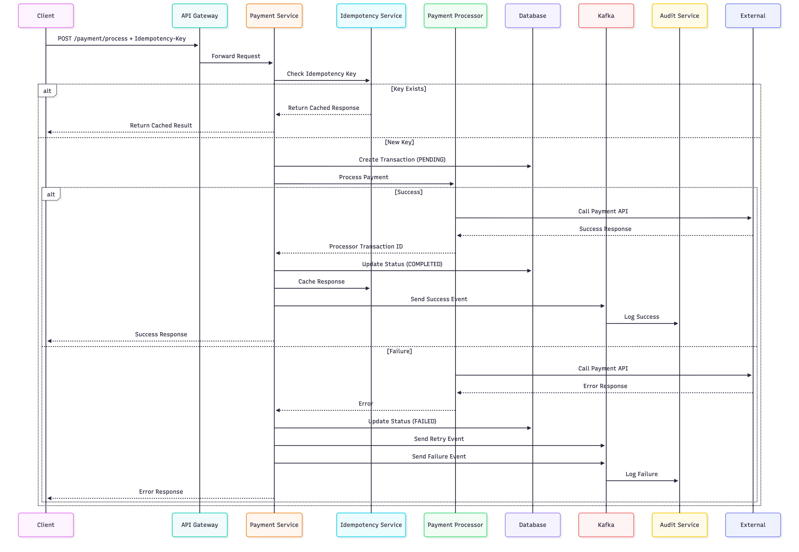

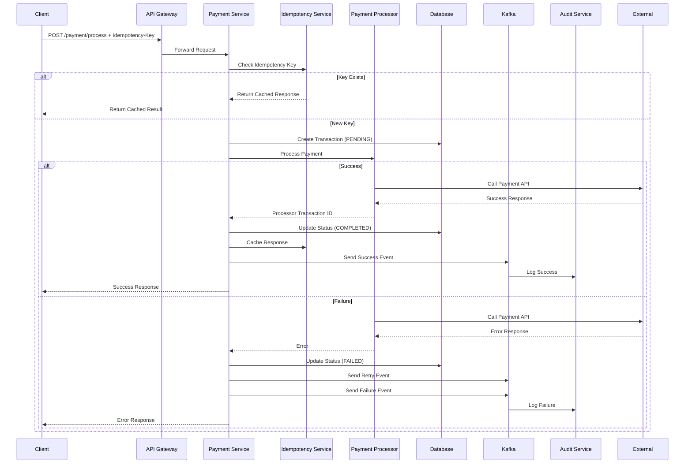
```mermaid
sequenceDiagram
    participant Client
    participant Gateway as API Gateway
    participant PS as Payment Service
    participant IDS as Idempotency Service
    participant PP as Payment Processor
    participant DB as Database
    participant Kafka
    participant Audit as Audit Service
    
    Client->>Gateway: POST /payment/process + Idempotency-Key
    Gateway->>PS: Forward Request
    
    PS->>IDS: Check Idempotency Key
    alt Key Exists
        IDS-->>PS: Return Cached Response
        PS-->>Client: Return Cached Result
    else New Key
        PS->>DB: Create Transaction (PENDING)
        PS->>PP: Process Payment
        
        alt Success
            PP->>External: Call Payment API
            External-->>PP: Success Response
            PP-->>PS: Processor Transaction ID
            PS->>DB: Update Status (COMPLETED)
            PS->>IDS: Cache Response
            PS->>Kafka: Send Success Event
            Kafka->>Audit: Log Success
            PS-->>Client: Success Response
        else Failure
            PP->>External: Call Payment API
            External-->>PP: Error Response
            PP-->>PS: Error
            PS->>DB: Update Status (FAILED)
            PS->>Kafka: Send Retry Event
            PS->>Kafka: Send Failure Event
            Kafka->>Audit: Log Failure
            PS-->>Client: Error Response
        end
    end
```

## 3. Idempotency Management

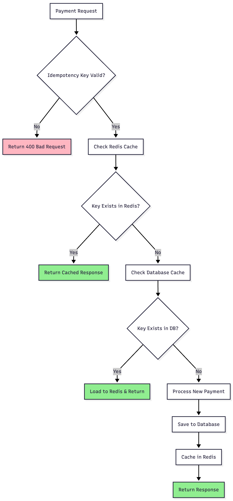

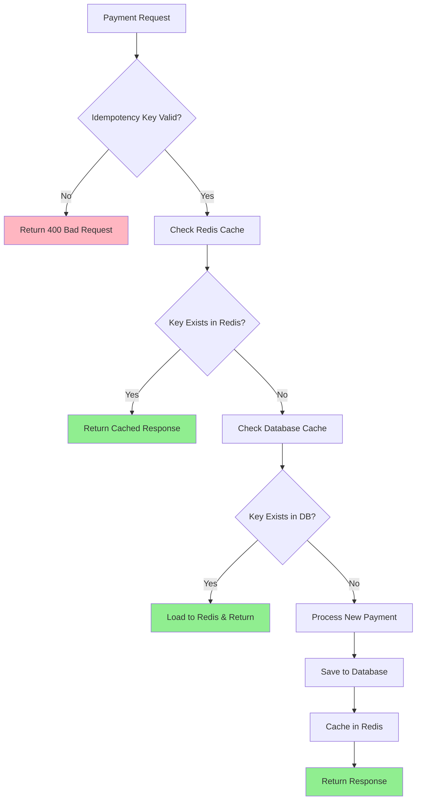
```mermaid
flowchart TD
    A[Payment Request] --> B{Idempotency Key Valid?}
    B -->|No| C[Return 400 Bad Request]
    B -->|Yes| D[Check Redis Cache]
    D --> E{Key Exists in Redis?}
    E -->|Yes| F[Return Cached Response]
    E -->|No| G[Check Database Cache]
    G --> H{Key Exists in DB?}
    H -->|Yes| I[Load to Redis & Return]
    H -->|No| J[Process New Payment]
    J --> K[Save to Database]
    K --> L[Cache in Redis]
    L --> M[Return Response]
    
    style F fill:#90EE90
    style I fill:#90EE90
    style M fill:#90EE90
    style C fill:#FFB6C1
```

## 4. Circuit Breaker Pattern

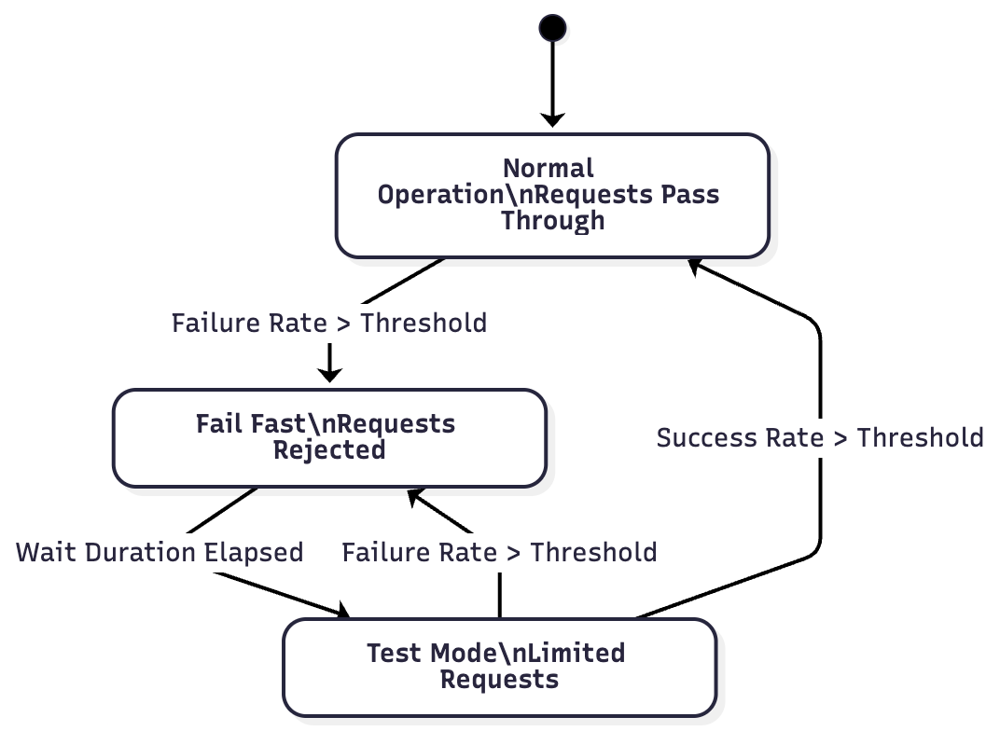

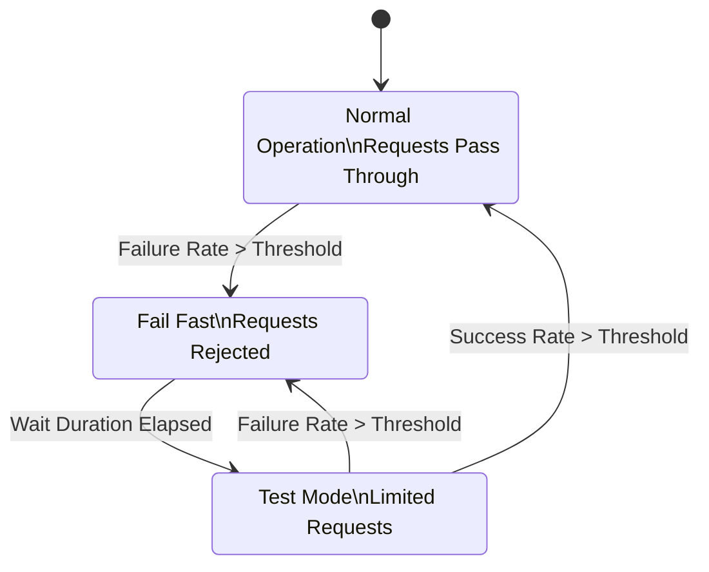
```mermaid
stateDiagram-v2
    [*] --> Closed
    Closed --> Open: Failure Rate > Threshold
    Open --> HalfOpen: Wait Duration Elapsed
    HalfOpen --> Closed: Success Rate > Threshold
    HalfOpen --> Open: Failure Rate > Threshold
    
    Closed: Normal Operation\nRequests Pass Through
    Open: Fail Fast\nRequests Rejected
    HalfOpen: Test Mode\nLimited Requests
```

## 5. Retry Mechanism with Exponential Backoff

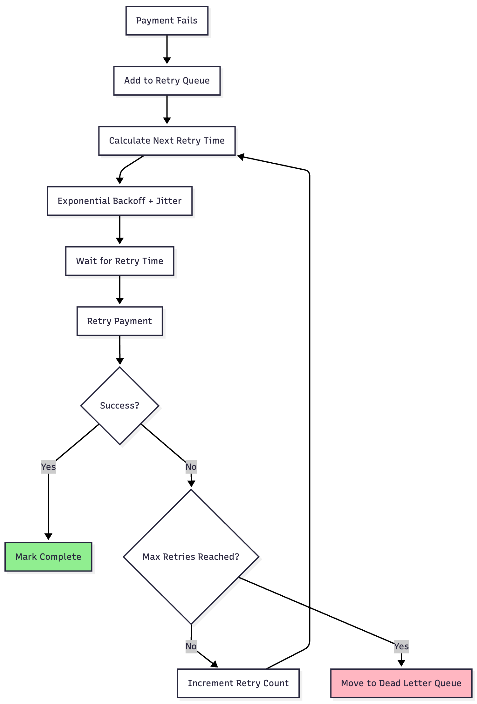

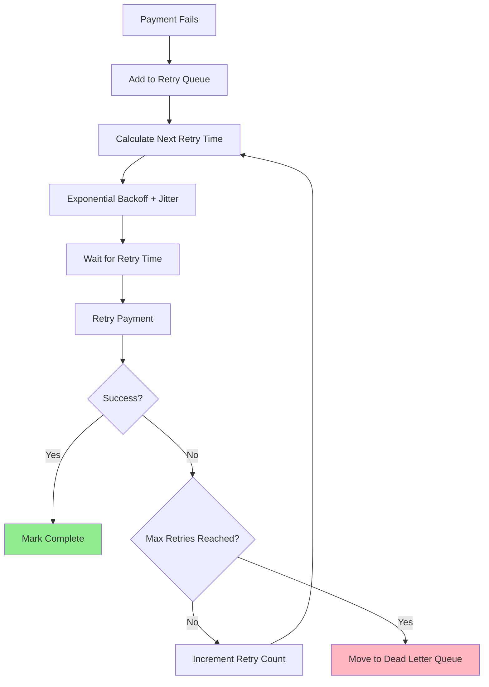
```mermaid
graph TD
    A[Payment Fails] --> B[Add to Retry Queue]
    B --> C[Calculate Next Retry Time]
    C --> D[Exponential Backoff + Jitter]
    D --> E[Wait for Retry Time]
    E --> F[Retry Payment]
    F --> G{Success?}
    G -->|Yes| H[Mark Complete]
    G -->|No| I{Max Retries Reached?}
    I -->|No| J[Increment Retry Count]
    J --> C
    I -->|Yes| K[Move to Dead Letter Queue]
    
    style H fill:#90EE90
    style K fill:#FFB6C1
```

## 6. Database Schema Relationships

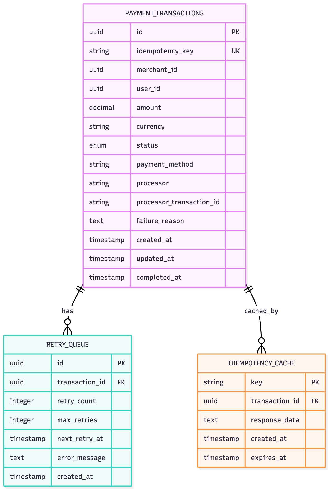

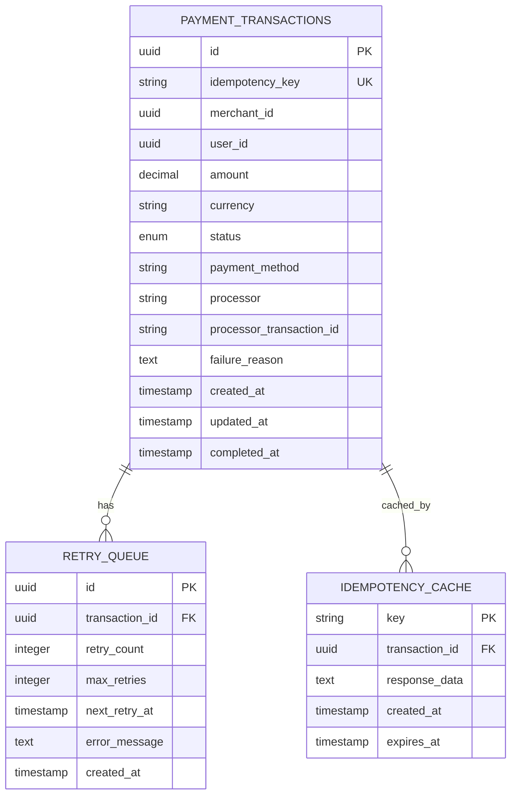
```mermaid
erDiagram
    PAYMENT_TRANSACTIONS ||--o{ RETRY_QUEUE : has
    PAYMENT_TRANSACTIONS ||--o{ IDEMPOTENCY_CACHE : cached_by
    
    PAYMENT_TRANSACTIONS {
        uuid id PK
        string idempotency_key UK
        uuid merchant_id
        uuid user_id
        decimal amount
        string currency
        enum status
        string payment_method
        string processor
        string processor_transaction_id
        text failure_reason
        timestamp created_at
        timestamp updated_at
        timestamp completed_at
    }
    
    IDEMPOTENCY_CACHE {
        string key PK
        uuid transaction_id FK
        text response_data
        timestamp created_at
        timestamp expires_at
    }
    
    RETRY_QUEUE {
        uuid id PK
        uuid transaction_id FK
        integer retry_count
        integer max_retries
        timestamp next_retry_at
        text error_message
        timestamp created_at
    }
```

## 7. Distributed Transaction Saga Pattern

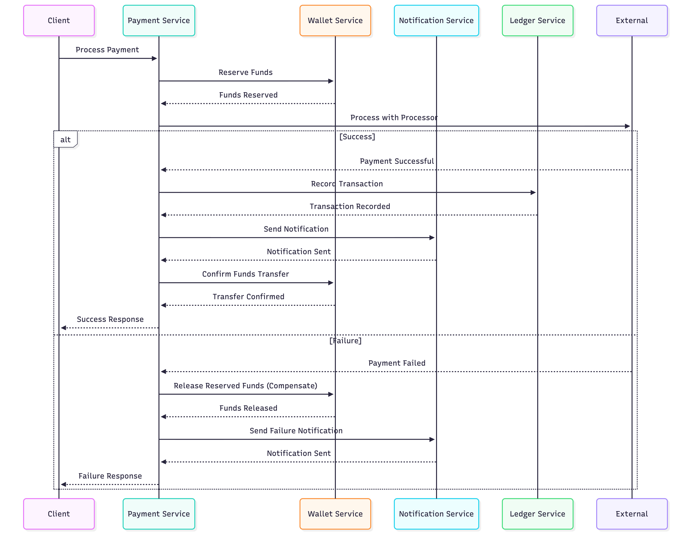

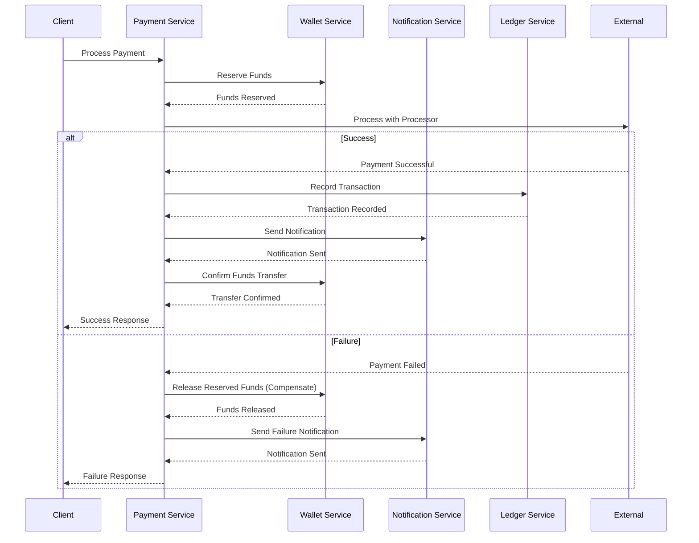
```mermaid
sequenceDiagram
    participant Client
    participant PS as Payment Service
    participant WS as Wallet Service
    participant NS as Notification Service
    participant LS as Ledger Service
    
    Client->>PS: Process Payment
    PS->>WS: Reserve Funds
    WS-->>PS: Funds Reserved
    
    PS->>External: Process with Processor
    alt Success
        External-->>PS: Payment Successful
        PS->>LS: Record Transaction
        LS-->>PS: Transaction Recorded
        PS->>NS: Send Notification
        NS-->>PS: Notification Sent
        PS->>WS: Confirm Funds Transfer
        WS-->>PS: Transfer Confirmed
        PS-->>Client: Success Response
    else Failure
        External-->>PS: Payment Failed
        PS->>WS: Release Reserved Funds (Compensate)
        WS-->>PS: Funds Released
        PS->>NS: Send Failure Notification
        NS-->>PS: Notification Sent
        PS-->>Client: Failure Response
    end
```

## 8. Monitoring and Alerting Architecture

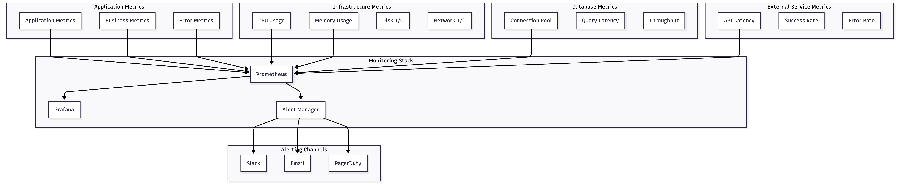

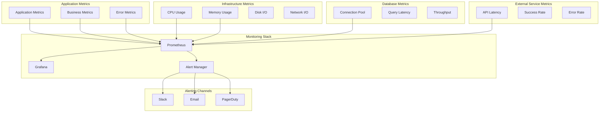
```mermaid
graph TB
    subgraph "Application Metrics"
        APP_METRICS[Application Metrics]
        BUSINESS_METRICS[Business Metrics]
        ERROR_METRICS[Error Metrics]
    end
    
    subgraph "Infrastructure Metrics"
        CPU[CPU Usage]
        MEMORY[Memory Usage]
        DISK[Disk I/O]
        NETWORK[Network I/O]
    end
    
    subgraph "Database Metrics"
        DB_CONN[Connection Pool]
        DB_LATENCY[Query Latency]
        DB_THROUGHPUT[Throughput]
    end
    
    subgraph "External Service Metrics"
        EXT_LATENCY[API Latency]
        EXT_SUCCESS[Success Rate]
        EXT_ERRORS[Error Rate]
    end
    
    subgraph "Monitoring Stack"
        PROMETHEUS[Prometheus]
        GRAFANA[Grafana]
        ALERTMANAGER[Alert Manager]
    end
    
    subgraph "Alerting Channels"
        SLACK[Slack]
        EMAIL[Email]
        PAGERDUTY[PagerDuty]
    end
    
    APP_METRICS --> PROMETHEUS
    BUSINESS_METRICS --> PROMETHEUS
    ERROR_METRICS --> PROMETHEUS
    CPU --> PROMETHEUS
    MEMORY --> PROMETHEUS
    DB_CONN --> PROMETHEUS
    EXT_LATENCY --> PROMETHEUS
    
    PROMETHEUS --> GRAFANA
    PROMETHEUS --> ALERTMANAGER
    
    ALERTMANAGER --> SLACK
    ALERTMANAGER --> EMAIL
    ALERTMANAGER --> PAGERDUTY
```

## 9. Security Architecture

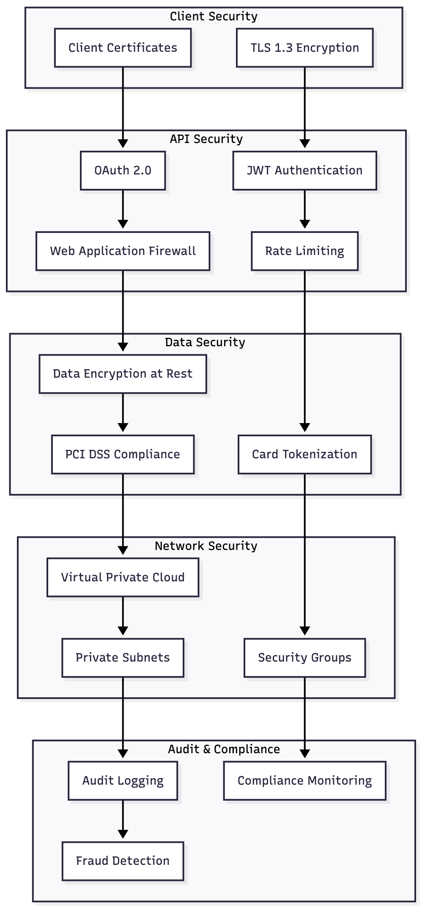

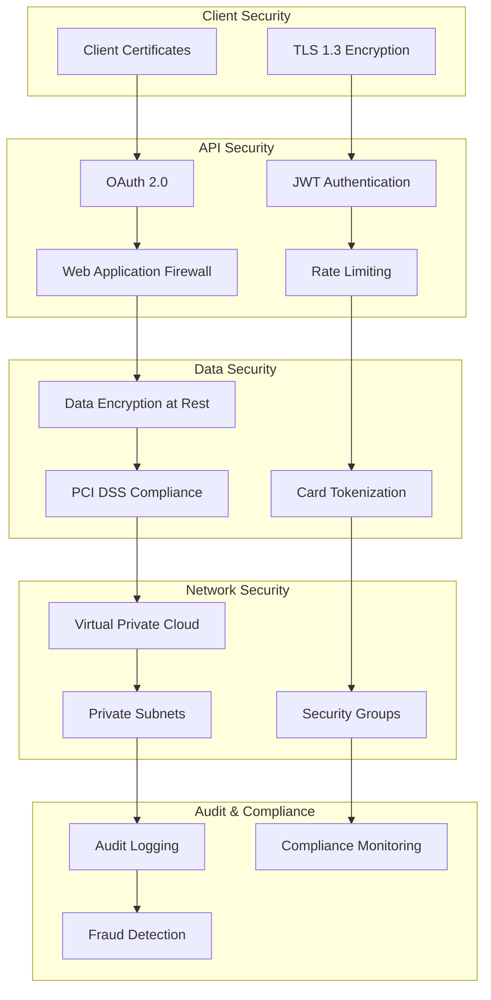
```mermaid
graph TB
    subgraph "Client Security"
        TLS[TLS 1.3 Encryption]
        CLIENT_CERT[Client Certificates]
    end
    
    subgraph "API Security"
        JWT[JWT Authentication]
        OAUTH[OAuth 2.0]
        RATE_LIMIT[Rate Limiting]
        WAF[Web Application Firewall]
    end
    
    subgraph "Data Security"
        ENCRYPTION[Data Encryption at Rest]
        TOKENIZATION[Card Tokenization]
        PCI_DSS[PCI DSS Compliance]
    end
    
    subgraph "Network Security"
        VPC[Virtual Private Cloud]
        SECURITY_GROUPS[Security Groups]
        PRIVATE_SUBNETS[Private Subnets]
    end
    
    subgraph "Audit & Compliance"
        AUDIT_LOGS[Audit Logging]
        COMPLIANCE[Compliance Monitoring]
        FRAUD_DETECTION[Fraud Detection]
    end
    
    TLS --> JWT
    CLIENT_CERT --> OAUTH
    JWT --> RATE_LIMIT
    OAUTH --> WAF
    
    WAF --> ENCRYPTION
    RATE_LIMIT --> TOKENIZATION
    ENCRYPTION --> PCI_DSS
    
    PCI_DSS --> VPC
    TOKENIZATION --> SECURITY_GROUPS
    VPC --> PRIVATE_SUBNETS
    
    PRIVATE_SUBNETS --> AUDIT_LOGS
    SECURITY_GROUPS --> COMPLIANCE
    AUDIT_LOGS --> FRAUD_DETECTION
```

## 10. Scalability Architecture

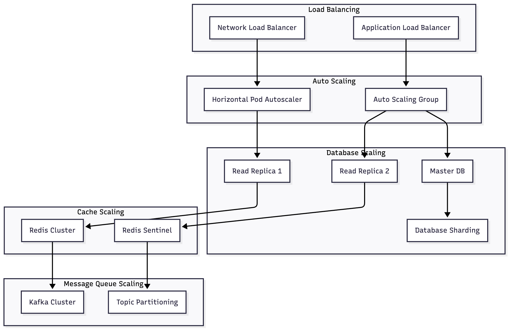

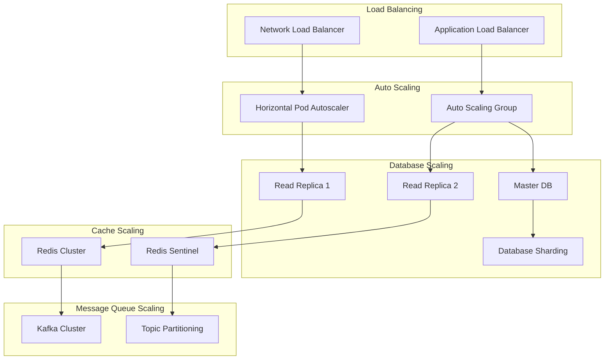
```mermaid
graph TB
    subgraph "Load Balancing"
        ALB[Application Load Balancer]
        NLB[Network Load Balancer]
    end
    
    subgraph "Auto Scaling"
        ASG[Auto Scaling Group]
        HPA[Horizontal Pod Autoscaler]
    end
    
    subgraph "Database Scaling"
        MASTER[Master DB]
        REPLICA1[Read Replica 1]
        REPLICA2[Read Replica 2]
        SHARDING[Database Sharding]
    end
    
    subgraph "Cache Scaling"
        REDIS_CLUSTER[Redis Cluster]
        REDIS_SENTINEL[Redis Sentinel]
    end
    
    subgraph "Message Queue Scaling"
        KAFKA_CLUSTER[Kafka Cluster]
        PARTITIONING[Topic Partitioning]
    end
    
    ALB --> ASG
    NLB --> HPA
    
    ASG --> MASTER
    HPA --> REPLICA1
    ASG --> REPLICA2
    
    MASTER --> SHARDING
    REPLICA1 --> REDIS_CLUSTER
    REPLICA2 --> REDIS_SENTINEL
    
    REDIS_CLUSTER --> KAFKA_CLUSTER
    REDIS_SENTINEL --> PARTITIONING
```