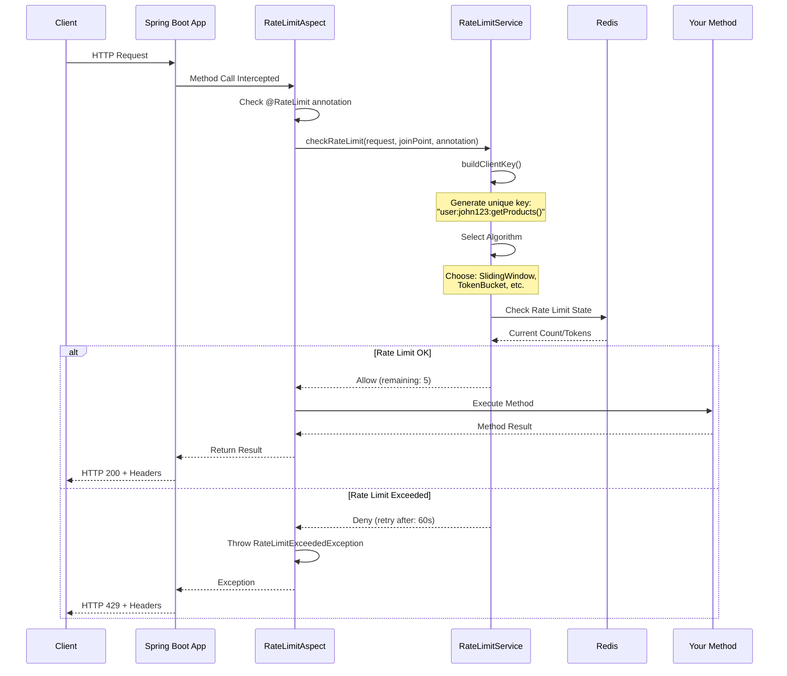
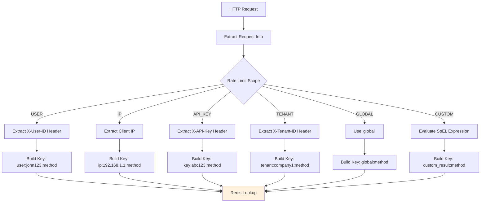
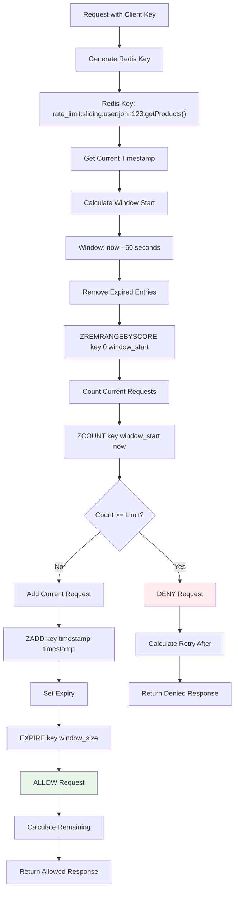
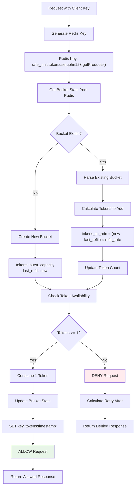
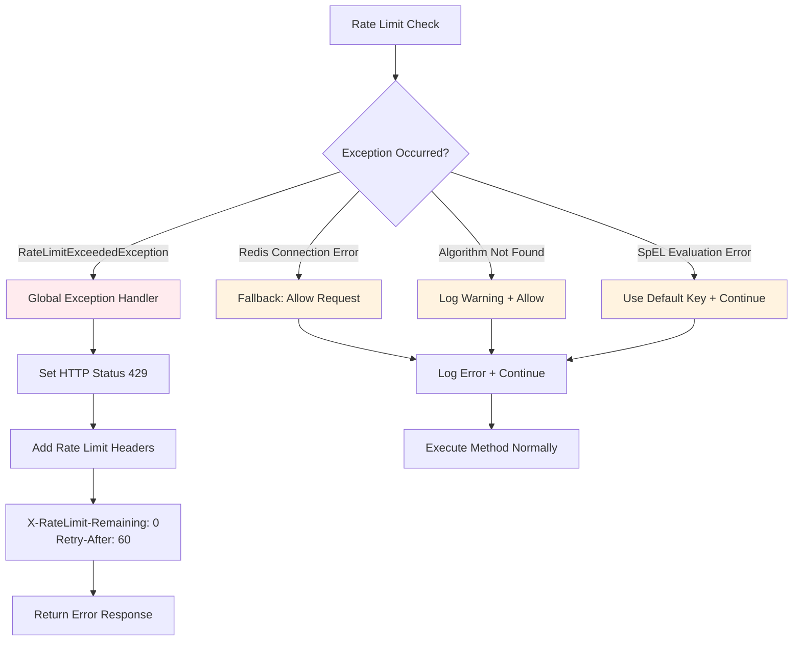
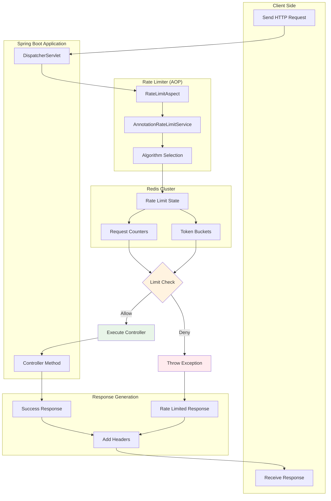
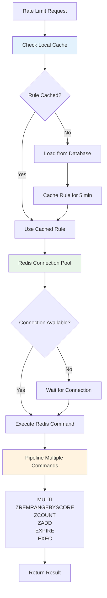
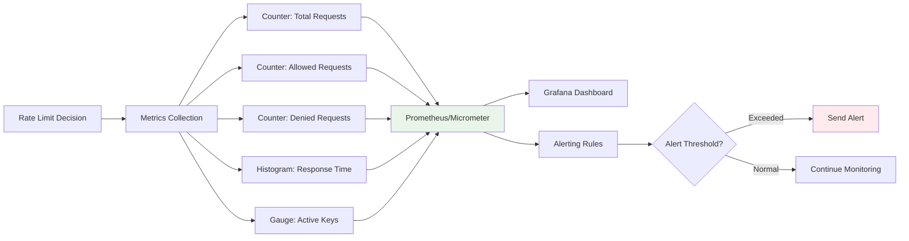

# Rate Limiter - Complete Flow Diagram

## 1. High-Level System Flow

```mermaid
graph TB
    A[Client Request] --> B[Spring Boot Application]
    B --> C[AOP Interceptor]
    C --> D{@RateLimit Annotation?}
    D -->|No| E[Execute Method Normally]
    D -->|Yes| F[Rate Limit Check]
    F --> G{Rate Limit Exceeded?}
    G -->|No| H[Execute Method]
    G -->|Yes| I[Throw RateLimitExceededException]
    H --> J[Return Response]
    I --> K[HTTP 429 Response]
    
    style A fill:#e1f5fe
    style K fill:#ffebee
    style J fill:#e8f5e8
```

## 2. Detailed Rate Limiting Flow



## 3. Client Key Generation Flow



## 4. Sliding Window Algorithm Flow



## 5. Token Bucket Algorithm Flow



## 6. Multi-Layer Rate Limiting Flow

```mermaid
flowchart TD
    A[Request] --> B[@RateLimits Annotation]
    B --> C[Extract Multiple @RateLimit]
    C --> D[Sort by Priority]
    
    D --> E[Check Layer 1: GLOBAL]
    E --> F{Global Limit OK?}
    F -->|No| G[DENY - Global Exceeded]
    F -->|Yes| H[Check Layer 2: USER]
    
    H --> I{User Limit OK?}
    I -->|No| J[DENY - User Exceeded]
    I -->|Yes| K[Check Layer 3: IP]
    
    K --> L{IP Limit OK?}
    L -->|No| M[DENY - IP Exceeded]
    L -->|Yes| N[ALL LAYERS PASSED]
    
    N --> O[Execute Method]
    
    G --> P[HTTP 429 Response]
    J --> P
    M --> P
    
    style G fill:#ffebee
    style J fill:#ffebee
    style M fill:#ffebee
    style O fill:#e8f5e8
```

## 7. Redis Data Structure Visualization

### Sliding Window (Sorted Set)
```
Redis Key: rate_limit:sliding:user:john123:getProducts()

ZRANGE key 0 -1 WITHSCORES
┌─────────────┬─────────────┐
│   Member    │    Score    │
├─────────────┼─────────────┤
│ 1704067200  │ 1704067200  │ ← Request 1
│ 1704067230  │ 1704067230  │ ← Request 2  
│ 1704067245  │ 1704067245  │ ← Request 3
│ 1704067250  │ 1704067250  │ ← Request 4
│ 1704067255  │ 1704067255  │ ← Request 5
└─────────────┴─────────────┘

Window: [1704067200 ────────────── 1704067260]
Current Time: 1704067260
Window Start: 1704067200 (60 seconds ago)
Count in Window: 5 requests
```

### Token Bucket (String)
```
Redis Key: rate_limit:token:user:john123:getProducts()

GET key
┌─────────────────────────────┐
│        Value                │
├─────────────────────────────┤
│    "7.5:1704067260"        │
│     ↑        ↑             │
│  tokens  last_refill       │
└─────────────────────────────┘

Bucket State:
- Available Tokens: 7.5
- Last Refill Time: 1704067260
- Refill Rate: 0.167 tokens/second
```

## 8. Error Handling Flow



## 9. Complete Request Lifecycle



## 10. Performance Optimization Flow



## 11. Monitoring and Metrics Flow



## 12. Configuration and Deployment Flow

```mermaid
graph TB
    subgraph "Development"
        A[@RateLimit Annotations]
        B[Application Code]
    end
    
    subgraph "Configuration"
        C[application.yml]
        D[Redis Configuration]
        E[Algorithm Settings]
    end
    
    subgraph "Runtime"
        F[Spring AOP Proxy]
        G[Rate Limiter Beans]
        H[Redis Connection]
    end
    
    subgraph "Production"
        I[Load Balancer]
        J[Multiple App Instances]
        K[Redis Cluster]
        L[Monitoring]
    end
    
    A --> F
    B --> F
    C --> G
    D --> H
    E --> G
    
    F --> I
    G --> J
    H --> K
    
    J --> L
    K --> L
    
    style A fill:#e1f5fe
    style I fill:#e8f5e8
    style K fill:#fff3e0
    style L fill:#f3e5f5
```

This comprehensive flow diagram shows exactly how the annotation-based rate limiter works from request to response, including all the internal components, decision points, and data flows.