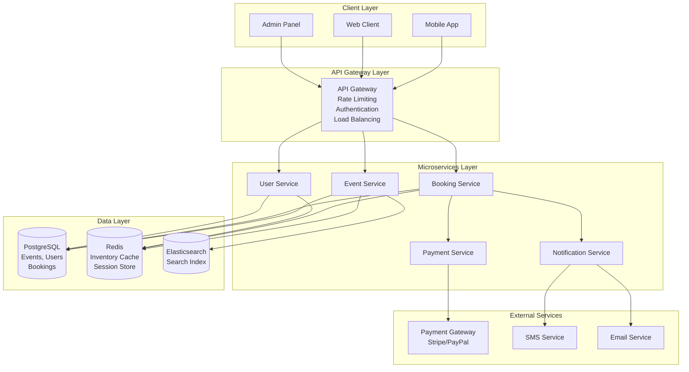
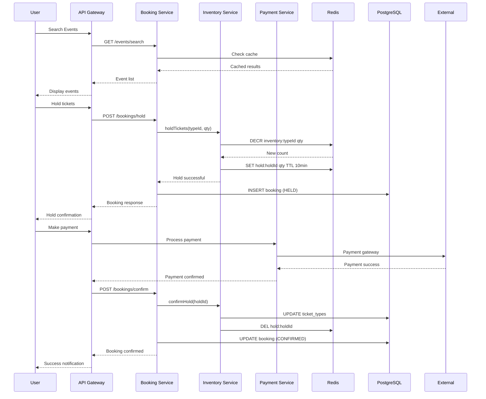
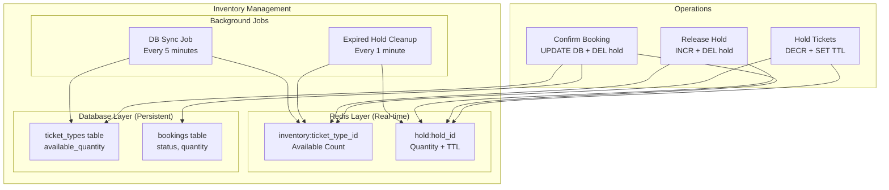
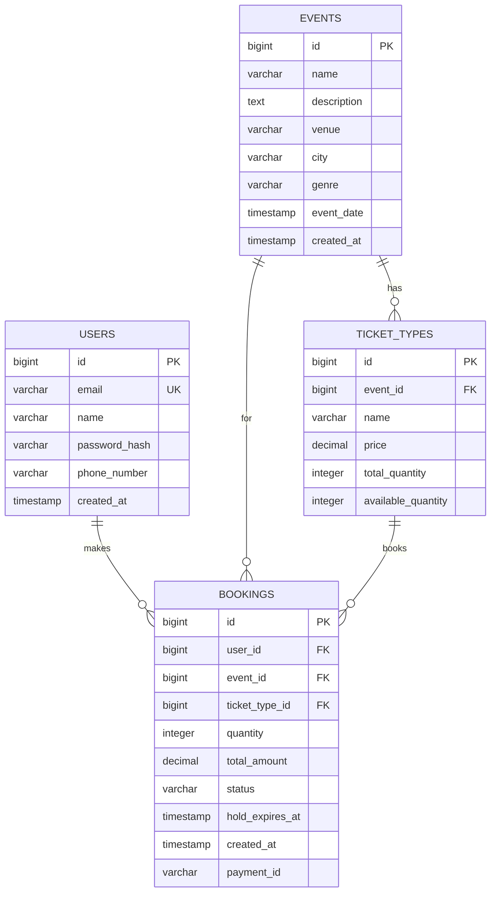
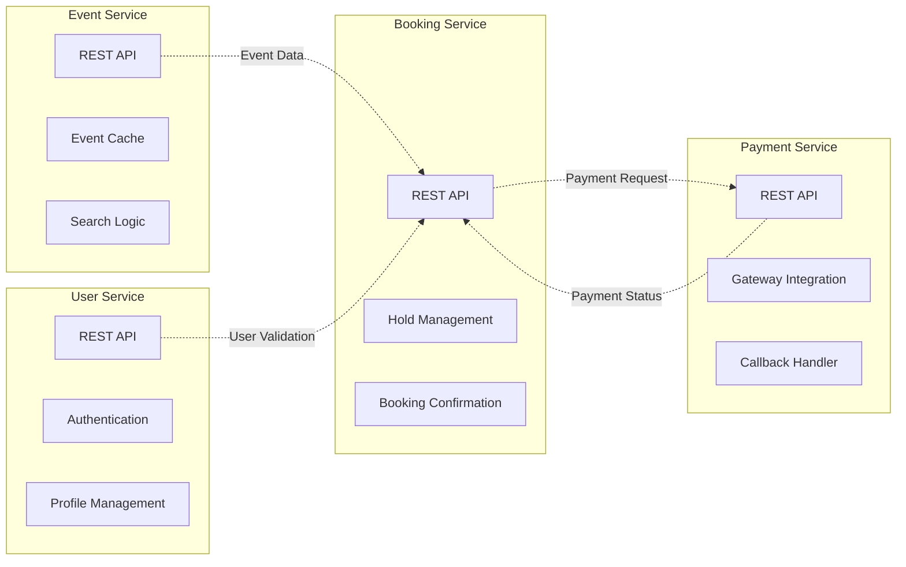
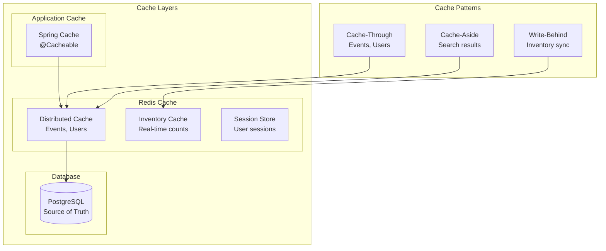
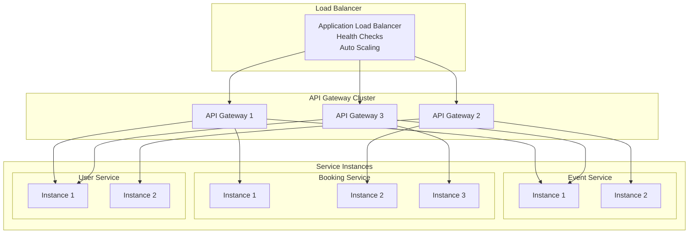
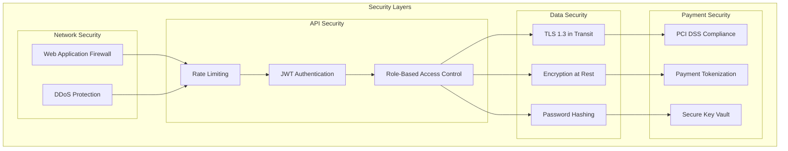
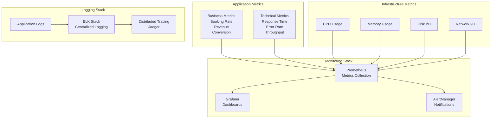
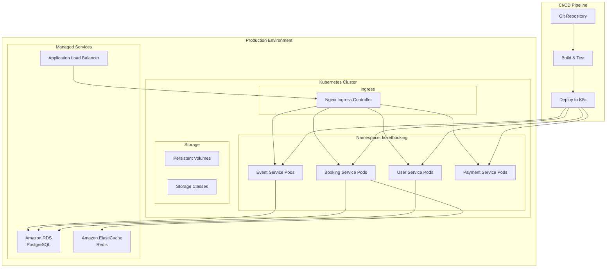

# Ticket Booking Platform - Architecture Diagrams

## 1. System Overview

## 2. Booking Flow Architecture

## 3. Inventory Management Architecture

## 4. Database Schema Relationships

## 5. Microservices Communication

## 6. Caching Strategy

## 7. Load Balancing and Scaling

## 8. Security Architecture

## 9. Monitoring and Observability

## 10. Deployment Architecture

These architecture diagrams provide a comprehensive visual representation of the ticket booking platform's design, covering system overview, data flow, microservices communication, caching strategies, security layers, and deployment architecture.