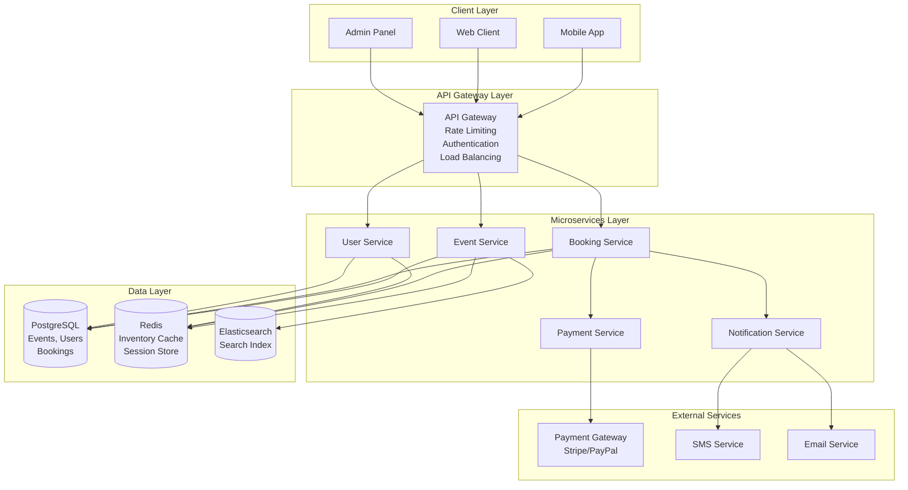
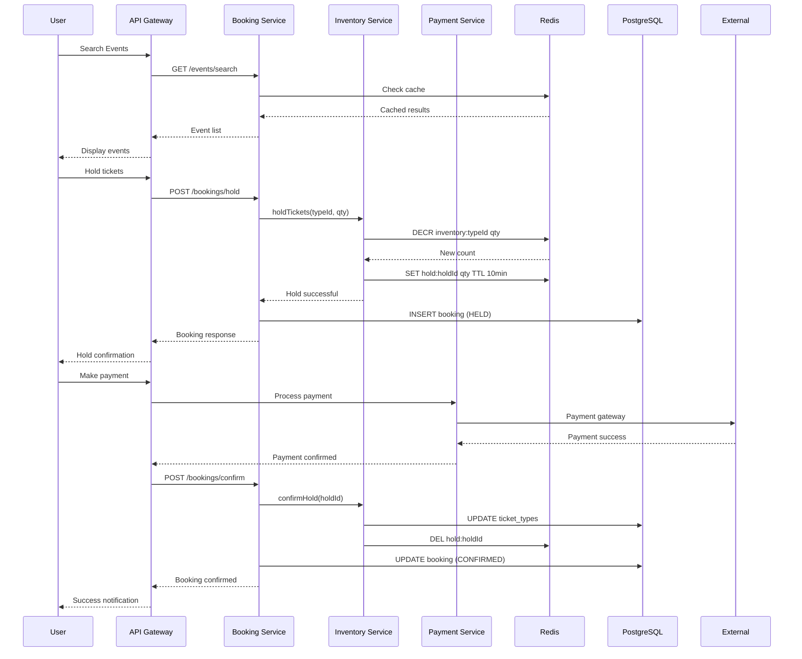
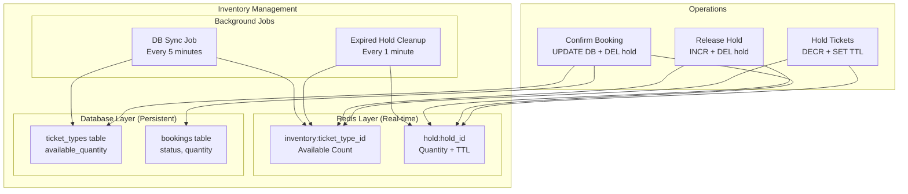
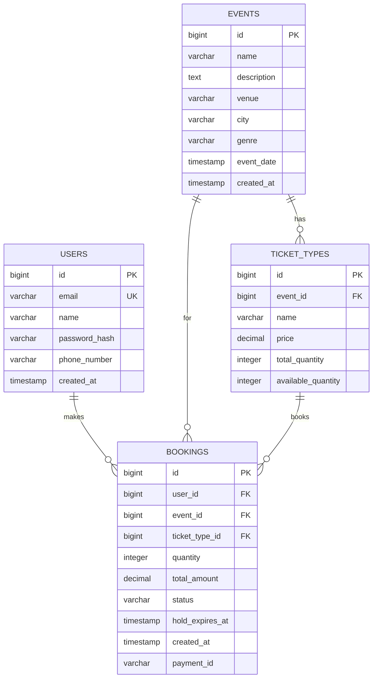
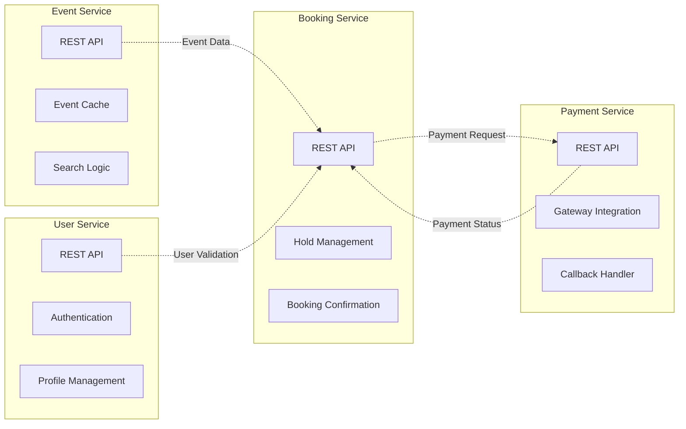
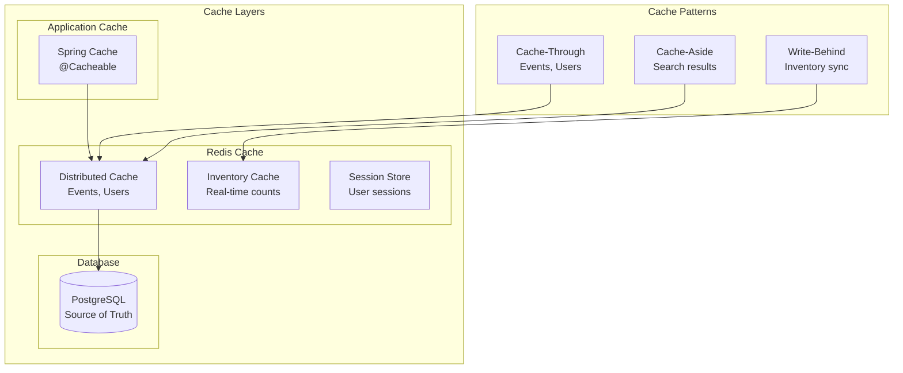
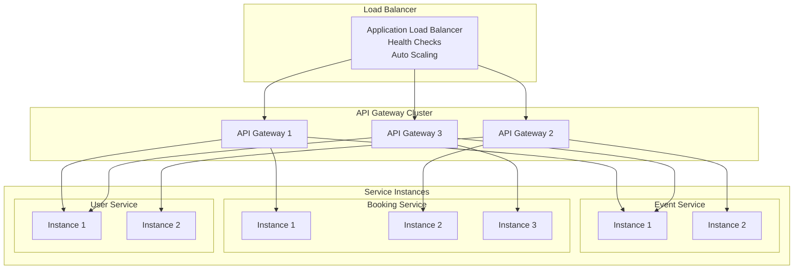
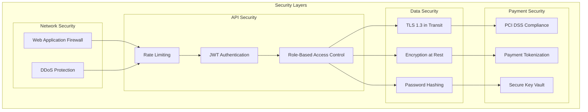
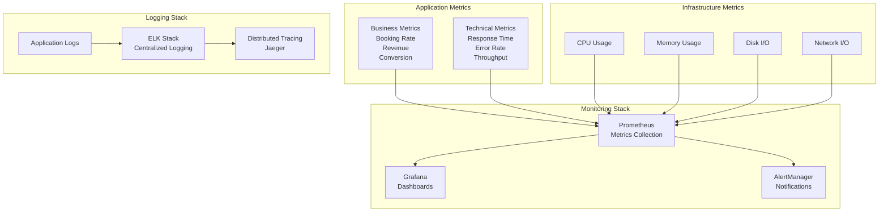
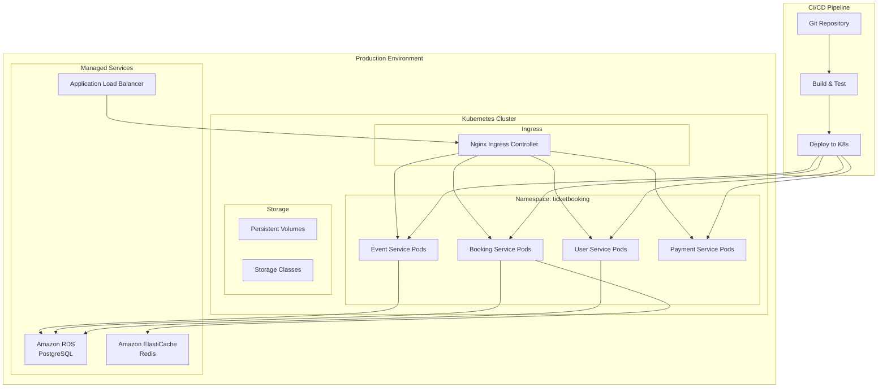

# Ticket Booking Platform - Architecture Diagrams

## Understanding Ticket Booking Architecture

### What Makes Ticket Booking Complex?
Ticket booking systems face unique challenges that require specialized architectural solutions:

1. **Flash Sale Handling**: Thousands of users trying to book limited tickets simultaneously
2. **Inventory Consistency**: Prevent overselling while maintaining high performance
3. **Hold Management**: Reserve tickets temporarily during checkout process
4. **Payment Integration**: Handle payment failures and ensure atomic transactions
5. **Real-time Updates**: Show accurate availability across all channels

### Key Architectural Decisions

#### Redis-First Inventory Management

**Why Redis for Inventory?**
```java
// Traditional database approach (slow and doesn't scale)
public boolean bookTicketDB(Long ticketTypeId, int quantity) {
    TicketType ticketType = repository.findById(ticketTypeId);
    if (ticketType.getAvailableQuantity() >= quantity) {
        ticketType.setAvailableQuantity(
            ticketType.getAvailableQuantity() - quantity);
        repository.save(ticketType);
        return true;
    }
    return false;
}

// Redis approach (fast and scalable)
public boolean bookTicketRedis(Long ticketTypeId, int quantity) {
    String key = "inventory:" + ticketTypeId;
    
    // Atomic operation - prevents race conditions
    Long remaining = redisTemplate.opsForValue().decrement(key, quantity);
    
    if (remaining < 0) {
        // Rollback if insufficient inventory
        redisTemplate.opsForValue().increment(key, quantity);
        return false;
    }
    
    // Async update to database
    asyncUpdateDatabase(ticketTypeId, quantity);
    return true;
}
```

**Benefits of Redis-First Approach**:
- **Sub-millisecond Response**: Redis operations are extremely fast
- **Atomic Operations**: DECR/INCR operations are atomic
- **High Concurrency**: Handle thousands of simultaneous requests
- **Eventual Consistency**: Database updated asynchronously

#### Hold Mechanism Implementation

**The Hold Problem**
```
Scenario: User selects tickets → Goes to payment → Payment takes 30 seconds
Problem: Other users might book the same tickets during payment
Solution: Hold tickets temporarily with TTL (Time To Live)
```

**Hold Implementation**
```java
@Service
public class TicketHoldService {
    private static final int HOLD_DURATION_MINUTES = 10;
    
    public String holdTickets(Long ticketTypeId, int quantity, Long userId) {
        String holdId = generateHoldId();
        String inventoryKey = "inventory:" + ticketTypeId;
        String holdKey = "hold:" + holdId;
        
        // Atomic decrement from available inventory
        Long remaining = redisTemplate.opsForValue().decrement(inventoryKey, quantity);
        
        if (remaining < 0) {
            // Insufficient inventory, rollback
            redisTemplate.opsForValue().increment(inventoryKey, quantity);
            return null;
        }
        
        // Create hold with automatic expiry
        HoldInfo holdInfo = new HoldInfo(ticketTypeId, quantity, userId);
        redisTemplate.opsForValue().set(holdKey, holdInfo, 
                                      Duration.ofMinutes(HOLD_DURATION_MINUTES));
        
        return holdId;
    }
    
    public void confirmHold(String holdId) {
        String holdKey = "hold:" + holdId;
        HoldInfo holdInfo = (HoldInfo) redisTemplate.opsForValue().get(holdKey);
        
        if (holdInfo != null) {
            // Permanently reduce inventory in database
            ticketTypeRepository.decrementAvailableQuantity(
                holdInfo.getTicketTypeId(), 
                holdInfo.getQuantity()
            );
            
            // Remove hold
            redisTemplate.delete(holdKey);
        }
    }
    
    public void releaseHold(String holdId) {
        String holdKey = "hold:" + holdId;
        HoldInfo holdInfo = (HoldInfo) redisTemplate.opsForValue().get(holdKey);
        
        if (holdInfo != null) {
            // Return inventory to available pool
            String inventoryKey = "inventory:" + holdInfo.getTicketTypeId();
            redisTemplate.opsForValue().increment(inventoryKey, holdInfo.getQuantity());
            
            // Remove hold
            redisTemplate.delete(holdKey);
        }
    }
}
```

#### Microservices Communication Patterns

**Synchronous vs Asynchronous Communication**

```java
// Synchronous - for critical path operations
@RestController
public class BookingController {
    
    @PostMapping("/bookings/hold")
    public ResponseEntity<BookingResponse> holdTickets(@RequestBody HoldRequest request) {
        // Synchronous call - user waits for response
        String holdId = inventoryService.holdTickets(
            request.getTicketTypeId(), 
            request.getQuantity(), 
            request.getUserId()
        );
        
        if (holdId != null) {
            Booking booking = bookingService.createHoldBooking(request, holdId);
            return ResponseEntity.ok(BookingResponse.success(booking));
        } else {
            return ResponseEntity.badRequest()
                .body(BookingResponse.error("No tickets available"));
        }
    }
}

// Asynchronous - for non-critical operations
@EventListener
public class BookingEventHandler {
    
    @Async
    public void handleBookingConfirmed(BookingConfirmedEvent event) {
        // Send confirmation email (async - don't block user)
        emailService.sendBookingConfirmation(
            event.getUserEmail(), 
            event.getBookingDetails()
        );
        
        // Update analytics (async)
        analyticsService.recordBooking(event.getBooking());
        
        // Send SMS notification (async)
        smsService.sendBookingConfirmation(
            event.getUserPhone(), 
            event.getBookingReference()
        );
    }
}
```

### Flash Sale Architecture Patterns

#### Queue-Based Processing
```java
@Component
public class FlashSaleManager {
    
    @EventListener
    public void handleHighTraffic(HighTrafficEvent event) {
        if (event.getConcurrentUsers() > FLASH_SALE_THRESHOLD) {
            // Switch to queue-based processing
            enableQueueMode(event.getEventId());
        }
    }
    
    private void enableQueueMode(Long eventId) {
        // Add users to virtual queue
        String queueKey = "queue:" + eventId;
        
        // Process queue with controlled rate
        scheduler.scheduleAtFixedRate(() -> {
            String userId = redisTemplate.opsForList().leftPop(queueKey);
            if (userId != null) {
                processBookingRequest(userId, eventId);
            }
        }, 0, 100, TimeUnit.MILLISECONDS); // Process 10 requests per second
    }
}
```

## 1. System Overview



## 2. Booking Flow Architecture



### Database Consistency Strategies

#### Write-Through vs Write-Behind Caching

**Write-Through (Strong Consistency)**
```java
public void updateInventoryWriteThrough(Long ticketTypeId, int quantity) {
    // Update Redis first
    String key = "inventory:" + ticketTypeId;
    redisTemplate.opsForValue().decrement(key, quantity);
    
    // Immediately update database (synchronous)
    ticketTypeRepository.decrementAvailableQuantity(ticketTypeId, quantity);
    
    // Both Redis and DB are consistent
}
```
**Pros**: Strong consistency between cache and database
**Cons**: Slower writes, database becomes bottleneck during flash sales

**Write-Behind (Eventual Consistency)**
```java
public void updateInventoryWriteBehind(Long ticketTypeId, int quantity) {
    // Update Redis immediately (fast response to user)
    String key = "inventory:" + ticketTypeId;
    redisTemplate.opsForValue().decrement(key, quantity);
    
    // Queue database update for later (asynchronous)
    inventoryUpdateQueue.send(new InventoryUpdate(ticketTypeId, quantity));
}

@EventListener
public void processInventoryUpdate(InventoryUpdate update) {
    // Process in background
    ticketTypeRepository.decrementAvailableQuantity(
        update.getTicketTypeId(), 
        update.getQuantity()
    );
}
```
**Pros**: Fast writes, high throughput during flash sales
**Cons**: Temporary inconsistency between cache and database

#### Reconciliation Strategy
```java
@Scheduled(fixedRate = 60000) // Every minute
public void reconcileInventory() {
    List<TicketType> ticketTypes = ticketTypeRepository.findAll();
    
    for (TicketType ticketType : ticketTypes) {
        String key = "inventory:" + ticketType.getId();
        Integer redisCount = (Integer) redisTemplate.opsForValue().get(key);
        
        if (redisCount == null) {
            // Initialize Redis from database
            redisTemplate.opsForValue().set(key, ticketType.getAvailableQuantity());
        } else if (!redisCount.equals(ticketType.getAvailableQuantity())) {
            // Reconcile differences
            log.warn("Inventory mismatch for ticket type {}: Redis={}, DB={}", 
                    ticketType.getId(), redisCount, ticketType.getAvailableQuantity());
            
            // During active sales, Redis is source of truth
            if (isActiveSalePeriod(ticketType.getEventId())) {
                ticketType.setAvailableQuantity(redisCount);
                ticketTypeRepository.save(ticketType);
            } else {
                // During quiet periods, database is source of truth
                redisTemplate.opsForValue().set(key, ticketType.getAvailableQuantity());
            }
        }
    }
}
```

## 3. Inventory Management Architecture

### Understanding Inventory Management Complexity

This diagram shows the multi-layered approach to inventory management:

1. **Redis Layer**: Real-time inventory tracking with atomic operations
2. **Database Layer**: Persistent storage and source of truth
3. **Background Jobs**: Cleanup and synchronization processes

#### Critical Operations Explained

**Hold Operation Flow**
```java
public class InventoryService {
    
    @Transactional
    public HoldResult holdTickets(Long ticketTypeId, int quantity, Long userId) {
        String inventoryKey = "inventory:" + ticketTypeId;
        
        // Step 1: Atomic decrement in Redis
        Long remaining = redisTemplate.opsForValue().decrement(inventoryKey, quantity);
        
        if (remaining < 0) {
            // Step 2: Rollback if insufficient inventory
            redisTemplate.opsForValue().increment(inventoryKey, quantity);
            return HoldResult.failure("Insufficient inventory");
        }
        
        // Step 3: Create hold with TTL
        String holdId = UUID.randomUUID().toString();
        String holdKey = "hold:" + holdId;
        
        HoldInfo holdInfo = new HoldInfo(
            ticketTypeId, 
            quantity, 
            userId, 
            System.currentTimeMillis() + Duration.ofMinutes(10).toMillis()
        );
        
        redisTemplate.opsForValue().set(holdKey, holdInfo, Duration.ofMinutes(10));
        
        // Step 4: Create booking record
        Booking booking = new Booking(
            userId, 
            ticketTypeId, 
            quantity, 
            BookingStatus.HELD, 
            holdId
        );
        bookingRepository.save(booking);
        
        return HoldResult.success(holdId, booking.getId());
    }
}
```

**Expired Hold Cleanup**
```java
@Component
public class HoldCleanupService {
    
    @Scheduled(fixedRate = 60000) // Every minute
    public void cleanupExpiredHolds() {
        // Find all hold keys
        Set<String> holdKeys = redisTemplate.keys("hold:*");
        
        for (String holdKey : holdKeys) {
            HoldInfo holdInfo = (HoldInfo) redisTemplate.opsForValue().get(holdKey);
            
            if (holdInfo == null) {
                // Hold already expired, check for orphaned bookings
                String holdId = holdKey.substring(5); // Remove "hold:" prefix
                
                List<Booking> orphanedBookings = bookingRepository
                    .findByHoldIdAndStatus(holdId, BookingStatus.HELD);
                
                for (Booking booking : orphanedBookings) {
                    // Release inventory back to pool
                    String inventoryKey = "inventory:" + booking.getTicketTypeId();
                    redisTemplate.opsForValue().increment(inventoryKey, booking.getQuantity());
                    
                    // Mark booking as expired
                    booking.setStatus(BookingStatus.EXPIRED);
                    bookingRepository.save(booking);
                    
                    log.info("Released {} tickets for expired booking: {}", 
                            booking.getQuantity(), booking.getId());
                }
            }
        }
    }
}
```



## 4. Database Schema Relationships



## 5. Microservices Communication



## 6. Caching Strategy



## 7. Load Balancing and Scaling



## 8. Security Architecture



## 9. Monitoring and Observability



## 10. Deployment Architecture



These architecture diagrams provide a comprehensive visual representation of the ticket booking platform's design, covering system overview, data flow, microservices communication, caching strategies, security layers, and deployment architecture.