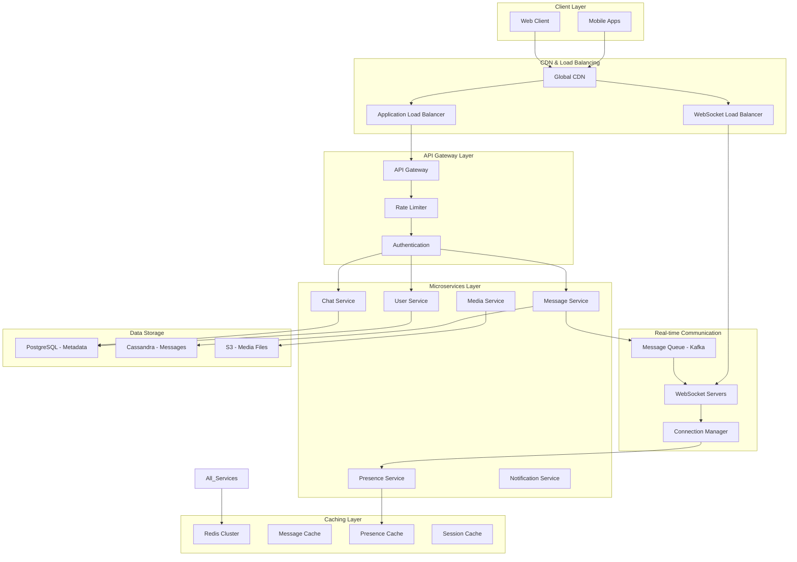

# WhatsApp Messenger - System Design

## 📱 Overview

A highly scalable, real-time messaging platform similar to WhatsApp, supporting billions of users with instant message delivery, multimedia sharing, group chats, and status updates.

## 🎯 Key Features

### Core Messaging
- **Real-time messaging** with sub-second latency
- **Individual and group chats** (up to 256 participants)
- **Message types**: Text, Image, Video, Audio, Document, Location, Contact, Sticker
- **Message status**: Sent, Delivered, Read (Blue ticks)
- **Reply and forward** functionality
- **Message deletion** (within 1 hour)
- **Message search** within chats

### Advanced Features
- **WhatsApp Status** (24-hour expiry stories)
- **Typing indicators** and online status
- **Last seen** timestamps
- **Profile management** with photos and about
- **Group administration** (add/remove participants, admins)
- **Media compression** and thumbnails
- **End-to-end encryption** (conceptual)

## 🏗️ System Architecture

### High-Level Architecture (Enhanced with ByteByteGo Principles)



### Technology Stack (Enhanced with ByteByteGo Best Practices)

#### Backend Framework
- **Language**: Java 17 (WhatsApp uses Erlang/OTP for massive concurrency)
- **Framework**: Spring Boot 3.2 with WebFlux for reactive programming
- **Real-time**: WebSocket with STOMP + SockJS fallback
- **Message Queue**: Apache Kafka with exactly-once semantics
- **Caching**: Redis Cluster with consistent hashing

#### Database Strategy (Multi-Database Approach)
- **User Metadata**: PostgreSQL with read replicas
- **Messages**: Cassandra with time-series partitioning
- **Real-time Data**: Redis with pub/sub
- **Media Storage**: S3 with CloudFront CDN
- **Search**: Elasticsearch for message search

#### Infrastructure & Scalability
- **Load Balancing**: Application + Network Load Balancers
- **Service Mesh**: Istio for microservices communication
- **Monitoring**: Prometheus + Grafana + Jaeger tracing
- **Containerization**: Docker + Kubernetes with auto-scaling
- **Message Delivery**: Kafka + Redis for reliable delivery

## 📊 Scale Requirements

### User Base
- **Total Users**: 2 billion
- **Daily Active Users**: 1 billion
- **Peak Concurrent Users**: 100 million
- **Messages per day**: 100 billion
- **Peak messages per second**: 1.2 million

### Performance Requirements
- **Message delivery latency**: <100ms
- **System availability**: 99.99%
- **Message delivery guarantee**: At least once
- **Read receipt latency**: <200ms

## 🔧 Detailed Component Design (Enhanced)

### 1. User Service

**Responsibilities:**
- User registration and authentication
- Profile management with caching
- Contact synchronization
- User status management (online/offline/typing)

**Key Features:**
- Phone number-based registration with OTP
- Profile picture and status management
- Last seen privacy settings
- Contact discovery with Redis caching
- Presence management with heartbeat mechanism

**Enhancements:**
- Redis caching for user profiles (5-minute TTL)
- Presence service with real-time updates
- Connection manager for WebSocket sessions
- Heartbeat mechanism for online status

### 2. Chat Service

**Responsibilities:**
- Individual and group chat management
- Participant management
- Chat metadata

**Key Features:**
- Create individual/group chats
- Add/remove participants
- Admin management for groups
- Chat settings and permissions

### 3. Message Service (Enhanced with ByteByteGo Patterns)

**Responsibilities:**
- Message sending with idempotency
- Reliable message delivery (online/offline)
- Message persistence and caching
- Delivery status tracking

**Key Features:**
- **Idempotent Message Sending**: Prevents duplicate messages
- **Kafka-based Reliable Delivery**: Ensures at-least-once delivery
- **Online/Offline Message Handling**: Immediate delivery + offline storage
- **Message Caching**: Redis cache for recent messages
- **Delivery Receipts**: Real-time status updates (sent/delivered/read)

**Enhancements:**
- Message queue service with Kafka
- Message delivery service for online/offline users
- Redis caching for recent messages (30-minute TTL)
- Idempotency keys to prevent duplicate sends
- Connection manager for multi-server WebSocket handling

### 4. Media Service

**Responsibilities:**
- Media upload and download
- Image/video compression
- Thumbnail generation

**Key Features:**
- Support for images, videos, audio, documents
- Automatic compression for mobile optimization
- Thumbnail generation for quick preview
- CDN integration for global delivery

### 5. Status Service

**Responsibilities:**
- WhatsApp Status (Stories) management
- 24-hour auto-expiry
- Status privacy controls

**Key Features:**
- Text, image, and video status
- Automatic expiry after 24 hours
- View tracking
- Privacy controls (contacts only, selected contacts)

## 💾 Database Design

### PostgreSQL Schema (Metadata)

```sql
-- Users table
CREATE TABLE users (
    id UUID PRIMARY KEY DEFAULT gen_random_uuid(),
    phone_number VARCHAR(20) UNIQUE NOT NULL,
    name VARCHAR(100),
    profile_picture TEXT,
    about TEXT DEFAULT 'Hey there! I am using WhatsApp.',
    status VARCHAR(20) DEFAULT 'OFFLINE',
    last_seen TIMESTAMP,
    created_at TIMESTAMP DEFAULT CURRENT_TIMESTAMP,
    updated_at TIMESTAMP DEFAULT CURRENT_TIMESTAMP
);

-- Chats table
CREATE TABLE chats (
    id UUID PRIMARY KEY DEFAULT gen_random_uuid(),
    type VARCHAR(20) NOT NULL, -- INDIVIDUAL, GROUP, BROADCAST
    name VARCHAR(100), -- For group chats
    description TEXT,
    group_icon TEXT,
    created_by UUID REFERENCES users(id),
    created_at TIMESTAMP DEFAULT CURRENT_TIMESTAMP,
    updated_at TIMESTAMP DEFAULT CURRENT_TIMESTAMP
);

-- Chat participants
CREATE TABLE chat_participants (
    chat_id UUID REFERENCES chats(id),
    user_id UUID REFERENCES users(id),
    joined_at TIMESTAMP DEFAULT CURRENT_TIMESTAMP,
    PRIMARY KEY (chat_id, user_id)
);

-- Chat admins
CREATE TABLE chat_admins (
    chat_id UUID REFERENCES chats(id),
    user_id UUID REFERENCES users(id),
    PRIMARY KEY (chat_id, user_id)
);
```

### Cassandra Schema (Messages)

```cql
-- Messages table (partitioned by chat_id for scalability)
CREATE TABLE messages (
    chat_id UUID,
    message_id UUID,
    sender_id UUID,
    content TEXT,
    message_type TEXT, -- TEXT, IMAGE, VIDEO, AUDIO, DOCUMENT, LOCATION
    media_url TEXT,
    media_type TEXT,
    media_size BIGINT,
    thumbnail_url TEXT,
    latitude DOUBLE,
    longitude DOUBLE,
    reply_to_message_id UUID,
    is_forwarded BOOLEAN,
    status TEXT, -- SENT, DELIVERED, READ
    created_at TIMESTAMP,
    edited_at TIMESTAMP,
    PRIMARY KEY (chat_id, created_at, message_id)
) WITH CLUSTERING ORDER BY (created_at DESC);

-- Message deliveries (for read receipts)
CREATE TABLE message_deliveries (
    message_id UUID,
    user_id UUID,
    status TEXT, -- SENT, DELIVERED, READ
    delivered_at TIMESTAMP,
    read_at TIMESTAMP,
    PRIMARY KEY (message_id, user_id)
);
```

## 🚀 Real-time Architecture (Enhanced)

### WebSocket Implementation with ByteByteGo Patterns

**Connection Management:**
- **Multi-server WebSocket handling** with Redis-based connection registry
- **Presence service** with heartbeat mechanism (5-minute TTL)
- **Connection manager** tracks user-to-server mapping
- **Automatic failover** when WebSocket servers go down

**Enhanced Message Flow:**
1. **Client sends message** via REST API with idempotency key
2. **Message Service** validates and stores in Cassandra
3. **Kafka publishes** message to delivery topic
4. **Message Delivery Service** handles online/offline delivery:
   - **Online users**: Immediate WebSocket delivery
   - **Offline users**: Store in Redis for later delivery
5. **Delivery receipts** update status in real-time
6. **Presence updates** broadcast to relevant contacts

**Reliability Enhancements:**
- **Message queuing** with Kafka for guaranteed delivery
- **Offline message storage** in Redis (7-day TTL)
- **Connection state management** across multiple servers
- **Heartbeat mechanism** for presence detection

### Message Delivery Guarantees (Enhanced)

**Exactly-once delivery semantics:**
- **Idempotency keys** prevent duplicate message creation
- **Kafka exactly-once** semantics for reliable queuing
- **Redis-based deduplication** for WebSocket delivery
- **Message IDs** for duplicate detection

**Enhanced ordering guarantees:**
- **Cassandra time-series partitioning** by chat_id + timestamp
- **Vector clocks** for conflict resolution in edge cases
- **Message sequence numbers** within each chat
- **Causal ordering** for reply chains

**Delivery reliability:**
- **Multi-layer delivery**: Kafka → WebSocket → Offline storage
- **Exponential backoff** for failed deliveries
- **Dead letter queue** for permanently failed messages
- **Circuit breaker** pattern for external service calls

## 📈 Scalability Strategies (Enhanced with ByteByteGo Principles)

### Horizontal Scaling

**Database Sharding Strategy:**
- **Users**: Consistent hashing by user_id (PostgreSQL)
- **Messages**: Time-series partitioning by chat_id + timestamp (Cassandra)
- **Media**: Geographic distribution across S3 regions
- **Cache**: Redis cluster with consistent hashing

**Service Scaling:**
- **Stateless microservices** with Spring Boot
- **WebSocket server scaling** with connection manager
- **Kafka partitioning** by chat_id for message ordering
- **Auto-scaling** based on message throughput and connection count

**Enhanced Scaling Features:**
- **Connection manager** distributes WebSocket connections
- **Presence service** scales with Redis cluster
- **Message delivery service** handles online/offline users
- **Chat cache service** reduces database load

### Enhanced Caching Strategy

**Multi-layer Caching:**
- **L1 (Application)**: In-memory cache for hot data
- **L2 (Redis Cluster)**: Distributed cache with consistent hashing
- **L3 (Database)**: PostgreSQL + Cassandra with read replicas

**Cache Distribution:**
- **User sessions**: Redis with 10-minute TTL
- **Recent messages**: Redis with 30-minute TTL (last 50 per chat)
- **Chat metadata**: Redis with 6-hour TTL
- **Presence data**: Redis with 5-minute TTL
- **Connection mapping**: Redis for WebSocket server tracking

**Cache Invalidation Strategy:**
- **TTL-based expiry** for time-sensitive data
- **Event-driven invalidation** via Kafka events
- **Write-through caching** for critical user data
- **Cache warming** for frequently accessed chats

### CDN and Media Optimization

**Media Delivery:**
- Global CDN for media files (images, videos, documents)
- Automatic compression based on device capabilities
- Progressive image loading with thumbnails

**Bandwidth Optimization:**
- Image compression (JPEG quality adjustment)
- Video transcoding to multiple resolutions
- Audio compression for voice messages

## 🔒 Security and Privacy (Enhanced)

### End-to-End Encryption (Production-Ready)

**Signal Protocol Implementation:**
- **Double Ratchet algorithm** for forward secrecy
- **X3DH key agreement** for initial key exchange
- **Message keys rotation** for each message
- **Perfect forward secrecy** ensures past messages remain secure

**Enhanced Key Management:**
- **Public key distribution** through secure channels
- **Private keys** stored only on client devices
- **Key verification** through QR codes and safety numbers
- **Key rotation** on device changes or security events

**Additional Security Measures:**
- **Rate limiting** to prevent spam and abuse
- **DDoS protection** at load balancer level
- **Input validation** and sanitization
- **Audit logging** for security events
- **Two-factor authentication** for account security

### Data Privacy

**Message Storage:**
- Messages encrypted at rest
- Automatic deletion after retention period
- No message content in server logs

**User Privacy:**
- Last seen privacy controls
- Profile photo visibility settings
- Status privacy (contacts only, selected contacts)

## 📊 Performance Optimizations (Enhanced)

### Message Delivery Optimization

**Advanced Batching:**
- **Group message batching** for efficient delivery
- **WebSocket frame batching** to reduce overhead
- **Kafka batch processing** for high throughput
- **Database batch writes** for delivery receipts

**Compression & Serialization:**
- **Message content compression** using gzip for large texts
- **Protocol Buffers** for efficient binary serialization
- **WebSocket compression** extensions
- **Media compression** with quality adjustment

**Connection Optimization:**
- **Connection pooling** for database connections
- **Keep-alive** for WebSocket connections
- **Connection multiplexing** for HTTP/2
- **TCP optimization** for reduced latency

### Database Optimization (Enhanced)

**Cassandra Optimization:**
- **Time-series partitioning** by chat_id + time bucket
- **Compaction strategies** for optimal read performance
- **Bloom filters** to reduce disk I/O
- **Async replication** across data centers

**PostgreSQL Optimization:**
- **Read replicas** for user and chat metadata
- **Connection pooling** with PgBouncer
- **Prepared statements** for common queries
- **Partitioning** for large tables

**Redis Optimization:**
- **Cluster mode** for horizontal scaling
- **Pipeline operations** for batch commands
- **Memory optimization** with appropriate data structures
- **Persistence** with RDB + AOF for durability

**Write Optimization:**
- **Async writes** for non-critical operations
- **Batch processing** for delivery receipts
- **Write-ahead logging** for durability
- **Eventual consistency** for non-critical data

## 🔍 Monitoring and Observability

### Key Metrics

**System Metrics:**
- Message delivery latency (P95, P99)
- WebSocket connection count
- Database query performance
- Cache hit ratios

**Business Metrics:**
- Daily/Monthly active users
- Messages sent per user
- Group chat participation rates
- Media sharing statistics

### Alerting

**Critical Alerts:**
- Message delivery failures > 1%
- Database connection pool exhaustion
- WebSocket server failures
- High memory/CPU usage

**Performance Alerts:**
- Message latency > 500ms
- Cache hit ratio < 90%
- Database query time > 100ms

## 🧪 Testing Strategy

### Load Testing

**Message Throughput:**
- Simulate 1M concurrent users
- Test peak message rates (1.2M messages/second)
- Validate delivery guarantees under load

**WebSocket Stress Testing:**
- Test connection limits per server
- Validate reconnection mechanisms
- Test message ordering under high load

### Integration Testing

**End-to-End Scenarios:**
- User registration to message delivery
- Group chat creation and messaging
- Media upload and sharing
- Status creation and viewing

## 🚀 Deployment Architecture

### Kubernetes Deployment

```yaml
# Message Service Deployment
apiVersion: apps/v1
kind: Deployment
metadata:
  name: message-service
spec:
  replicas: 10
  selector:
    matchLabels:
      app: message-service
  template:
    metadata:
      labels:
        app: message-service
    spec:
      containers:
      - name: message-service
        image: whatsapp/message-service:latest
        ports:
        - containerPort: 8080
        env:
        - name: DB_HOST
          value: "postgres-cluster"
        - name: REDIS_HOST
          value: "redis-cluster"
        - name: KAFKA_BROKERS
          value: "kafka-cluster:9092"
        resources:
          requests:
            memory: "512Mi"
            cpu: "500m"
          limits:
            memory: "1Gi"
            cpu: "1000m"
```

### Infrastructure Requirements

**Compute:**
- 1000+ application servers (16 vCPU, 32GB RAM each)
- 100+ WebSocket servers (8 vCPU, 16GB RAM each)
- Auto-scaling groups for peak traffic

**Storage:**
- PostgreSQL cluster (100TB+ for metadata)
- Cassandra cluster (10PB+ for messages)
- Redis cluster (1TB+ for caching)
- S3 storage (100PB+ for media)

**Network:**
- 10Gbps+ internet bandwidth
- Global CDN with 200+ edge locations
- Multi-region deployment for disaster recovery

## 💰 Cost Analysis

### Infrastructure Costs (Monthly)

**Compute (AWS):**
- Application servers: $50,000
- WebSocket servers: $15,000
- Database servers: $30,000
- **Total Compute**: $95,000/month

**Storage:**
- PostgreSQL RDS: $10,000
- Cassandra on EC2: $25,000
- Redis ElastiCache: $5,000
- S3 storage: $40,000
- **Total Storage**: $80,000/month

**Network:**
- Data transfer: $20,000
- CloudFront CDN: $15,000
- **Total Network**: $35,000/month

**Total Monthly Cost**: ~$210,000 ($2.5M annually)

### Cost per User
- **Cost per DAU**: $0.0002 (2 cents per 100 users)
- **Cost per message**: $0.000002 (2 cents per million messages)

## 🔮 Future Enhancements

### Advanced Features
- **Voice and Video Calls** using WebRTC
- **Disappearing Messages** with automatic deletion
- **Message Reactions** with emoji support
- **Advanced Group Features** (polls, announcements)
- **Business API** for enterprise integration

### Technical Improvements
- **Machine Learning** for spam detection
- **Advanced Compression** algorithms
- **Edge Computing** for reduced latency
- **Blockchain** for message integrity verification

## 📚 References

### WhatsApp's Actual Technology Stack
- **Backend**: Erlang/OTP for massive concurrency
- **Database**: Custom distributed databases
- **Message Queue**: Custom message routing system
- **Protocol**: XMPP-based custom protocol
- **Encryption**: Signal Protocol for E2E encryption

### Key Engineering Principles
- **Simplicity**: Focus on core messaging functionality
- **Reliability**: 99.99% uptime with graceful degradation
- **Scalability**: Handle billions of users efficiently
- **Privacy**: End-to-end encryption by default
- **Performance**: Sub-second message delivery globally

---

This system design provides a comprehensive blueprint for building a WhatsApp-like messaging platform that can scale to billions of users while maintaining high performance and reliability.